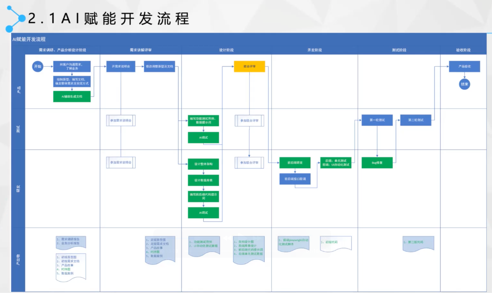

# 写在前面的话

## 理念转变

在AI的辅助下，我们正在重新定义我们的软件开发理念。从原本大量成本投入在实现上，转变为大量成本投入在需求分析上，将需求做细，足以衔接客户真实诉求与最终实现。（暂且将项目过程分为需求和实现两个阶段）

### 实现目标

<ClientOnly>
  <ECharts :option="option" />
</ClientOnly>

| 项目 | 传统开发模式 | AI辅助开发模式 |
|------|------------|--------------|
| 需求阶段 | 文档/原型/会议纪要…… | 用于代码生成的提示词工程 |
| 实现阶段 | 编写文档、代码的人工时 | 机时、架构集成 |

### 几个观点

#### 1. 需求不仅仅是规格说明书

需求有多种形式，不仅仅是规格说明书，一般包括用户故事、用例、用户画像等。当然，我们仔细理解，需求还包含了会议纪要、客服记录、用户反馈、竞品分析、市场调研、客户的项目规划等等。

也可以用一个更合适的词：**项目背景资料**，也就是散落的需求。

论据：*一般我们认为，所有需要都应当记录要系统需求规格说明书（SRS）中，但是实际上，只要是有多个人在参与在记录，就一定会遗漏，检查的过程耗时费力，还有不当争执！*

#### 2. 有些概念我们不再关心

- 复用：除非是质量足够高的代码，能够被广泛复用，否则，复用是低效的。
- 缺陷：缺陷一定是需求没说清，其它绝大部分都由机器自己修复。
- 规范：很多过程性规范会消失，如编码规范，因为人一般不再系统地阅读代码。

#### 3. 有些概念会更受重视

- 架构：利用架构将AI给出零散的应用结合起来，形成整体交付物。
- 文档：生产的文档不仅要适合人阅读，还要适合机器阅读。
- 规范：一些规范要更严格，如UI设计规范，因为要降低AI生成的随机性。

#### 4. 你要的是数据库还是数据？

- 数据库：为了方便查找，是有一定规则的管理工具。
- 数据：AI是怎么管理数据的？知识？文本？……

## 软件过程

### 航安云创的AI过程

航安云创的AI赋能开发流程分为六个阶段：

#### 1. 需求调研、产品分析设计阶段

启动项目；需求调研：新需求收集、了解业务；产品分析：场景分析、需求分析、功能分析等
输出物：

- 需求调研报告，业务分析报告
- 初版原型图、初版需求文档、产品故事、时序图、数据实例

#### 2. 需求评审阶段

开展需求评审会议；参与方：业务需求方、开发团队

输出物：

- 定稿原型图、定稿需求文档、产品故事、时序图、数据实例

#### 3. 设计阶段

编写功能设计文档；基于功能需求进行AI模型设计；设计数据结构；编写接口设计文档；完成设计评审

输出物：

- 功能测试用例、UI自动化测试数据
- 架构设计图、后端库表设计、前后端代码提示、后端单元测试数据

#### 4. 开发阶段

前后端开发；后端单元测试；前后端联调

输出物：

- playwright自动化测试脚本
- 初版代码

#### 5. 测试阶段

系统测试环境搭建；编写测试用例；执行：单元测试、集成测试；进行bug修复；完成第一轮测试和第二轮测试

输出物：

- 第二版代码

#### 6. 验收阶段

产品验收；结项

整个流程强调了AI开发的特点：
1. 前期需求分析和设计更加重要
2. 开发过程中需要多轮AI评审
3. 测试阶段需要特别关注AI功能的准确性
4. 全流程都有完整的文档支持

## 开发方法变化（TDD）

### 传统编码方式

1. 需求分析，想不清楚细节，管他呢，先开始写
2. 发现需求细节不明确，去跟业务人员确认
3. 确认好几次终于写完所有逻辑
4. 运行起来测试一下，靠，果然不工作，调试
5. 调试好久终于工作了
6. 转测试，QA 测出 bug，debug，打补丁
7. 终于，代码可以工作了
8. 一看代码烂的像坨屎，不敢动，动了还得手工测试，还得让 QA 测试，还得加班...

### TDD 编码方式

1. 先分解任务，分离关注点（AI生成）
2. 列 Example，用实例化需求，澄清需求细节（AI生成）
3. 写测试，只关注需求，程序的输入输出，不关心中间过程（AI直出）
4. 写实现，不考虑别的需求，用最简单的方式满足当前这个小需求即可（AI直出）
5. 重构，用手法消除代码里的坏味道（AI辅助）
6. 写完，手动测试一下，基本没什么问题，有问题补个用例，修复（AI生成）
7. 转测试，小问题，补用例，修复（AI生成）
8. 代码整洁且用例齐全，信心满满地提交

