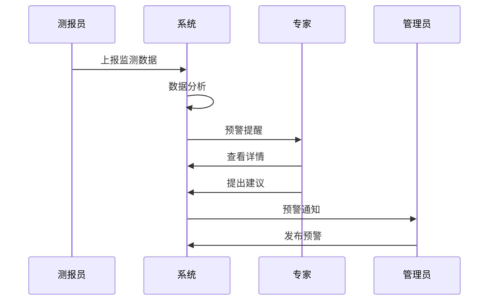

# 第4步 场景与故事

## 示例：病虫测防联动一张图

在本节中，我们将以"病虫测防联动一张图"功能为例，演示如何使用AI辅助将功能需求转换为用户故事和场景描述。

### 1. 需求转用户故事

使用提示词将功能需求转换为用户故事，详细提示词见：[需求转用户故事提示词](./step4/1-requirements-to-stories.md)

### 2. 故事转场景

使用提示词将用户故事转换为具体场景，详细提示词见：[用户故事转场景提示词](./step4/2-stories-to-scenarios.md)

### 3. 内容展示

使用提示词生成图文并茂的展示文档，详细提示词见：[内容展示提示词](./step4/3-presentation.md)

## 用户场景分析

### 场景分析方法

1. 识别关键用户角色
2. 定义用户目标
3. 描述使用场景
4. 分析用户行为
5. 确定系统响应

### 场景示例

以病虫害监测预警为例：



## 用户故事编写

### 用户故事模板

```
作为一个<角色>
我想要<功能>
以便于<价值>
```

### INVEST原则

- Independent（独立的）
- Negotiable（可协商的）
- Valuable（有价值的）
- Estimatable（可估算的）
- Small（小的）
- Testable（可测试的）

### 故事示例

1. 测报员故事
```
作为一名测报员
我想要便捷地录入病虫害监测数据
以便于及时反映田间病虫害发生情况
```

2. 专家故事
```
作为一名植保专家
我想要查看历史监测数据和趋势分析
以便于做出准确的预警判断
```

3. 管理员故事
```
作为一名植保管理员
我想要查看全省病虫害发生态势
以便于及时组织防控工作
```

## 验收标准

每个用户故事都需要明确的验收标准：

1. 功能验收标准
   - 具体的功能点
   - 输入输出要求
   - 业务规则

2. 非功能验收标准
   - 性能要求
   - 安全要求
   - 用户体验要求

## 优先级划分

使用MoSCoW方法进行优先级划分：

- Must Have（必须有）
- Should Have（应该有）
- Could Have（可以有）
- Won't Have（暂不考虑） 