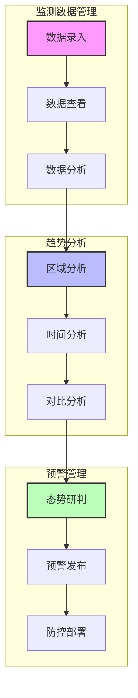
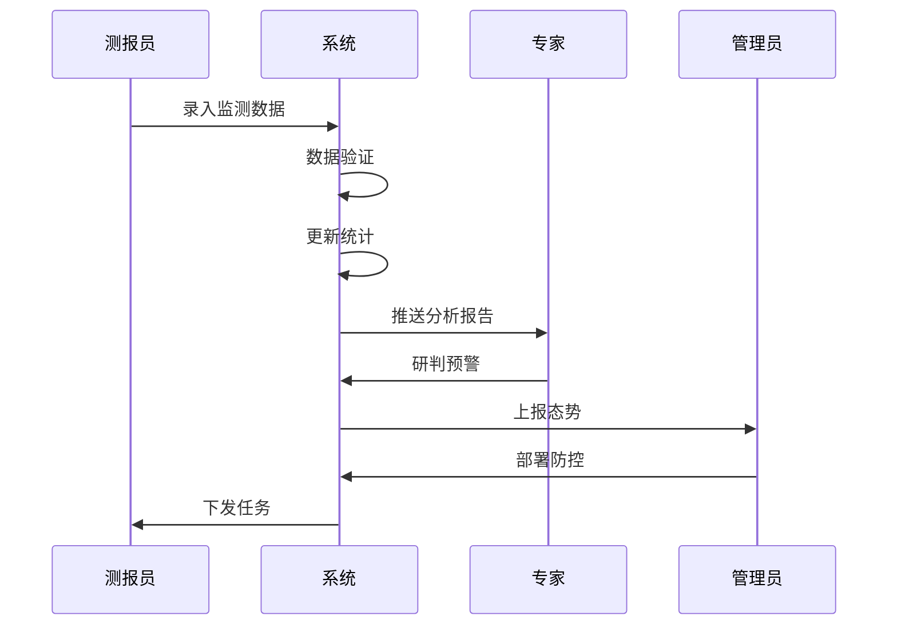

# 用户故事转场景提示词

## 提示词模板

```prompt
你是一位用户体验专家和业务分析师。请根据以下用户故事，生成详细的业务场景描述和用户故事地图：

用户故事：
[在此粘贴用户故事列表]

要求：
1. 场景描述要求：
   - 详细描述用户使用场景
   - 包含用户目标、前置条件、操作步骤、预期结果
   - 说明触发条件和完成标准
   - 描述可能的异常情况和处理方式

2. 故事地图构建要求：
   - 按照用户活动组织故事
   - 标识故事间的依赖关系
   - 划分最小可行产品(MVP)
   - 规划发布路线图

3. 输出格式：
   - 使用Mermaid图表展示用户故事地图
   - 使用时序图展示关键场景流程
   - 使用Markdown格式化文本
```

## 示例输入

```
测报员用户故事：
1. 数据录入故事（Must Have）
作为一名测报员
我想要便捷地录入病虫害监测数据
以便于及时反映田间病虫害发生情况

2. 数据查看故事（Must Have）
作为一名测报员
我想要查看本区域的历史监测数据
以便于进行同期对比分析

专家用户故事：
1. 趋势分析故事（Must Have）
作为一名植保专家
我想要查看全省病虫害发生趋势图
以便于进行预警研判

2. 分布分析故事（Should Have）
作为一名植保专家
我想要查看病虫害的空间分布热力图
以便于掌握发生规律和特点

管理员用户故事：
1. 态势总览故事（Must Have）
作为一名植保管理员
我想要查看全省病虫害发生和防治总体情况
以便于及时组织防控工作

2. 专题分析故事（Should Have）
作为一名植保管理员
我想要查看重点病虫害的专题分析报告
以便于进行针对性部署
```

## 示例输出

### 1. 业务场景描述

#### 病虫害监测数据录入场景

**目标用户**：测报员

**前置条件**：
- 用户已登录系统
- 用户具有数据录入权限
- 已完成田间调查

**操作流程**：
1. 进入数据录入界面
2. 选择监测地点和时间
3. 填写病虫害发生信息
4. 上传现场照片（可选）
5. 提交数据

**预期结果**：
- 数据保存成功
- 生成监测记录
- 触发数据分析更新

**异常处理**：
- 网络异常时自动保存草稿
- 数据异常时提示校验规则
- 必填项缺失时阻止提交

### 2. 用户故事地图



### 3. 关键场景流程



### 4. 发布规划

**MVP（第一期）**：
- 基础数据录入功能
- 历史数据查询功能
- 简单统计分析功能

**第二期**：
- 趋势分析功能
- 空间分布分析
- 预警研判功能

**第三期**：
- 专题分析报告
- 智能预警推送
- 协同防控功能 