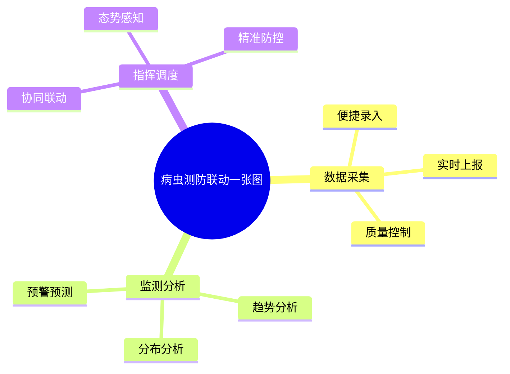
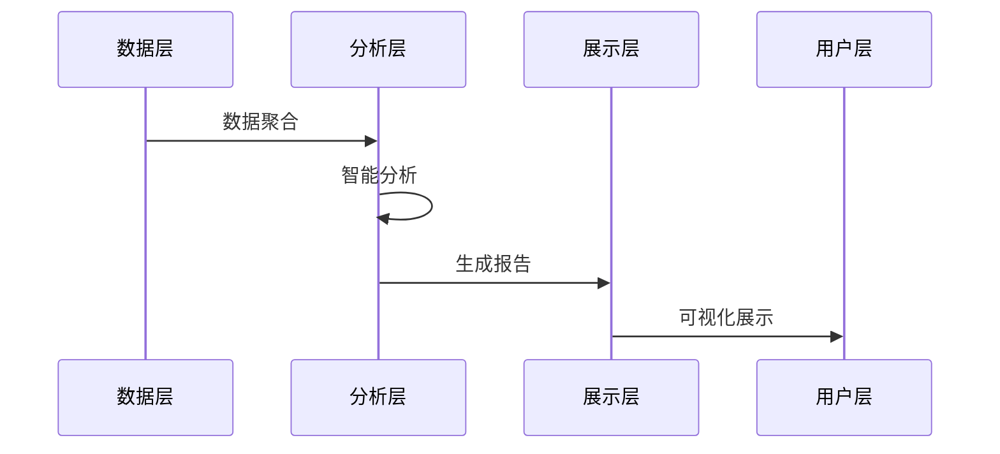
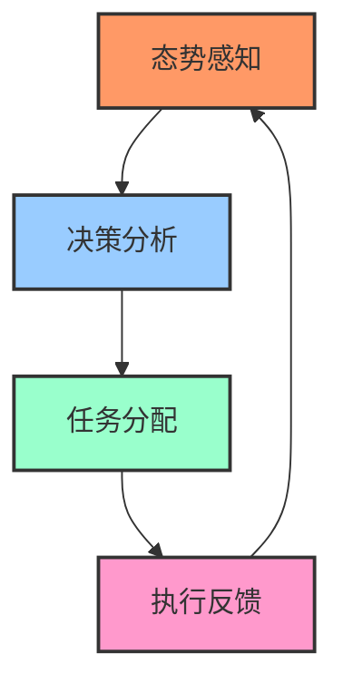
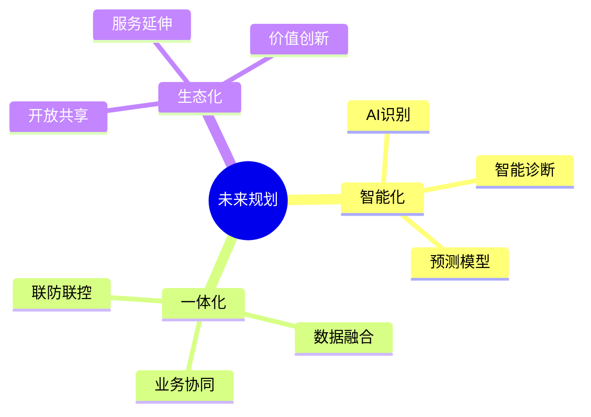

# 内容展示提示词

## 提示词模板

```prompt
你是一位专业的产品经理和演示专家。请将以下用户故事和场景内容，转换为一份图文并茂的演示文档：

内容：
[在此粘贴用户故事和场景内容]

要求：
1. 文档结构：
   - 简明的概述
   - 清晰的目录
   - 逻辑的章节
   - 突出的重点
   - 完整的总结

2. 可视化要求：
   - 使用流程图展示业务流程
   - 使用思维导图展示功能架构
   - 使用时序图展示交互过程
   - 使用图标突出关键信息
   - 使用表格组织对比信息

3. 展示重点：
   - 突出业务价值
   - 强调用户体验
   - 展示创新特点
   - 说明实现路径
   - 预期实施效果

4. 输出格式：
   - 使用Markdown格式
   - 支持Mermaid图表
   - 适合幻灯片展示
```

## 示例输入

```
[粘贴之前生成的用户故事和场景内容]
```

## 示例输出

# 病虫测防联动一张图

## 1. 系统概述

### 1.1 建设目标



### 1.2 系统价值

| 用户角色 | 主要价值 | 关键功能 |
|---------|---------|---------|
| 测报员 | 提高工作效率 | 便捷录入、数据查询 |
| 专家 | 辅助决策分析 | 趋势分析、预警研判 |
| 管理员 | 提升管理水平 | 态势总览、任务调度 |

## 2. 核心功能

### 2.1 数据采集模块

::: tip 创新特点
- 移动端采集
- 智能校验
- 离线存储
:::


### 2.2 分析预警模块

::: warning 关键功能
- 多维度分析
- 智能预警
- 专家会商
:::



### 2.3 指挥调度模块

::: info 应用场景
- 应急指挥
- 联防联控
- 资源调度
:::



## 3. 实施路径

### 3.1 分期规划

1. 第一期（MVP）
   - 基础数据采集
   - 数据可视化
   - 简单分析功能

2. 第二期
   - 智能分析
   - 预警预测
   - 专家会商

3. 第三期
   - 协同指挥
   - 智能决策
   - 效果评估

### 3.2 预期效果

::: tip 实施效益
- 提升监测效率30%
- 减少数据处理时间50%
- 提高预警准确率20%
- 加快响应速度40%
:::

## 4. 总结展望

### 4.1 创新价值

- 数据驱动：实现数据全程可追溯
- 智能分析：提供智能化决策支持
- 协同联动：促进部门协同作战
- 精准防控：提升防控精准化水平

### 4.2 未来展望

