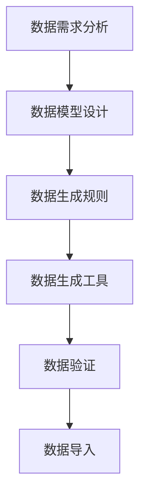
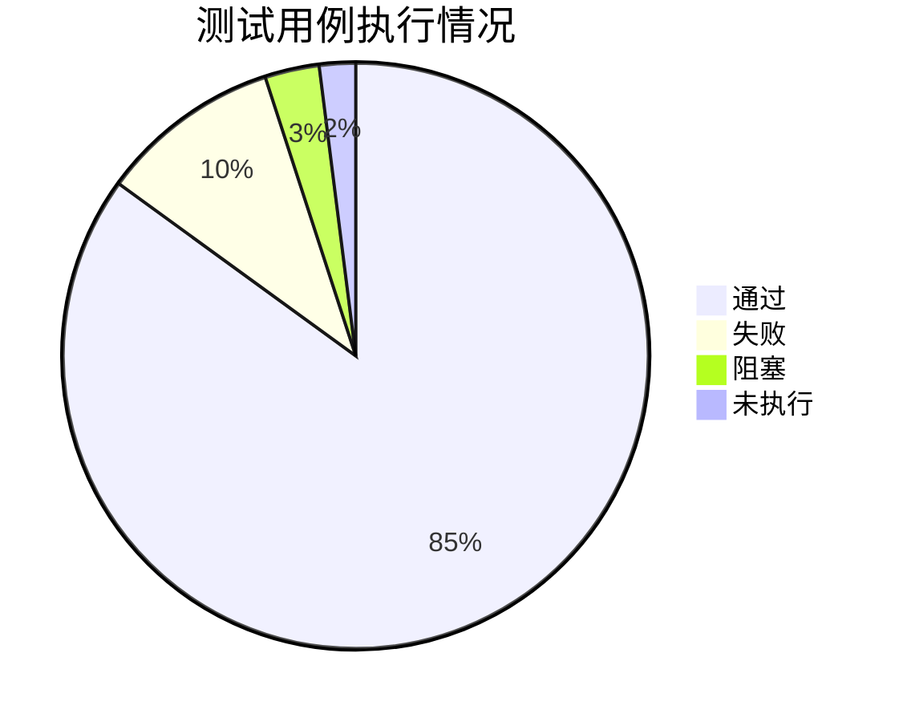

# 第5步 测试用例与数据

## 测试用例设计

### 测试用例分类

1. 功能测试用例
   - 正常流程测试
   - 异常流程测试
   - 边界条件测试

2. 性能测试用例
   - 负载测试
   - 压力测试
   - 并发测试

3. 接口测试用例
   - 接口功能测试
   - 接口性能测试
   - 接口安全测试

### 测试用例模板

```yaml
用例标题: 病虫害数据录入测试
前置条件: 
  - 用户已登录系统
  - 具有数据录入权限
测试步骤:
  1. 进入数据录入页面
  2. 填写监测数据
  3. 提交数据
预期结果:
  - 数据保存成功
  - 返回成功提示
  - 数据显示在列表中
```

## 测试数据准备

### 数据类型

1. 基础数据
   - 用户数据
   - 字典数据
   - 配置数据

2. 业务数据
   - 病虫害数据
   - 监测数据
   - 预警数据

3. 模拟数据
   - 历史数据
   - 压力测试数据
   - 性能测试数据

### 数据生成策略



## 自动化测试

### 测试框架选择

1. 接口测试
   - Postman
   - JMeter
   - RestAssured

2. UI测试
   - Selenium
   - Cypress
   - Playwright

3. 性能测试
   - JMeter
   - LoadRunner
   - K6

### 测试脚本示例

```javascript
// Playwright UI测试示例
test('病虫害数据录入', async ({ page }) => {
  // 登录系统
  await page.goto('/login');
  await page.fill('#username', 'tester');
  await page.fill('#password', '123456');
  await page.click('#login-button');

  // 进入数据录入页面
  await page.click('#data-entry');

  // 填写表单
  await page.fill('#date', '2024-02-01');
  await page.fill('#location', '安徽省合肥市');
  await page.fill('#pest-type', '稻飞虱');
  await page.fill('#severity', '中等');

  // 提交数据
  await page.click('#submit-button');

  // 验证结果
  await expect(page.locator('.success-message')).toBeVisible();
  await expect(page.locator('.data-list')).toContainText('稻飞虱');
});
```

## 测试报告

### 报告内容

1. 测试概述
   - 测试范围
   - 测试环境
   - 测试周期

2. 测试执行情况
   - 用例执行统计
   - 缺陷统计分析
   - 测试覆盖率

3. 测试结论
   - 质量评估
   - 风险分析
   - 建议改进

### 报告示例

