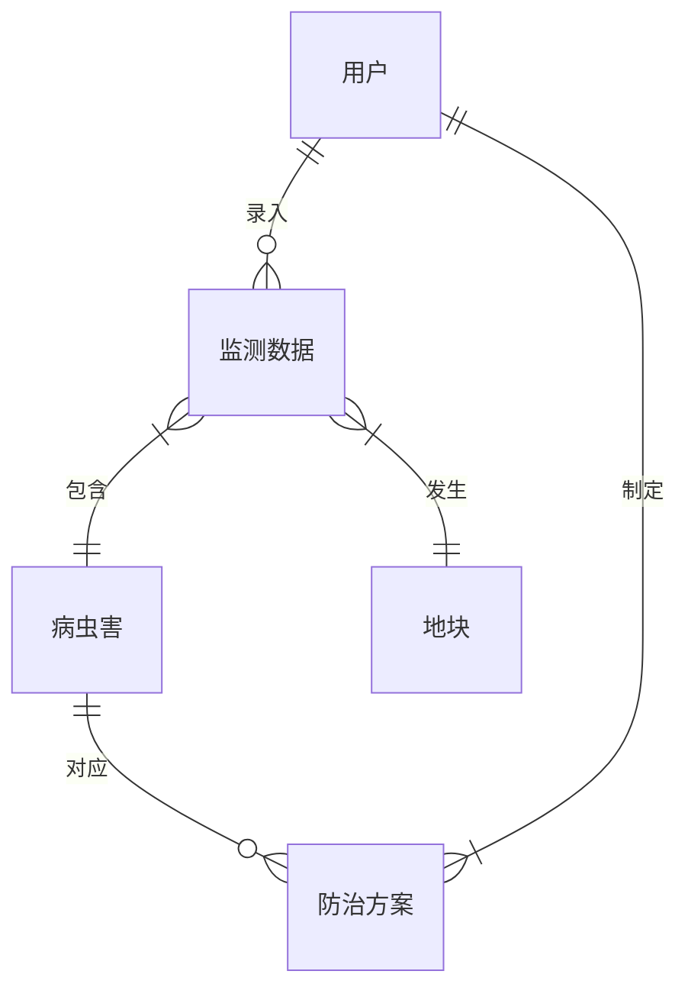

# 第6步 数据库设计与代码

## 数据库设计

### 概念模型设计

使用实体关系图(ERD)描述业务实体及其关系：



### 逻辑模型设计

1. 用户表设计
```sql
CREATE TABLE `user` (
  `id` bigint NOT NULL AUTO_INCREMENT,
  `username` varchar(50) NOT NULL COMMENT '用户名',
  `password` varchar(100) NOT NULL COMMENT '密码',
  `role` varchar(20) NOT NULL COMMENT '角色',
  `status` tinyint NOT NULL DEFAULT '1' COMMENT '状态',
  `create_time` datetime NOT NULL DEFAULT CURRENT_TIMESTAMP,
  `update_time` datetime NOT NULL DEFAULT CURRENT_TIMESTAMP,
  PRIMARY KEY (`id`),
  UNIQUE KEY `uk_username` (`username`)
) ENGINE=InnoDB DEFAULT CHARSET=utf8mb4 COMMENT='用户表';
```

2. 监测数据表设计
```sql
CREATE TABLE `monitoring_data` (
  `id` bigint NOT NULL AUTO_INCREMENT,
  `pest_id` bigint NOT NULL COMMENT '病虫害ID',
  `plot_id` bigint NOT NULL COMMENT '地块ID',
  `user_id` bigint NOT NULL COMMENT '录入用户ID',
  `occurrence_level` varchar(20) NOT NULL COMMENT '发生程度',
  `occurrence_area` decimal(10,2) NOT NULL COMMENT '发生面积',
  `monitor_time` datetime NOT NULL COMMENT '监测时间',
  `create_time` datetime NOT NULL DEFAULT CURRENT_TIMESTAMP,
  PRIMARY KEY (`id`),
  KEY `idx_pest_id` (`pest_id`),
  KEY `idx_plot_id` (`plot_id`),
  KEY `idx_user_id` (`user_id`)
) ENGINE=InnoDB DEFAULT CHARSET=utf8mb4 COMMENT='监测数据表';
```

## 代码生成

### 后端代码生成

1. Entity类生成
```java
@Data
@TableName("monitoring_data")
public class MonitoringData {
    @TableId(type = IdType.AUTO)
    private Long id;
    
    @TableField("pest_id")
    private Long pestId;
    
    @TableField("plot_id")
    private Long plotId;
    
    @TableField("user_id")
    private Long userId;
    
    @TableField("occurrence_level")
    private String occurrenceLevel;
    
    @TableField("occurrence_area")
    private BigDecimal occurrenceArea;
    
    @TableField("monitor_time")
    private LocalDateTime monitorTime;
    
    @TableField("create_time")
    private LocalDateTime createTime;
}
```

2. Service接口生成
```java
public interface MonitoringDataService extends IService<MonitoringData> {
    // 自定义业务方法
    List<MonitoringData> queryByTimeRange(LocalDateTime start, LocalDateTime end);
    
    List<MonitoringData> queryByPestId(Long pestId);
    
    List<MonitoringData> queryByPlotId(Long plotId);
}
```

3. Controller生成
```java
@RestController
@RequestMapping("/api/monitoring")
public class MonitoringDataController {
    @Autowired
    private MonitoringDataService monitoringDataService;
    
    @PostMapping
    public Result<MonitoringData> add(@RequestBody MonitoringData data) {
        monitoringDataService.save(data);
        return Result.success(data);
    }
    
    @GetMapping("/{id}")
    public Result<MonitoringData> getById(@PathVariable Long id) {
        return Result.success(monitoringDataService.getById(id));
    }
    
    @GetMapping("/list")
    public Result<List<MonitoringData>> list(
            @RequestParam LocalDateTime start,
            @RequestParam LocalDateTime end) {
        return Result.success(monitoringDataService.queryByTimeRange(start, end));
    }
}
```

### 前端代码生成

1. API接口定义
```typescript
// api/monitoring.ts
import { request } from '@/utils/request';

export interface MonitoringData {
  id: number;
  pestId: number;
  plotId: number;
  userId: number;
  occurrenceLevel: string;
  occurrenceArea: number;
  monitorTime: string;
  createTime: string;
}

export const monitoringApi = {
  add: (data: MonitoringData) => 
    request.post<MonitoringData>('/api/monitoring', data),
    
  getById: (id: number) => 
    request.get<MonitoringData>(`/api/monitoring/${id}`),
    
  list: (params: { start: string; end: string }) =>
    request.get<MonitoringData[]>('/api/monitoring/list', { params })
};
```

2. Vue组件生成
```vue
<template>
  <div class="monitoring-form">
    <a-form :model="formData" @finish="onSubmit">
      <a-form-item label="病虫害" name="pestId">
        <a-select v-model:value="formData.pestId">
          <a-select-option 
            v-for="pest in pestList" 
            :key="pest.id" 
            :value="pest.id"
          >
            {{ pest.name }}
          </a-select-option>
        </a-select>
      </a-form-item>
      
      <a-form-item label="发生程度" name="occurrenceLevel">
        <a-select v-model:value="formData.occurrenceLevel">
          <a-select-option value="轻">轻</a-select-option>
          <a-select-option value="中">中</a-select-option>
          <a-select-option value="重">重</a-select-option>
        </a-select>
      </a-form-item>
      
      <a-form-item label="发生面积" name="occurrenceArea">
        <a-input-number 
          v-model:value="formData.occurrenceArea" 
          :min="0" 
          :step="0.01"
        />
      </a-form-item>
      
      <a-form-item label="监测时间" name="monitorTime">
        <a-date-picker 
          v-model:value="formData.monitorTime" 
          show-time 
        />
      </a-form-item>
      
      <a-form-item>
        <a-button type="primary" html-type="submit">提交</a-button>
      </a-form-item>
    </a-form>
  </div>
</template>

<script lang="ts" setup>
import { ref, onMounted } from 'vue';
import { monitoringApi } from '@/api/monitoring';
import type { MonitoringData } from '@/api/monitoring';

const formData = ref<MonitoringData>({
  pestId: undefined,
  plotId: undefined,
  occurrenceLevel: undefined,
  occurrenceArea: undefined,
  monitorTime: undefined
});

const onSubmit = async () => {
  try {
    await monitoringApi.add(formData.value);
    message.success('提交成功');
  } catch (error) {
    message.error('提交失败');
  }
};
</script>
```

## 代码审查

### 审查清单

1. 数据库设计审查
   - 表结构是否合理
   - 索引是否完善
   - 字段类型是否适当

2. 后端代码审查
   - 代码规范性
   - 异常处理
   - 性能优化
   - 安全性检查

3. 前端代码审查
   - 组件复用性
   - 状态管理
   - 用户体验
   - 错误处理 