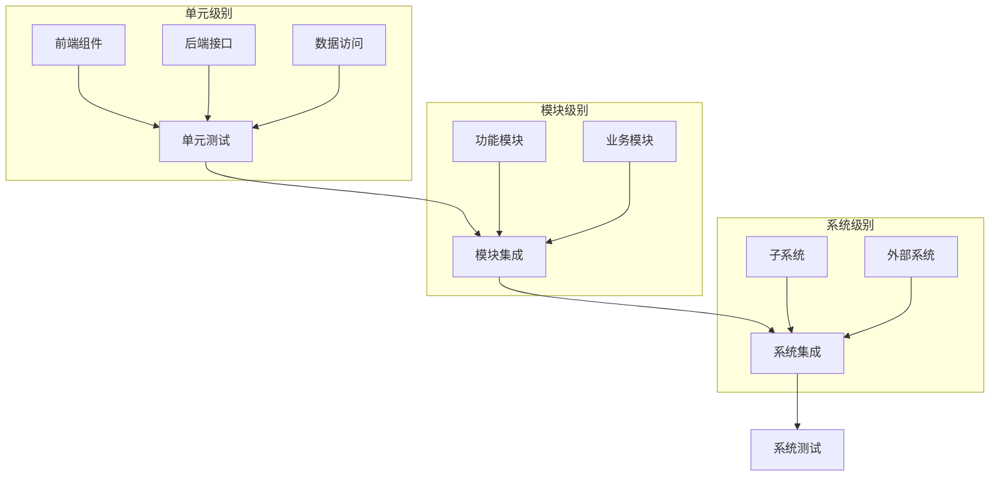
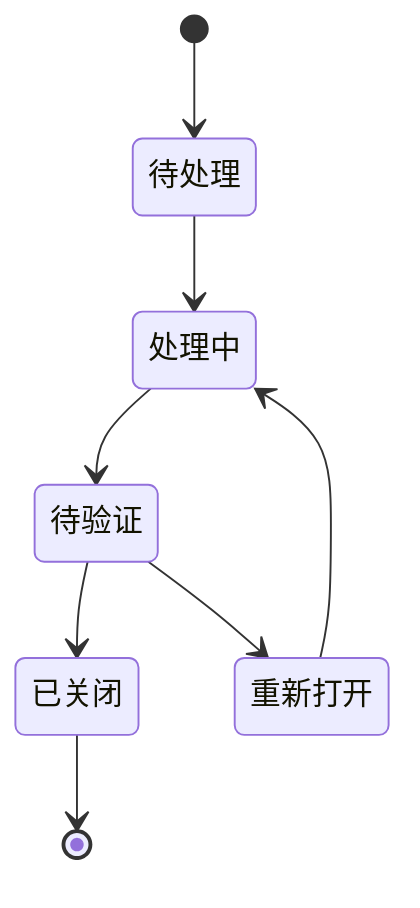

# 第7步 集成与测试

## 系统集成

### 集成策略



### 集成步骤

1. 准备工作
   - 环境配置
   - 依赖管理
   - 数据准备

2. 模块集成
   - 接口对接
   - 数据流转
   - 异常处理

3. 系统集成
   - 系统间通信
   - 数据同步
   - 性能优化

## 部署流程

### 环境准备

1. 开发环境
```yaml
# docker-compose.yml
version: '3'
services:
  mysql:
    image: mysql:8.0
    ports:
      - "3306:3306"
    environment:
      MYSQL_ROOT_PASSWORD: root
      MYSQL_DATABASE: pest_db
    volumes:
      - ./mysql/data:/var/lib/mysql
      
  redis:
    image: redis:6.2
    ports:
      - "6379:6379"
    volumes:
      - ./redis/data:/data
      
  nginx:
    image: nginx:1.20
    ports:
      - "80:80"
    volumes:
      - ./nginx/conf:/etc/nginx/conf.d
      - ./dist:/usr/share/nginx/html
```

2. 测试环境
```bash
# 环境初始化脚本
#!/bin/bash

# 1. 安装依赖
npm install

# 2. 构建前端
npm run build

# 3. 启动服务
docker-compose up -d

# 4. 初始化数据
mysql -h localhost -u root -p pest_db < init.sql

# 5. 健康检查
curl http://localhost/health
```

### 部署步骤

1. 打包
```bash
# 前端打包
npm run build

# 后端打包
mvn clean package
```

2. 部署
```bash
# 停止服务
docker-compose down

# 更新代码
cp target/*.jar app.jar
cp -r dist/* nginx/html/

# 启动服务
docker-compose up -d

# 验证部署
curl http://localhost/health
```

## 系统测试

### 测试计划

1. 功能测试
   - 接口测试
   - UI测试
   - 业务流程测试

2. 非功能测试
   - 性能测试
   - 安全测试
   - 兼容性测试

### 测试执行

1. 接口测试
```javascript
// Jest测试用例
describe('监测数据接口测试', () => {
  test('添加监测数据', async () => {
    const data = {
      pestId: 1,
      plotId: 1,
      occurrenceLevel: '中',
      occurrenceArea: 100.5,
      monitorTime: '2024-02-01 10:00:00'
    };
    
    const response = await request(app)
      .post('/api/monitoring')
      .send(data);
      
    expect(response.status).toBe(200);
    expect(response.body.code).toBe(0);
    expect(response.body.data).toHaveProperty('id');
  });
});
```

2. UI测试
```javascript
// Cypress测试用例
describe('监测数据录入', () => {
  beforeEach(() => {
    cy.login('tester', '123456');
  });
  
  it('应能成功录入数据', () => {
    cy.visit('/monitoring/add');
    
    cy.get('#pestId').select('稻飞虱');
    cy.get('#occurrenceLevel').select('中');
    cy.get('#occurrenceArea').type('100.5');
    cy.get('#monitorTime').type('2024-02-01 10:00:00');
    
    cy.get('button[type="submit"]').click();
    
    cy.get('.success-message').should('be.visible');
  });
});
```

### 问题跟踪

使用JIRA等工具进行问题跟踪：



## 验收标准

### 功能验收

1. 基本功能
   - 数据录入准确性
   - 业务流程完整性
   - 系统响应及时性

2. 扩展功能
   - 报表导出功能
   - 数据分析功能
   - 预警提醒功能

### 非功能验收

1. 性能指标
   - 响应时间 < 1s
   - 并发用户 > 100
   - CPU使用率 < 70%

2. 安全要求
   - 权限控制
   - 数据加密
   - 操作审计 