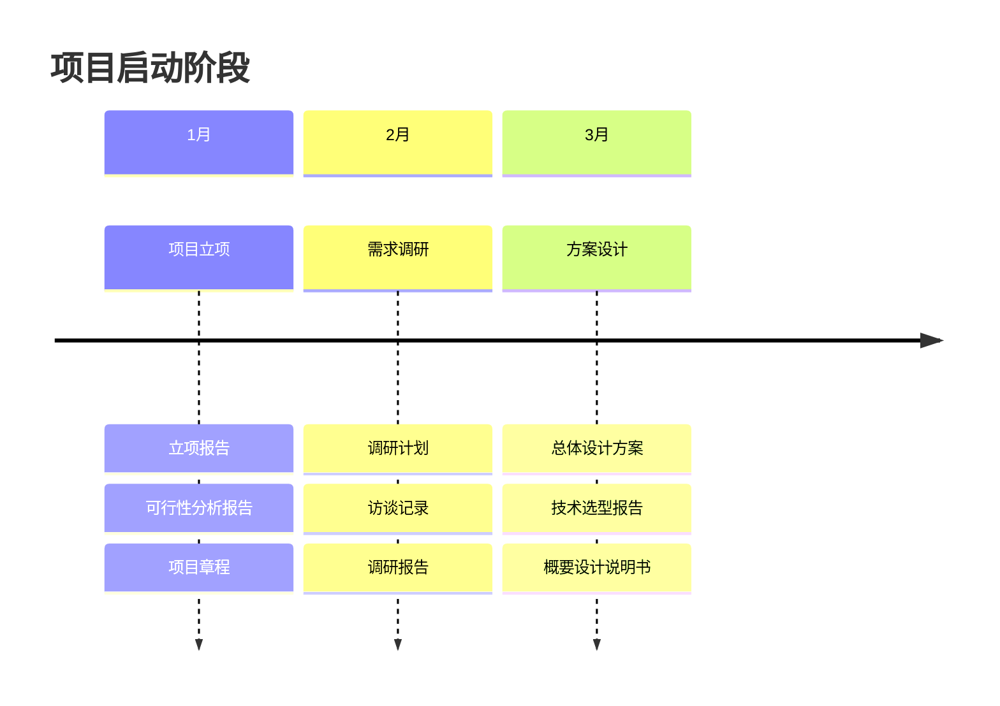
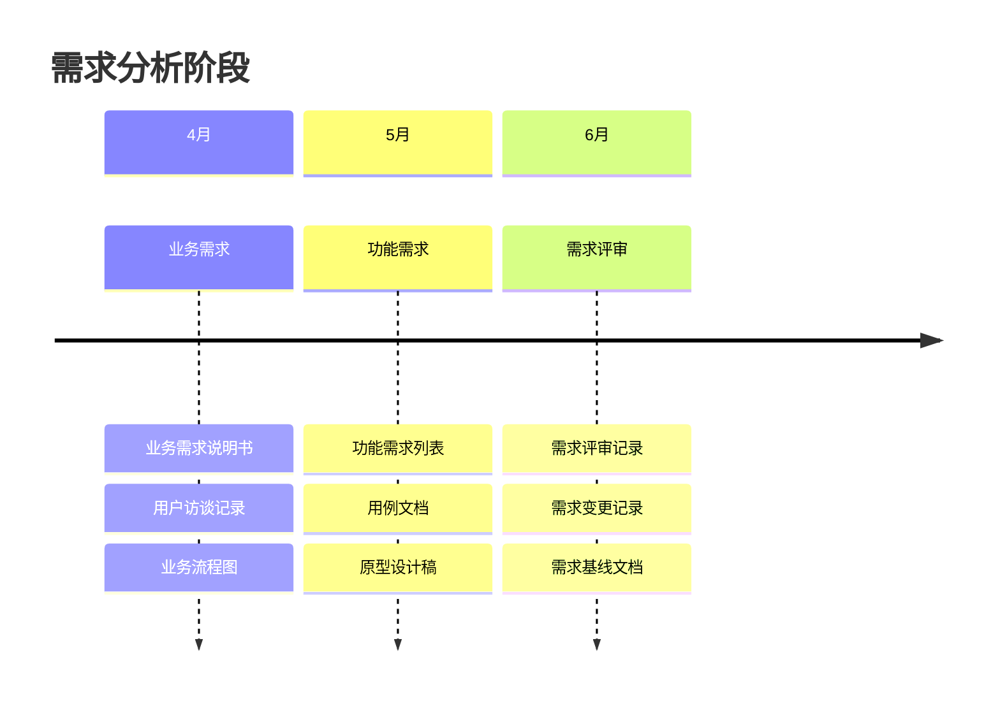
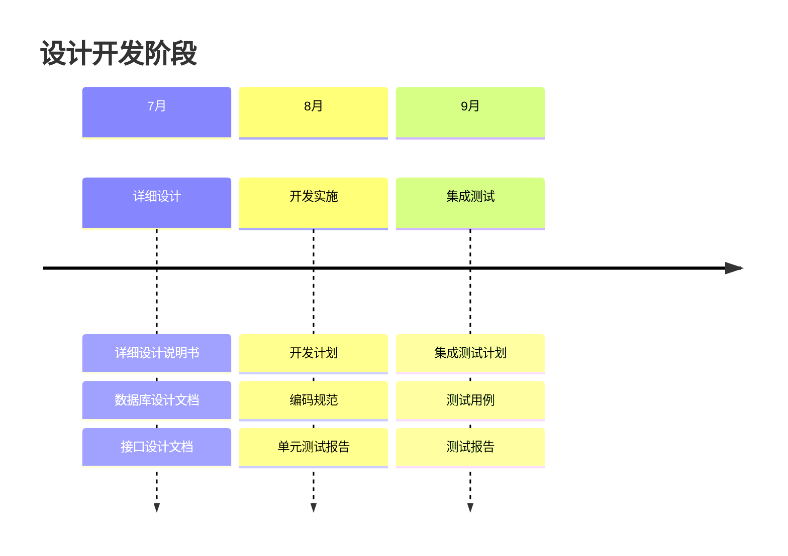
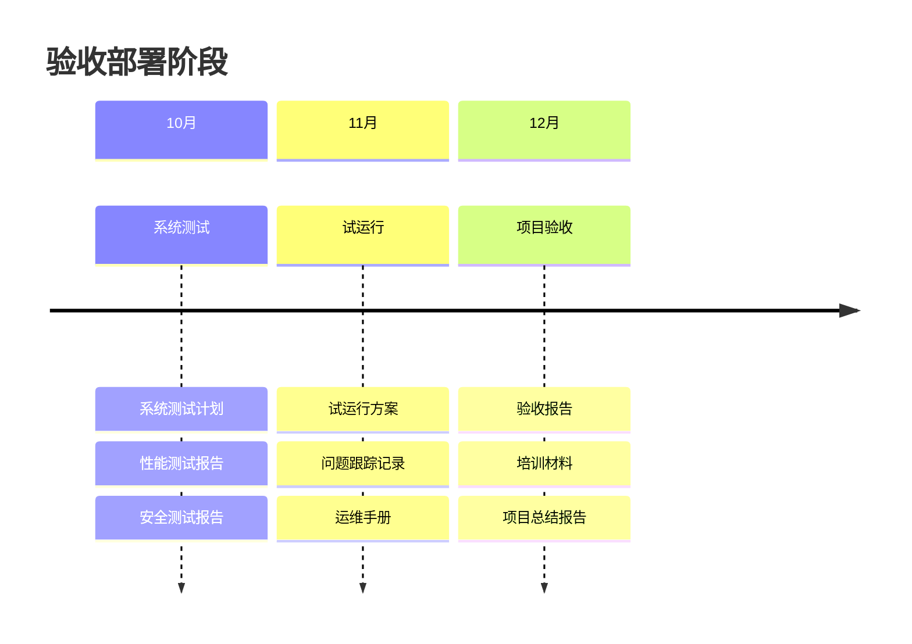
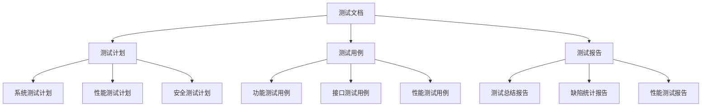

# 项目过程资料

## 1. 项目启动阶段

### 2024年Q1


## 2. 需求分析阶段

### 2024年Q2


## 3. 设计开发阶段

### 2024年Q3


## 4. 验收部署阶段

### 2024年Q4


## 5. 文档清单

### 5.1 管理文档
| 文档类型 | 文档名称 | 更新日期 | 版本 |
|---------|----------|----------|------|
| 项目管理 | 项目章程 | 2024-01-15 | V1.0 |
| 计划管理 | 项目计划 | 2024-01-20 | V1.0 |
| 质量管理 | 质量计划 | 2024-02-01 | V1.0 |
| 配置管理 | 配置计划 | 2024-02-15 | V1.0 |

### 5.2 技术文档
```json
{
  "design_docs": {
    "requirement": {
      "business_requirement": "业务需求说明书_V1.0",
      "functional_requirement": "功能需求说明书_V1.0",
      "interface_requirement": "接口需求说明书_V1.0"
    },
    "architecture": {
      "system_architecture": "系统架构设计说明书_V1.0",
      "database_design": "数据库设计说明书_V1.0",
      "interface_design": "接口设计说明书_V1.0"
    },
    "development": {
      "coding_standard": "编码规范_V1.0",
      "development_guide": "开发指南_V1.0",
      "api_document": "API文档_V1.0"
    }
  }
}
```

### 5.3 测试文档


### 5.4 运维文档
| 文档类型 | 文档名称 | 适用对象 | 用途 |
|---------|----------|----------|------|
| 部署文档 | 部署指南 | 运维人员 | 系统部署 |
| 运维文档 | 运维手册 | 运维人员 | 日常运维 |
| 用户文档 | 用户手册 | 最终用户 | 系统使用 |
| 培训文档 | 培训教材 | 培训讲师 | 用户培训 | 