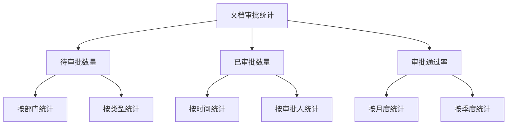

# 报表清单

## 1. 需求分析报表

### 1.1 需求统计报表
| 报表名称 | 更新周期 | 用途 | 查看权限 |
|---------|----------|------|----------|
| 需求总量统计 | 实时 | 统计需求数量和状态分布 | 所有用户 |
| 需求趋势分析 | 每日 | 分析需求增长趋势 | 管理员、产品经理 |
| 需求分类统计 | 每周 | 统计各类型需求占比 | 管理员、产品经理 |
| 需求来源分析 | 每月 | 分析需求来源分布 | 管理员、产品经理 |

### 1.2 需求质量报表
| 报表名称 | 更新周期 | 用途 | 查看权限 |
|---------|----------|------|----------|
| 需求完成率 | 每日 | 统计需求完成情况 | 管理员、项目经理 |
| 需求延期率 | 每周 | 分析需求延期情况 | 管理员、项目经理 |
| 需求变更率 | 每月 | 统计需求变更情况 | 管理员、产品经理 |
| 需求满意度 | 每月 | 分析需求满意度 | 管理员、产品经理 |

## 2. 项目管理报表

### 2.1 项目进度报表
```json
{
  "report": {
    "name": "项目进度报表",
    "frequency": "weekly",
    "metrics": [
      {
        "name": "计划完成率",
        "type": "percentage",
        "calculation": "完成任务数/计划任务数"
      },
      {
        "name": "进度偏差率",
        "type": "percentage",
        "calculation": "(实际工时-计划工时)/计划工时"
      }
    ],
    "dimensions": [
      "项目",
      "模块",
      "负责人"
    ]
  }
}
```

### 2.2 资源使用报表
```json
{
  "report": {
    "name": "资源使用报表",
    "frequency": "monthly",
    "metrics": [
      {
        "name": "人力投入",
        "type": "number",
        "unit": "人天"
      },
      {
        "name": "资源利用率",
        "type": "percentage",
        "calculation": "实际工时/可用工时"
      }
    ],
    "dimensions": [
      "部门",
      "角色",
      "项目"
    ]
  }
}
```

## 3. 文档管理报表

### 3.1 文档统计报表
| 报表名称 | 更新周期 | 用途 | 查看权限 |
|---------|----------|------|----------|
| 文档数量统计 | 实时 | 统计文档总量 | 所有用户 |
| 文档分类统计 | 每周 | 统计各类文档占比 | 管理员、文档管理员 |
| 文档版本统计 | 每月 | 分析文档版本分布 | 管理员、文档管理员 |
| 文档访问统计 | 每日 | 统计文档访问情况 | 管理员、文档管理员 |

### 3.2 文档审批报表


## 4. 系统运营报表

### 4.1 用户活跃度报表
| 指标 | 统计维度 | 更新周期 | 展示方式 |
|-----|----------|----------|----------|
| DAU | 日活跃用户数 | 每日 | 折线图 |
| MAU | 月活跃用户数 | 每月 | 柱状图 |
| 用户留存率 | 新用户留存 | 每周 | 热力图 |
| 访问频次 | 用户访问次数 | 每日 | 饼图 |

### 4.2 性能监控报表
```json
{
  "report": {
    "name": "系统性能报表",
    "frequency": "realtime",
    "metrics": [
      {
        "name": "响应时间",
        "type": "time",
        "unit": "ms",
        "threshold": {
          "warning": 1000,
          "critical": 3000
        }
      },
      {
        "name": "并发用户数",
        "type": "number",
        "threshold": {
          "warning": 500,
          "critical": 1000
        }
      },
      {
        "name": "系统资源使用率",
        "type": "percentage",
        "threshold": {
          "warning": 80,
          "critical": 90
        }
      }
    ]
  }
}
```

## 5. 自定义报表

### 5.1 报表配置
```json
{
  "customReport": {
    "template": {
      "type": "table/chart",
      "dimensions": ["dimension1", "dimension2"],
      "metrics": ["metric1", "metric2"],
      "filters": {
        "date": "date_range",
        "category": "multiple_select",
        "status": "single_select"
      }
    },
    "permissions": {
      "create": ["admin", "manager"],
      "edit": ["admin"],
      "view": ["all"]
    }
  }
}
```

### 5.2 导出格式
| 格式 | 支持类型 | 特点 | 适用场景 |
|-----|----------|------|----------|
| Excel | .xlsx | 可编辑、格式丰富 | 数据分析 |
| PDF | .pdf | 格式固定、打印友好 | 报告展示 |
| CSV | .csv | 通用格式、易处理 | 数据迁移 |
| Word | .docx | 文档格式、易编辑 | 报告编辑 | 