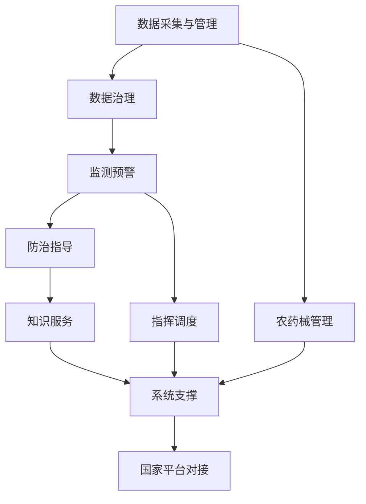

## 功能架构总览

安徽省病虫疫情信息调度指挥平台的功能架构是一个面向未来、开放共享的智能系统，旨在全面提升省级植保工作的信息化、智能化和协同化水平。架构设计充分考虑了植保工作的复杂性、专业性和创新性，通过模块化、可扩展的方式，实现对病虫害监测、预警、防治的全流程、全要素管理。

### 功能架构设计理念

观点：功能架构遵循"业务驱动、技术赋能、开放创新"的设计原则，构建一个智能、开放、可持续发展的植保信息生态系统。
- 模块解耦：各功能模块相对独立又紧密协作，支持敏捷迭代和技术创新。
- 数据中台：建立统一的数据治理和共享机制，实现数据资源的价值最大化。
- 智能赋能：深度融合大数据分析、人工智能和知识图谱技术，提升决策智能化水平。
- 开放生态：预留开放接口，支持多方协同创新和技术生态建设。

### 功能架构主要模块

#### 1. 数据采集与管理模块
观点：作为系统的数据底座，该模块负责汇聚和管理植保工作的全域数据。
- 物联网监测数据：接入田间传感器、无人机、卫星遥感等多源感知设备数据。
- 人工采集数据：支持基层农技人员通过移动端进行田间观测数据的精准上报。
- 数据接入：提供标准化的数据接入协议和安全认证机制。

#### 2. 数据治理模块
观点：构建植保大数据治理的专业标准和智能平台。
- 数据标准化：制定植保领域数据采集、存储、使用的统一标准规范。
- 数据质量管理：建立多维度数据质量评估模型和持续改进机制。
- 数据安全：实现数据全生命周期的安全防护和合规管理。
- 数据共享：构建安全可控的数据资源开放和交换平台。

#### 3. 监测预警模块
观点：系统的智能决策中枢，通过先进算法实现病虫害的精准预警。
- 预警模型构建：基于机器学习和知识图谱技术，构建动态更新的病虫害风险预测模型。
- 实时预警：整合气象、地理、生态等多维数据，生成多层次、精细化预警信息。
- 专题分析：针对小麦赤霉病、草地贪夜蛾等重点对象开展深度智能分析。

#### 4. 防治指导模块
观点：提供面向生态文明的智能化病虫害防治技术服务。
- 绿色防控：推广生态友好的防治技术，构建农业生态系统防御体系。
- 精准施药：基于大数据分析，提供作物生长阶段的个性化防治建议。
- 技术知识库：建设植保领域的智能知识图谱和专家系统。

#### 5. 指挥调度模块
观点：实现跨区域、多层级的协同联动和资源优化配置。
- 应急响应：构建快速、精准的跨区域联防联控指挥体系。
- 资源管理：实现农药、器械等防治资源的智能调配和追踪。
- 会商协同：支持多终端、可视化的远程会商和协同决策。

#### 6. 农药械管理模块
观点：推动农药使用的规范化、智能化和生态化管理。
- 使用追溯：建立农药全流程追溯和大数据监管系统。
- 风险评估：构建农药使用的生态环境影响评估模型。
- 绿色农药：推广环保农药和生物防治技术。

#### 7. 知识服务模块
观点：构建开放、互动的植保知识创新与传播平台。
- 数字知识库：汇集植保领域专业文献、技术标准和实践案例。
- 在线培训：提供个性化的专业技能培训和知识更新。
- 专家服务：搭建专家、一线工作者和科研机构的开放交流平台。

#### 8. 国家平台对接模块
观点：实现与国家植保信息系统的无缝对接和协同。
- 标准对接：遵循国家植保信息化标准规范。
- 数据交换：建立安全、高效的跨区域数据共享机制。
- 协同治理：支持国家级植保政策的快速传导和执行。

#### 9. 系统支撑模块
观点：提供系统运行的安全、高效的技术底座。
- 安全管理：实现等保三级安全防护和零信任安全架构。
- 性能监控：确保系统7x24小时稳定运行。
- 灾备恢复：构建多级容灾和快速恢复机制。

### 功能架构图

### 架构特色与创新

观点：功能架构体现了植保信息化的系统性、前瞻性和创新性。
- 跨层级协同：打通国家、省、县、基层四级植保信息通道。
- 智能赋能：深度融合大数据分析和人工智能技术。
- 开放生态：构建面向未来的植保技术创新平台。
- 绿色导向：强调生态文明和可持续发展理念。

通过这一先进的功能架构，安徽省病虫疫情信息调度指挥平台将成为现代农业植保工作的重要技术支撑和创新引擎，为农业防灾减灾提供全方位的智能化解决方案。
