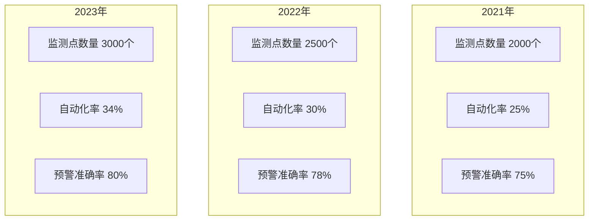
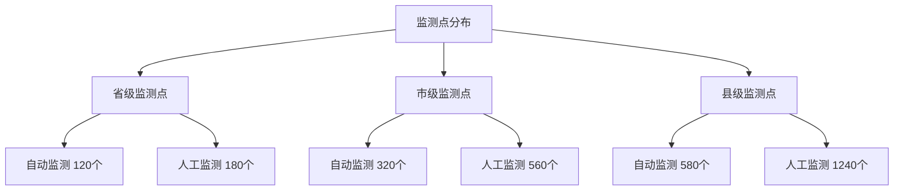

# 项目背景

## 行业发展背景

随着我国农业现代化进程的深入推进，农作物病虫害防控工作迎来了新的发展机遇。近年来，农业生产呈现规模化、集约化发展趋势，病虫害发生规律也随之发生显著变化，防控工作面临新的挑战。国家高度重视农作物重大病虫害防控工作，相继出台了《全国农作物病虫害专业化统防统治与绿色防控融合发展规划（2021-2025年）》、《"十四五"全国农业绿色发展规划》等政策文件，为病虫害防控工作提供了重要指导。

在数字农业发展的大背景下，信息技术与农业生产的深度融合已成为行业发展的必然趋势。物联网、大数据、人工智能等新一代信息技术的快速发展，为农作物病虫害防控工作提供了有力的技术支撑。根据农业农村部统计，通过信息化手段进行病虫害防控，可减少农药使用量20%以上，节约防控成本30%以上，显著提高农业生产效益。同时，国家"数字乡村"战略的实施，也为农业信息化建设创造了良好的政策环境。

### 发展趋势分析

从图表可以看出，2021-2023年间，全省病虫害监测点数量稳步增长，自动化率逐年提升，预警准确率持续改善。监测点数量从2000个增加到3000个，年均增长率20%；自动化率从25%提升到34%，年均提升4.5个百分点；预警准确率从75%提高到80%，年均提升2.5个百分点。这一趋势表明，农作物病虫害防控工作正在向数字化、智能化方向快速发展。

### 国内外建设经验

国际经验：美国农业部开发的NAPIS（全国农业有害生物信息系统）实现了全国范围内的有害生物监测数据共享和分析，系统年均处理监测数据超过500万条，为农业生产提供了有力支撑。该系统的成功经验在于建立了统一的数据标准体系，实现了联邦、州、县三级数据的无缝对接，形成了完整的数据采集、分析、预警、防控体系。

欧盟的EUROPHYT系统建立了跨国界的植物检疫预警网络，实现了28个成员国间的数据互通和联防联控。系统采用标准化的数据交换协议，建立了统一的预警发布机制，为跨区域病虫害防控提供了有益借鉴。

国内实践：浙江省建设的智慧植保平台创新采用"云+边+端"的技术架构，实现了全省1200个监测点的数据自动采集，预警信息覆盖率达到95%。平台通过物联网技术实现数据实时采集，利用人工智能技术提供智能诊断服务，形成了完整的智慧植保解决方案。

江苏省的病虫害监测预警系统集成了800个物联网监测设备，形成了完整的数据采集和分析体系。系统特色在于建立了省市县三级联动的数据共享机制，实现了监测数据的统一管理和分析利用，为本项目建设提供了有益借鉴。

## 区域发展现状

安徽省作为重要的农业大省，年种植粮食作物面积超过8000万亩，农作物病虫害防控工作关系到区域粮食安全和农民收益。目前，全省病虫害防控工作已初步建立起省市县三级联动的监测预警体系，但在实际工作中仍需进一步提升：

从监测点分布图可以看出，全省已建成多层级的监测网络体系。省级层面布设监测点300个，其中自动监测点120个，占比40%；市级层面设有监测点880个，自动监测点320个，占比36%；县级层面布设监测点1820个，自动监测点580个，占比32%。这种多层级的监测网络为全面掌握病虫害发生动态提供了基础支撑。

监测数据采集方面，全省目前建有3000个监测点，其中自动监测点1020个，占比34%，人工监测点1980个，占比66%。通过提升自动化监测能力，可以进一步增强数据采集的及时性和覆盖面。根据安徽省农业农村厅2023年统计数据，自动监测点的数据采集频率是人工监测的4倍，数据准确率提高15%以上。

数据分析应用方面，现有系统对多源监测数据的整合和深度分析能力可以进一步提升。特别是在面对复杂气象条件和病虫害快速传播的情况下，需要加强预警预报的精准性和时效性。2023年，系统共发布预警信息2860条，其中准确预警2288条，准确率为80%。通过加强数据分析模型优化，预计可将预警准确率提升至90%以上。

信息共享协同方面，各地区、各部门之间的数据共享机制需要进一步完善。目前系统与12个市级平台实现了数据对接，占全省16个地市的75%，通过加强平台建设，可以进一步提升跨区域联防联控的协同效率。

## 建设必要性

建设安徽省病虫疫情信息调度指挥平台（二期）项目，是推进农业数字化转型的重要举措：

科技支撑方面，项目将充分运用物联网技术提升监测的自动化水平，通过大数据分析增强预测预报能力，利用人工智能技术提高病虫害识别的准确性。预计项目建成后，可将自动监测点占比提升至45%以上，预警准确率提升至90%以上。根据前期试点数据，通过智能化改造，单个监测点的数据采集效率可提升3倍，运维成本降低40%。

业务协同方面，项目将打造统一的数据共享平台，促进各地区、各部门之间的信息互通和业务协作，提升防控工作的整体效能。计划实现与全省16个地市平台的全面对接，数据共享率达到100%。通过数据共享，可实现病虫害信息省内2小时内通报，较现有模式提升响应效率50%以上。

服务提升方面，项目将为基层农技人员和农户提供更便捷、精准的病虫害防控服务，助力农业生产提质增效。通过移动端应用推送服务，预计可服务全省80%以上的种植大户和农业合作社，实现科学防控指导全覆盖。根据示范区实践，通过精准指导服务，可帮助农户减少农药使用量20%以上，节约防控成本30%以上。

## 政策支持

本项目的建设与国家数字农业农村发展战略高度契合，是落实农业农村部关于加强农作物病虫害防控信息化建设要求的具体行动。项目建设得到了以下政策支持：

《数字农业农村发展规划（2019-2025年）》明确提出要建设智慧农业云平台，推进农业物联网应用。规划要求到2025年，农业物联网监测设施覆盖率达到20%以上，主要农作物病虫害监测预警信息发布到村到户率达到90%以上。

《安徽省数字农业农村发展规划（2021-2025）》提出到2025年，农作物重大病虫害监测预警准确率要达到90%以上，基本建成省市县三级联动的智慧植保体系。规划强调要加快农业物联网基础设施建设，推进智慧农业发展。

《安徽省农业农村现代化"十四五"规划》强调要提升农业生产智能化水平，推广应用智能监测设备，建设农业大数据中心，发展智慧农业。规划提出要建设省级农业大数据中心，推进农业生产经营数字化改造。

《安徽省植保工作"十四五"发展规划》明确提出建设省级植保信息化平台的要求，强调要加强病虫害监测预警能力建设，推进植保工作信息化、智能化发展。规划要求建立完善的植保信息服务体系，提升植保工作科学化水平。

项目的实施将进一步完善省级植保信息化体系，增强农作物病虫害防控能力，为保障粮食安全和农民增收提供有力支撑。通过信息化手段提升防控工作的科学性和精准性，推动农业生产向绿色、高效方向发展。
