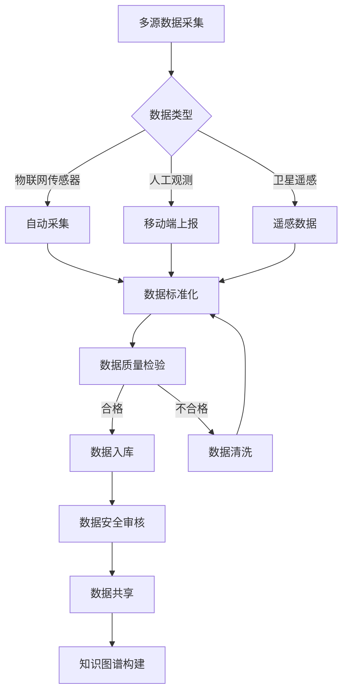
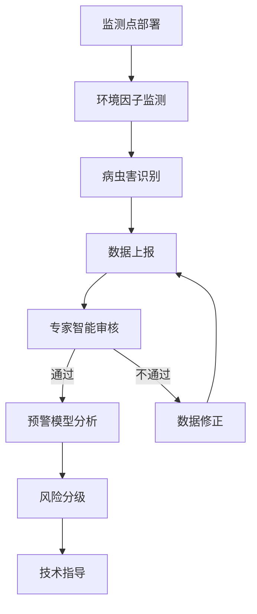
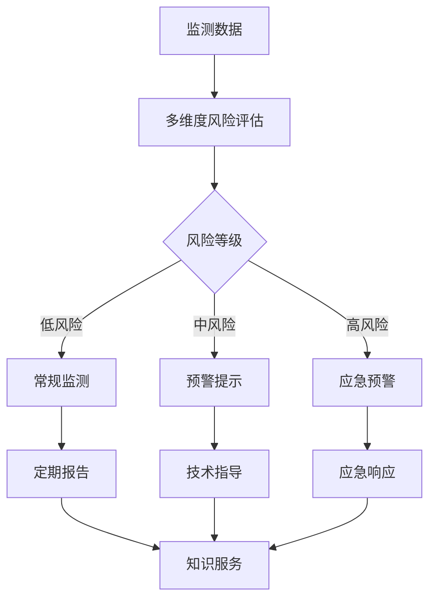
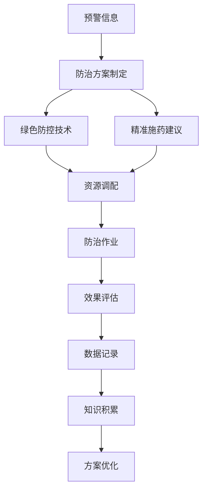
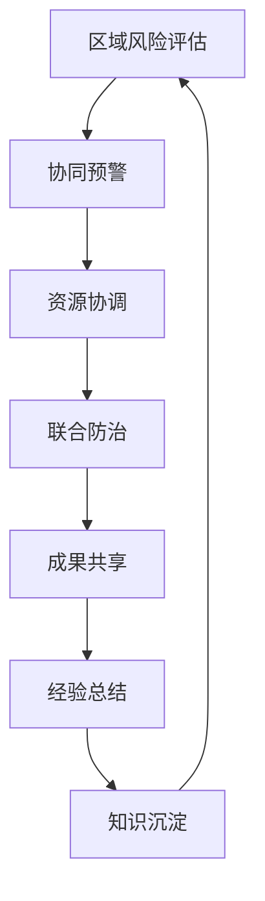
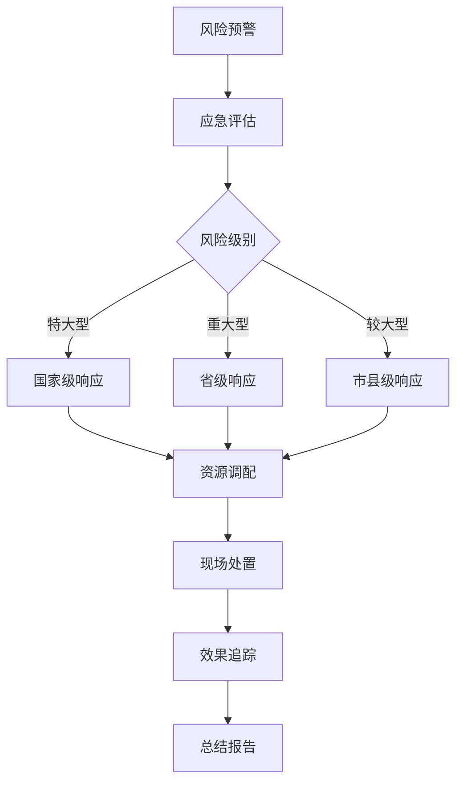

## 业务流程概述

安徽省病虫疫情信息调度指挥平台的业务流程体现了现代植保工作的系统性、智能性和生态性。通过标准化、信息化和智能化的流程设计，构建了一个全面、高效、协同的植保技术创新生态系统，实现从病虫害监测到防治的全链条、全要素智能管理。

### 业务流程设计原则

观点：业务流程设计遵循"生态优先、智能驱动、多元协同"的核心理念。
- 全程可追溯：每个环节的数据和操作都能被精准记录和追踪。
- 多级联动：构建国家、省、县、基层四级植保部门的立体协同网络。
- 智能决策：深度融合大数据分析、人工智能和知识图谱技术，提升决策的科学性和精准性。
- 绿色导向：强调生态文明理念，推广绿色防控和可持续发展技术。

### 主要业务流程

#### 1. 数据采集与治理流程

观点：数据采集与治理是系统智能化的基础，确保数据的高质量和安全性。
- 多源融合：整合物联网、人工观测和遥感等多元数据。
- 标准化：统一数据格式和口径，保证数据一致性。
- 质量控制：建立多维度数据质量评估机制。
- 安全治理：实现数据全生命周期的安全防护。

#### 2. 病虫害监测流程

观点：监测流程是植保工作的神经系统，实现对病虫害的精准感知。
- 全域覆盖：建立省、县、基层多级监测网络。
- 智能识别：运用人工智能技术进行病虫害精准识别。
- 专家审核：引入专家知识系统进行数据验证。

#### 3. 病虫害预警流程

观点：预警流程是系统的智能决策中枢，为农业生产提供精准风险预示。
- 多维评估：综合考虑环境、气象、生态等多元因素。
- 分级响应：根据风险等级采取差异化的防治策略。
- 知识服务：将预警结果转化为可执行的技术指导。

#### 4. 病虫害防治流程

观点：防治流程体现现代植保工作的科学性和生态性。
- 技术路线多元：优先选择生态友好的防治方式。
- 精准施策：根据作物生长状况和风险等级定制防治方案。
- 持续优化：通过效果评估不断完善防治策略。

#### 5. 跨区域联防联控流程

观点：跨区域协同是应对大规模病虫害的关键机制。
- 信息共享：打通区域间信息壁垒。
- 资源整合：实现防治资源的优化配置。
- 知识传承：形成区域联防的最佳实践。

#### 6. 应急响应流程

观点：应急响应流程体现植保工作的快速反应和协同能力。
- 分级响应：根据病虫害风险启动不同级别的应急机制。
- 快速调配：实现跨区域的应急资源优化配置。
- 持续追踪：对应急处置效果进行全程监控。

### 业务流程创新特色

观点：业务流程设计充分体现了现代农业植保工作的科技创新精神。
- 数字赋能：利用信息技术提升植保工作效率。
- 生态优先：强调绿色防控和可持续发展。
- 智能决策：通过大数据和人工智能支持精准防治。
- 开放协同：构建多元主体参与的植保治理新模式。

通过这些创新的业务流程，安徽省病虫疫情信息调度指挥平台将为农业生产提供全方位、智能化的技术支持，推动植保工作迈向现代化、生态化和智能化。
