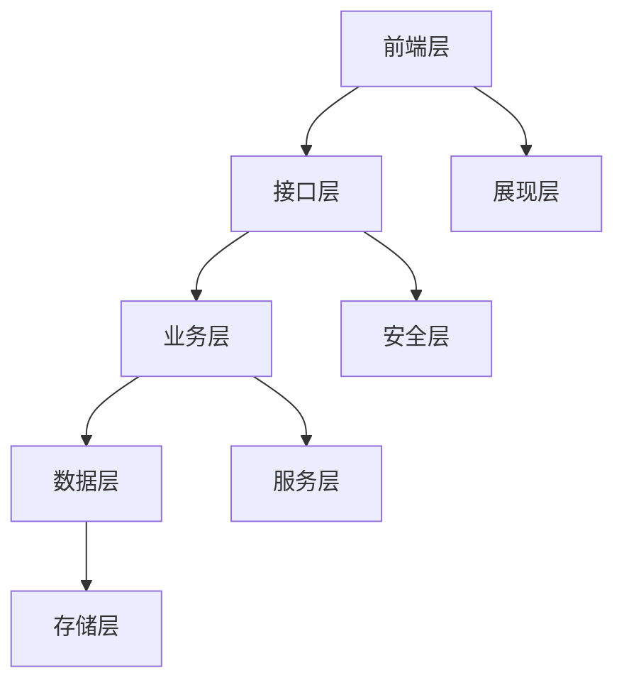
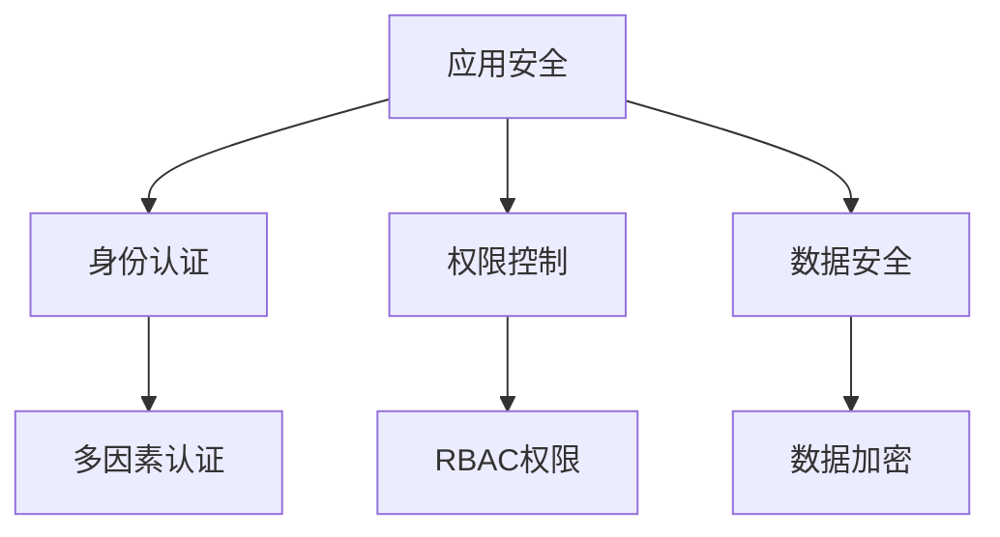

# 建设内容

## 1. 功能建设

### 1.1 需求管理功能
- 需求收集与分析
  - 需求采集表单
  - 需求分类管理
  - 需求优先级评估
  - 需求可行性分析
- 需求评审与确认
  - 评审流程管理
  - 评审意见收集
  - 需求确认流程
  - 需求基线管理
- 需求变更管理
  - 变更申请流程
  - 影响分析功能
  - 变更审批流程
  - 变更历史记录
- 需求追踪管理
  - 需求关联关系
  - 需求状态跟踪
  - 需求完成度监控
  - 需求验证管理

### 1.2 文档管理功能
- 文档创建与编辑
  - 在线文档编辑
  - 模板管理
  - 版本控制
  - 协同编辑
- 文档审批流程
  - 审批流程配置
  - 审批状态管理
  - 意见反馈
  - 修订记录
- 文档存储管理
  - 分类存储
  - 标签管理
  - 全文检索
  - 权限控制

### 1.3 协作管理功能
- 团队协作
  - 任务分配
  - 进度跟踪
  - 团队沟通
  - 资源共享
- 消息通知
  - 系统通知
  - 待办提醒
  - 消息订阅
  - 邮件集成

## 2. 技术建设

### 2.1 系统架构


### 2.2 技术组件
```json
{
  "frontend": {
    "framework": "Vue.js 3.x",
    "ui": "Element Plus",
    "build": "Vite",
    "state": "Pinia"
  },
  "backend": {
    "framework": "Spring Boot",
    "security": "Spring Security",
    "database": "MyBatis Plus",
    "cache": "Redis"
  },
  "database": {
    "main": "MySQL",
    "nosql": "MongoDB",
    "search": "Elasticsearch"
  },
  "devops": {
    "container": "Docker",
    "orchestration": "Kubernetes",
    "ci_cd": "Jenkins",
    "monitor": "Prometheus"
  }
}
```

## 3. 数据建设

### 3.1 数据模型
- 业务数据模型
  - 需求管理模型
  - 文档管理模型
  - 用户管理模型
  - 系统管理模型
- 基础数据模型
  - 字典数据
  - 配置数据
  - 日志数据
  - 统计数据

### 3.2 数据标准
| 数据类型 | 标准规范 | 示例 |
|---------|----------|------|
| 编码规则 | 统一编码标准 | REQ-2024-001 |
| 命名规范 | 驼峰命名法 | userName |
| 字段格式 | 数据类型规范 | datetime: YYYY-MM-DD HH:mm:ss |
| 值域范围 | 数据有效性规则 | status: [0-待处理,1-处理中,2-已完成] |

## 4. 安全建设

### 4.1 安全架构


### 4.2 安全措施
1. 应用安全
   - 登录认证
   - 会话管理
   - 访问控制
   - 操作审计

2. 数据安全
   - 传输加密
   - 存储加密
   - 备份恢复
   - 数据脱敏

3. 系统安全
   - 漏洞扫描
   - 入侵检测
   - 防火墙
   - 安全审计

## 5. 运维建设

### 5.1 部署架构
```json
{
  "environments": {
    "development": {
      "servers": "2台应用服务器",
      "database": "主从架构",
      "cache": "集群部署"
    },
    "testing": {
      "servers": "2台应用服务器",
      "database": "主从架构",
      "cache": "单节点部署"
    },
    "production": {
      "servers": "4台应用服务器",
      "database": "集群架构",
      "cache": "集群部署"
    }
  }
}
```

### 5.2 运维管理
1. 监控管理
   - 系统监控
   - 应用监控
   - 日志监控
   - 告警管理

2. 运维工具
   - 自动化部署
   - 配置管理
   - 日志分析
   - 性能优化 