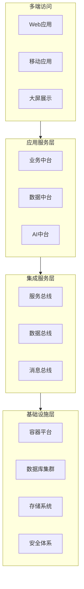
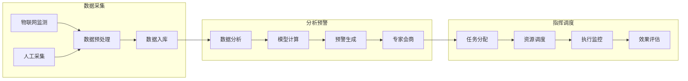
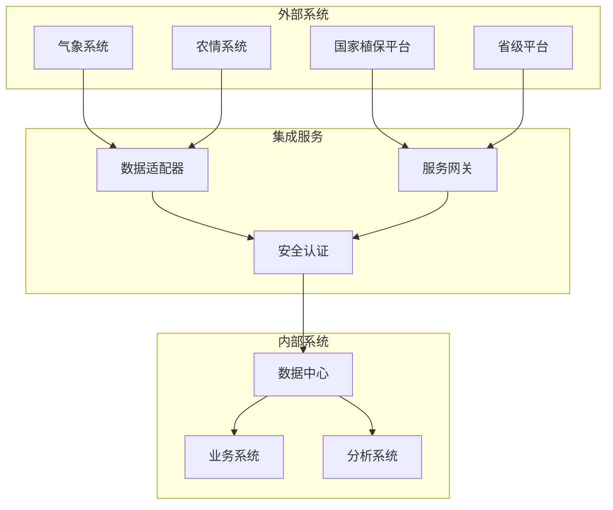
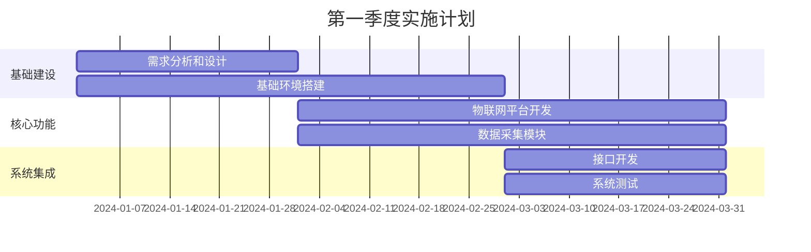
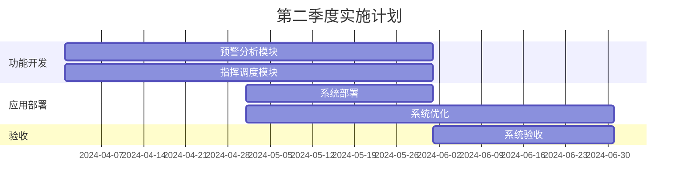
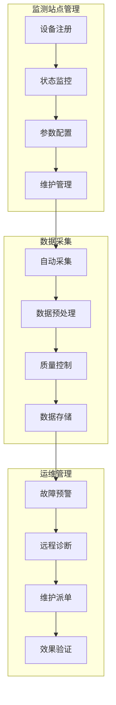

# 建设内容

## 系统集成方案

### 总体集成架构

系统采用分布式微服务架构，通过统一的集成框架实现各个子系统的有机整合：

### 业务集成流程

### 数据迁移策略

数据迁移采用分阶段、可回滚的策略，确保数据迁移的安全性和可靠性：

1. 数据清理阶段：对一期系统数据进行清理和规范化处理
2. 数据转换阶段：按照新系统数据标准进行格式转换
3. 数据迁移阶段：采用增量迁移方式，确保业务连续性
4. 数据验证阶段：通过自动化工具验证数据一致性

### 系统对接方案

系统对接采用标准化的接口规范，实现与各类外部系统的高效集成：

## 技术路线图

### 2024年第一季度

### 2024年第二季度

## 安全保障体系建设

### 安全防护体系

系统将建立完善的纵深防御体系，实现多层次、全方位的安全防护：

1. 网络安全防护
- 部署防火墙、入侵检测系统等安全设备
- 实施网络访问控制和流量监控
- 建立网络安全隔离区，保护核心业务系统

2. 应用安全防护
- 实施统一身份认证和访问控制
- 部署Web应用防火墙，防止应用层攻击
- 建立应用安全审计机制

3. 数据安全防护
- 实施数据分级分类管理
- 建立数据加密传输机制
- 部署数据库审计系统
- 建立数据备份恢复机制

### 等保建设要求

系统将按照等级保护三级标准进行建设，重点实施以下措施：

1. 安全管理制度
- 建立完整的信息安全管理制度体系
- 制定安全事件应急预案
- 建立安全管理责任制

2. 安全技术措施
- 实施访问控制和身份认证
- 部署安全审计和监控预警
- 建立系统容灾备份机制

3. 安全运维管理
- 建立安全运维管理流程
- 定期开展安全检查和评估
- 建立安全事件响应机制

## 物联网数据应用与管理系统

本系统着眼于提升物联网监测数据的采集、管理和应用能力，为病虫害防控工作提供坚实的数据基础。

### 物联网监测站点管理

系统将建立统一的物联网监测设备管理平台，实现对全省监测设备的智能化管理。主要功能包括设备注册管理、运行状态监控、参数远程配置等。平台支持多种类型监测设备的标准化接入，确保数据采集的规范性和可靠性。同时，系统具备设备故障预警和远程诊断功能，提高设备维护效率。

### 数据采集与处理

系统采用先进的边缘计算技术，实现气象、虫情、病情等监测数据的智能化采集和处理。通过部署边缘计算节点，在数据源头进行预处理和初步分析，有效提升数据传输效率和质量。系统配备专业的数据质量控制模块，具备异常数据识别、数据修正等功能，确保数据的准确性和可用性。

### 数据可视化分析

系统提供丰富的数据可视化工具，支持多维度的数据展示和分析。通过直观的图表展示、空间分析等方式，帮助用户快速理解和利用监测数据。系统支持自定义数据分析模板，满足不同用户的个性化分析需求。

## 病虫害智能识别与预警系统

本系统整合多源数据资源，构建智能化的病虫害识别和预警体系，提供科学的决策支持。

### 图像智能识别

系统采用深度学习技术，开发专业的病虫害图像识别模型。通过持续的模型训练和优化，系统可准确识别常见农作物病虫害，识别准确率达到90%以上。系统支持移动端图像采集和实时识别，方便基层农技人员快速诊断病虫害情况。

### 预警模型应用

系统基于气象数据、历史发生规律、作物生长周期等多维数据，构建科学的病虫害预测预报模型。通过机器学习算法，系统可分析病虫害发生发展趋势，提供精准的预警信息。同时，系统具备模型自学习能力，可根据实际防控效果不断优化预测模型。

## 专题分析与决策支持系统

系统针对重点病虫害，开发专业的分析决策工具，提供精准的防控指导。

### 重大病虫害分析决策

系统将针对小麦赤霉病、草地贪夜蛾等重大病虫害，建立专门的分析模型和决策支持工具。通过整合历史数据、气象条件、农事活动等信息，提供科学的预测分析和防控建议。系统支持多维度的数据分析，包括：

1. 发生趋势分析
- 基于历史数据的时空分布分析
- 结合气象条件的发展趋势预测
- 农事活动影响因素分析

2. 损失评估分析
- 受灾面积动态评估
- 产量损失预测分析
- 经济损失评估

3. 防控效果分析
- 防控措施效果评估
- 成本效益分析
- 经验总结与模型优化

### 小麦赤霉病防控分析

系统整合气象条件、品种特性、历史发生等信息，构建小麦赤霉病预测预报模型。通过分析发病条件和趋势，系统可及时发出预警信息，并提供科学的防控建议。系统支持防控适期的精准推送，指导农户合理安排防控时间。

### 草地贪夜蛾监测防控

系统建立草地贪夜蛾迁飞预测模型，结合气象数据和虫情监测信息，分析预测虫害扩散趋势。通过可视化展示迁飞路径，系统帮助决策人员制定科学的防控策略。同时，系统提供防控案例库，供基层人员参考借鉴。

## 绿色防控管理系统

本系统致力于推广绿色防控技术，促进农业可持续发展。

### 技术库管理

系统建立完整的绿色防控技术知识库，收录各类防控技术、应用案例和研究成果。通过专业的评估体系，系统可为不同地区、不同作物推荐适宜的防控技术。系统支持技术交流和经验分享，促进绿色防控技术的推广应用。

### 示范区建设管理

系统支持绿色防控示范区的规划建设和管理，记录防控措施实施情况和效果评估。通过数据分析，系统可总结推广成功经验，指导其他地区开展绿色防控工作。系统提供示范区建设标准和评价体系，确保示范效果。

## 协同办公与信息交流系统

系统打造现代化的办公协同平台，提升工作效率和服务质量。

### 移动办公应用

系统开发便捷的移动端应用，支持外业数据采集、信息上报和任务处理。通过离线数据采集和同步机制，确保野外工作数据的及时上传和共享。系统提供个性化的工作界面，满足不同岗位人员的办公需求。

### 视频会商服务

系统提供专业的远程会议和专家会诊服务，支持多方视频会议、屏幕共享和在线交流。通过高清视频传输和智能会议管理，保障远程会议的质量和效果。系统支持会议录制和回放，方便后期学习和参考。

## 数字知识库系统

系统构建专业的植保知识服务平台，提供全面的知识支持。

### 知识资源管理

系统采用先进的知识管理技术，对病虫害防控相关的科技文献、技术资料、案例经验进行系统化管理。通过智能检索和知识图谱，帮助用户快速获取所需信息。系统支持知识更新和共享，促进防控经验的积累和传播。

### 专家资源服务

系统建立完善的植保专家库，提供便捷的专家咨询和技术指导服务。通过专家在线值班机制，确保技术咨询的及时响应。系统支持专家资源的合理调配，提高专家服务的效率和质量。
