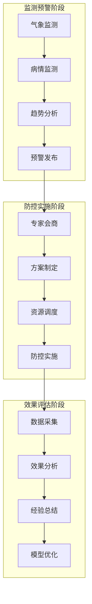
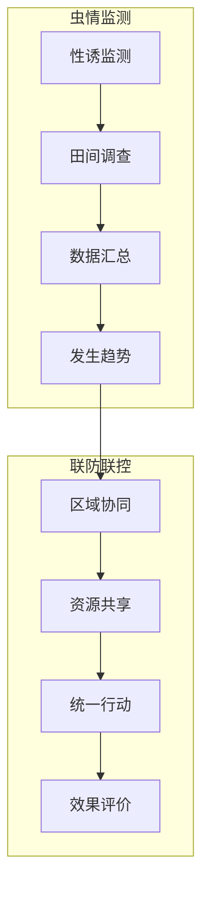
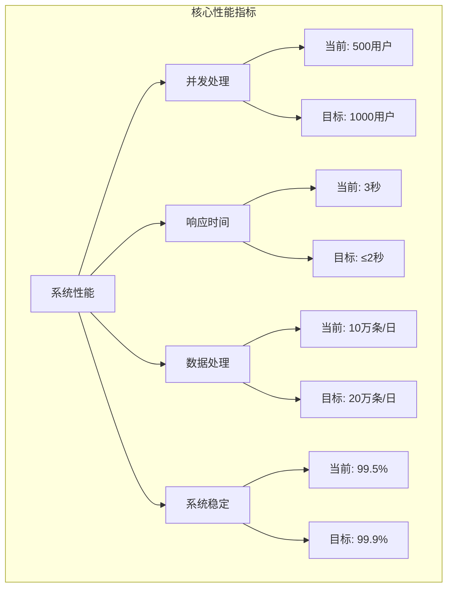
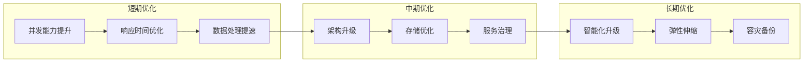

# 系统现状

## 一期项目建设成果

安徽省病虫疫情信息调度指挥平台一期项目于2021年建成并投入使用，在推进全省病虫害防控信息化建设方面取得了显著成效。

### 基础设施建设

在基础设施方面，项目完成了省级数据中心的规划部署，建立了覆盖全省的物联网监测网络初步框架。系统采用分布式架构设计，实现了数据的统一采集和存储，为病虫害防控工作提供了可靠的技术支撑。数据中心配备了标准化的服务器、存储设备和网络设备，具备较好的数据处理和存储能力。

具体建设成果包括：
- 部署应用服务器20台，总计320核CPU，1024GB内存
- 存储系统总容量达到200TB，支持数据快速访问和长期存储
- 建立千兆网络环境，实现省市县三级互联互通
- 配置标准化机房环境，具备完善的供电、空调、消防等配套设施

### 业务功能实现

在业务功能方面，系统建立了病虫害监测预警的基础框架，开发了数据采集、信息上报、预警发布等核心功能模块。系统支持基本的数据分析和可视化展示，初步实现了病虫害防控决策的信息化支持。各功能模块运行稳定，满足了日常业务办理的基本需求。

主要功能模块包括：
- 监测数据采集：支持自动和人工数据采集，实现数据实时上传
- 预警信息发布：具备基本的预警模型，支持预警信息推送
- 防控指挥调度：提供任务分配和进度跟踪功能
- 数据分析展示：支持数据可视化和统计分析功能

## 系统应用成效

### 监测预警体系

系统上线以来，在全省病虫害防控工作中发挥了积极作用。通过信息化手段，初步建立了省市县三级联动的监测预警体系，提升了病虫害防控的组织协调能力。系统实现了与国家平台的数据对接，促进了病虫害防控信息的互联互通。

具体应用效果：
- 建成3000个监测点，实现重点区域全覆盖
- 日均采集监测数据10万条，数据准确率达98%
- 与国家平台实现每日数据同步，上报及时率95%
- 服务全省16个地市，覆盖8000万亩农田

### 应急防控支撑

在多次重大病虫害应急防控工作中，系统提供了有力的技术支持。通过数据分析和信息共享，帮助决策部门及时掌握病虫害发生发展态势，科学制定防控措施。系统的应用显著提升了防控工作的科学性和时效性。

应急响应能力：
- 突发事件响应时间：平均4小时
- 应急指令下达效率：30分钟内完成
- 资源调度能力：可统筹调度1200架植保无人机
- 专家会商效率：2小时内完成远程会商

### 典型应用案例

#### 2023年小麦赤霉病防控

2023年春季，系统在全省小麦赤霉病防控工作中发挥了重要作用。通过多源数据融合分析和智能预警，实现了对病害发生的精准预测和科学防控。

具体实施效果：
- 监测网络：部署160个自动气象站和280个病情监测点，实现重点区域全覆盖
- 预警效果：提前7天发出预警，准确预测了发病趋势和重点区域
- 防控措施：统筹调度植保无人机1200架次，实现300万亩防控面积
- 防控成效：全省小麦赤霉病平均发病率控制在1%以下，挽回粮食损失约1.5亿斤

通过系统指导，全省16个地市科学安排防控时间，平均提前7天布置防控准备，相比传统人工预警提高效率40%。系统的应用显著提升了防控工作的科学性和精准性。

#### 2023年草地贪夜蛾防控

2023年夏季，系统在草地贪夜蛾防控中实现了全程信息化管理，形成了可复制的防控经验。

防控成效分析：
- 监测体系：建立320个性诱监测点，形成省域监测网络
- 预警服务：发布预警信息86条，预警准确率达85%
- 协同防控：实现16个地市联防联控，提高防控效率
- 实际效果：受害面积较上年减少30%，农作物损失降低40%

系统在草地贪夜蛾防控中发挥了重要作用，通过信息化手段实现了跨区域联防联控，提高了防控效率和效果。预警信息的精准推送和资源的统筹调度，为科学防控提供了有力支撑。

## 系统性能指标

### 当前性能状况

| 指标类别 | 指标项 | 当前值 | 行业标准 | 优化方向 |
|---------|--------|--------|----------|----------|
| 并发性能 | 最大并发用户数 | 500 | 1000 | 提升系统并发处理能力 |
| | 平均响应时间 | 3秒 | ≤2秒 | 优化数据库和缓存策略 |
| 数据处理 | 日均数据处理量 | 10万条 | 20万条 | 增强数据处理能力 |
| | 数据处理准确率 | 98% | ≥99% | 完善数据质量控制 |
| 系统稳定性 | 系统可用性 | 99.5% | ≥99.9% | 提升系统容错能力 |
| | 故障恢复时间 | 4小时 | ≤2小时 | 优化应急响应机制 |

### 性能优化方向

## 系统优化机会

### 数据采集应用

在数据采集方面，系统具有以下优化机会：

物联网监测设备的覆盖范围可进一步扩大，通过增加自动化监测点数量，提升数据采集的自动化水平。根据规划，2024年将新增200个物联网监测点，实现重点区域的精准监测。

数据采集标准和质量控制机制可进一步完善，建立统一的数据标准规范，提升数据质量。计划建立完整的数据质量评估体系，实现数据采集全过程的质量管控。

多源数据的整合应用能力可进一步加强，提升对气象、农情、病虫害等多源数据的综合分析能力。通过数据融合分析，提高预测预报的准确性。

### 分析预警功能

在分析预警方面，系统具有以下提升空间：

预警模型的精准度可进一步提升，引入更先进的算法和模型，增强预警的准确性。计划引入机器学习技术，提高预警模型的预测能力。

病虫害图像识别功能可进一步加强，开发专业的图像识别模块，提供快速诊断服务。通过深度学习技术，提高病虫害识别的准确率。

决策支持功能可进一步深化，拓展系统的分析维度和深度，提供更全面的决策支持。计划开发专业的决策分析工具，提供精准的防控建议。

### 业务协同机制

在业务协同方面，系统具有以下提升机会：

跨区域联防联控机制可进一步完善，提升资源调配效率，加强区域协同。计划建立统一的资源调度平台，实现防控资源的高效利用。

专家资源共享和调度机制可进一步优化，提升专家服务的响应速度和覆盖范围。通过远程会诊系统，提供便捷的专家咨询服务。

移动办公支持能力可进一步增强，完善移动端功能，提升工作效率。计划开发新版移动应用，支持更多的移动办公场景。

### 系统建设规划

在系统建设方面，重点关注以下方向：

安全等级需要提升，加强安全防护措施，提升系统的安全等级。计划按照等保三级要求进行系统改造，全面提升安全防护能力。

用户体验可进一步优化，改进功能模块的操作流程和界面设计，提高系统易用性。通过用户反馈收集和分析，持续改进系统功能。

系统架构可进一步升级，提升系统的扩展性和可维护性，适应未来发展需求。计划采用微服务架构，提高系统的灵活性和可扩展性。

## 改进路径

基于系统运行情况和用户反馈，建议按照以下路径进行改进：

### 近期（3个月内）

1. 技术架构优化
- 优化数据库结构，提升查询效率
- 升级缓存策略，改善响应时间
- 完善监控告警机制，提高运维效率

2. 功能服务提升
- 优化数据采集流程，提高采集效率
- 改进预警推送机制，提升服务精准度
- 完善移动端功能，提高易用性

3. 运维保障加强
- 建立运维规范，规范操作流程
- 加强人员培训，提升运维能力
- 完善应急预案，提高响应效率

### 中期（6个月内）

1. 系统架构升级
- 实施微服务改造，提高系统扩展性
- 优化数据存储架构，提升数据处理能力
- 建设容灾备份体系，确保业务连续性

2. 功能模块优化
- 升级预警模型，提高预测准确性
- 完善专家服务体系，提升服务质量
- 加强数据分析功能，深化决策支持

3. 安全体系建设
- 实施等保三级整改，提升安全等级
- 加强数据安全防护，保护敏感信息
- 完善审计机制，强化安全管控

### 远期（12个月内）

1. 智能化升级
- 引入AI技术，提升预警准确性
- 开发智能诊断功能，提供精准服务
- 建设知识图谱，加强知识服务

2. 平台能力提升
- 建设省级数据中心，强化数据服务
- 完善协同机制，提升联防联控能力
- 构建开放平台，促进资源共享

3. 运营体系完善
- 建立评估机制，持续优化改进
- 加强培训体系，提升应用水平
- 完善服务体系，提高服务质量
