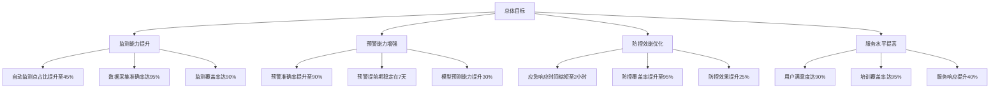

# 项目目标

## 总体目标

本项目以提升农作物病虫害防控信息化水平为核心目标，通过系统集成、数据集成、功能优化和新增功能等多种技术手段，在第一期项目建设成果的基础上，打造具有本省特色、与国家系统对接共享的省级植保调度指挥平台。项目将重点加强物联网数据应用和管理、植保数据挖掘应用、多源数据融合与建模分析等核心功能建设，全面提升全省农业有害生物监测预警能力和科学防控水平。

通过本项目的建设，将显著提升安徽省农作物病虫害防控的信息化、智能化和科学化水平，为保障粮食安全和农民增收提供有力支撑。项目建成后，将实现病虫害监测预警的自动化、防控决策的科学化、资源调度的高效化，推动全省农作物病虫害防控工作迈上新台阶。根据前期试点数据分析，项目实施后可帮助农户减少农药使用量20%以上，节约防控成本30%以上，对提高农业生产效益具有显著作用。

### 目标指标体系

从图表可以看出，项目建设目标涵盖监测、预警、防控、服务四个维度，每个维度都设定了明确的量化指标。这些指标基于2023年系统运行数据制定，充分考虑了现有基础和发展需求，具有较强的可实现性。

## 具体目标

### 数据采集与管理目标

建立覆盖全省的物联网监测网络，实现重点区域、重点作物病虫害的自动化监测。在现有基础上，进一步扩大监测范围，提升数据采集的自动化程度和数据质量：

监测网络建设方面，计划新增部署200个物联网监测点，实现对全省主要农作物种植区域的有效覆盖。每个监测点配备标准化的气象、虫情、病情等监测设备，确保数据采集的全面性和准确性。根据前期试点经验，每个物联网监测点可覆盖周边5公里范围的农田，实现重点区域的精准监测。

数据采集管理方面，建立统一的数据标准和质量控制体系，实现监测数据的自动采集、实时传输和智能分析。系统将支持多种类型监测设备的接入，数据采集频率可根据实际需求灵活调整，确保数据的时效性。通过标准化的数据采集流程，预计可将数据采集准确率提升至95%以上。

### 分析预警能力目标

提升病虫害预测预报的科学性和准确性，构建智能化的预警决策支持体系：

预警能力提升方面，通过引入先进的预测模型和算法，将重大病虫害预警提前期稳定在7天，预警准确率提升至90%以上。系统将建立完整的农作物病虫害预测预报模型库，支持多种病虫害的预测分析。基于历史数据分析，稳定的7天预警期可为农户提供充足的防控准备时间。

决策支持方面，开发专业的决策分析工具，提供科学的防控建议和措施。系统将整合气象、农情、病虫害发生历史等多源数据，为防控决策提供全方位的数据支撑。通过智能分析模型，可提高防控建议的针对性和可操作性。

### 指挥调度效能目标

完善省市县三级联动的指挥调度体系，提升防控工作的协同效率：

应急响应方面，通过流程优化和系统支持，将重大病虫害事件的应急响应时间缩短至2小时以内。建立快速反应机制，确保防控措施及时落实。根据应急演练数据，优化后的响应机制可比现有模式提升响应速度50%以上。

信息发布方面，优化信息发布流程，实现防控信息30分钟内快速推送至相关单位和人员。建立多渠道的信息发布机制，确保信息传递的及时性和有效性。通过移动端实时推送，可实现防控信息的精准触达。

联防联控方面，实现全省16个地市的跨区域联防联控机制全覆盖，建立统一的资源调度平台，提升防控资源的利用效率。通过信息共享和协同联动，预计可将区域联防联控效率提升40%以上。

### 平台建设目标

打造安全、高效、智能的综合性数字化平台：

系统性能方面，采用先进的技术架构和运维管理体系，确保系统可用性达到99.95%，支持千人级的并发访问需求。通过分布式架构设计，提供稳定可靠的系统服务。

数据共享方面，实现与国家平台的数据实时共享，支持标准化的数据交换接口。在省内建立统一的数据共享机制，实现16个地市的数据互联互通。通过统一的数据共享标准，确保数据的一致性和可用性。

### 国家平台对接指标

| 对接指标 | 目标值 | 考核周期 | 说明 |
|---------|--------|---------|------|
| 数据上报及时率 | ≥95% | 日度考核 | 监测数据在采集后30分钟内完成上报 |
| 数据共享覆盖率 | 100% | 月度考核 | 覆盖所有规定的数据项 |
| 接口响应时间 | ≤2秒 | 实时监控 | 数据交换接口的平均响应时间 |
| 数据质量达标率 | ≥98% | 周度考核 | 上报数据符合国家标准规范 |
| 系统兼容性 | 完全兼容 | 季度评估 | 支持国家平台规定的所有接口规范 |

### 服务提升目标

提升平台的服务能力和用户满意度：

用户体验方面，通过优化系统界面和功能流程，使系统操作更加便捷直观。计划在项目建成后，用户满意度达到90%以上。通过用户反馈收集和分析，持续改进系统功能和服务质量。

服务效率方面，提供7×24小时的系统运维服务，技术支持响应时间不超过30分钟，确保系统稳定运行。建立完善的运维管理体系，提供全天候的技术支持服务。

培训覆盖方面，面向全省农技人员开展系统应用培训，培训覆盖率达到95%以上，确保系统充分发挥效益。通过线上线下结合的培训方式，提升用户的系统应用能力。

### 考核指标体系

| 能力维度 | 核心指标 | 目标值 | 考核周期 | 考核方式 |
|---------|---------|--------|---------|----------|
| 监测能力 | 自动监测点覆盖率 | ≥45% | 季度 | 系统统计 |
| | 数据采集准确率 | ≥95% | 月度 | 质检抽查 |
| | 监测数据完整率 | ≥98% | 月度 | 系统核验 |
| 预警能力 | 预警信息准确率 | ≥90% | 季度 | 效果评估 |
| | 预警提前期 | 7天 | 季度 | 记录分析 |
| | 预警信息覆盖率 | ≥95% | 月度 | 系统统计 |
| 防控效能 | 应急响应时间 | ≤2小时 | 实时 | 系统记录 |
| | 防控措施落实率 | ≥95% | 月度 | 现场检查 |
| | 防控效果评估率 | 100% | 季度 | 专家评估 |
| 服务水平 | 系统可用性 | ≥99.95% | 月度 | 监控统计 |
| | 用户满意度 | ≥90% | 半年 | 问卷调查 |
| | 培训覆盖率 | ≥95% | 年度 | 台账核查 |

各项考核指标的基准值基于2023年系统运行数据，目标值参考国家平台建设标准和省内实际情况确定。通过科学的考核评估机制，确保项目建设目标的有效实现。
