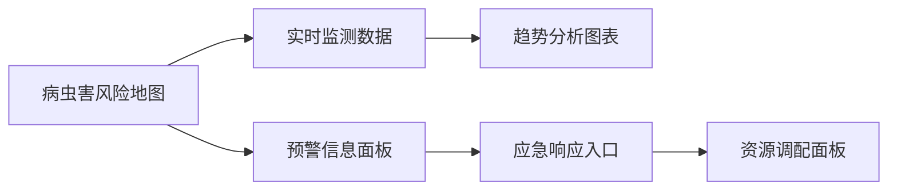
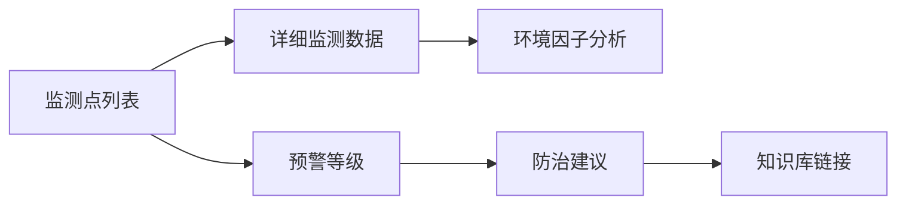
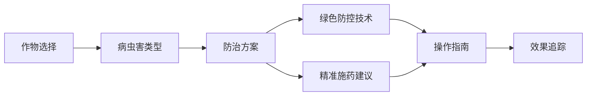

## 界面设计总体理念

安徽省病虫疫情信息调度指挥平台的界面设计以"专业、智能、生态"为核心，致力于为植保工作者提供直观、高效、富有人文关怀的数字化工作平台。界面设计不仅追求美观和功能性，更注重用户体验、生态文明理念和技术创新，全面支持现代植保工作的信息化转型。

### 设计原则

观点：界面设计遵循"用户中心、专业至上、生态优先"的设计理念。
- 专业性：充分体现植保行业的专业特征和工作逻辑。
- 智能性：通过交互设计体现系统的智能决策能力。
- 生态性：界面风格和交互逻辑体现生态文明理念。
- 包容性：支持多终端、多场景、多用户群体的使用需求。
- 无障碍：确保界面对不同能力用户的友好性。

### 视觉风格

观点：界面视觉风格融合科技感、生态美学和人文关怀。
- 色彩系统：以生态绿、专业蓝为主，体现植保工作的专业性和生态性。
  - 主色调：生态绿（#2E8B57）和专业蓝（#4A90E2）
  - 辅助色：柔和的灰色和白色，增强可读性
  - 强调色：橙色（#FF6B35），用于突出重要信息和预警
- 字体设计：
  - 主字体：等宽黑体，保证信息清晰度
  - 字号：主要内容14-16px，标题18-24px
  - 行间距：1.5倍，提高阅读舒适度
- 图标风格：简约线性图标，结合生态元素，易于识别和理解

### 暗黑模式设计

观点：提供多样化的视觉体验，减少夜间使用的视觉疲劳。
- 色彩调整：
  - 背景色：深灰色（#121212）
  - 文字颜色：柔和的浅灰色和白色
  - 图表配色：保持清晰度和可读性
- 用户选择：
  - 支持手动切换
  - 跟随系统设置
  - 根据时间自动切换

### 关键界面设计

#### 1. 数据总览大屏

观点：大屏界面是系统的"指挥中心"，提供全局视角和智能决策支持。
- 地图可视化：多层次展示区域病虫害风险分布
  - 热力图：风险程度颜色渐变
  - 图层切换：环境因子、历史数据、预测风险
- 实时数据：动态更新监测点数据
  - 数据卡片：简洁展示关键指标
  - 趋势图：展示数据变化轨迹
- 预警面板：
  - 风险等级颜色编码
  - 详细预警信息展开
- 应急响应：
  - 快速启动应急预案
  - 资源调配可视化

#### 2. 监测预警界面

观点：监测预警界面是系统的智能决策中枢。
- 监测点管理：
  - 地图和列表双视图
  - 多维度筛选和排序
- 数据钻取：
  - 单点详情弹窗
  - 历史数据对比
- 预警分级：
  - 颜色和图标直观展示风险等级
  - 风险趋势预测
- 智能建议：
  - 基于大数据的个性化防治指导
  - 链接专家知识库

#### 3. 防治指导界面

观点：防治指导界面是技术服务的核心。
- 个性化推荐：
  - 根据作物、区域、生长阶段定制方案
  - AI智能匹配最佳防治技术
- 技术路线：
  - 突出绿色防控和生态友好方法
  - 环境影响评估
- 操作指南：
  - 图文并茂的实施步骤
  - 视频教学资源
- 效果追踪：
  - 防治效果记录
  - 数据反馈和持续优化

#### 4. 移动端界面

观点：移动端界面为一线工作者提供便捷的现场服务。
- 轻量化设计：
  - 简化功能，突出关键操作
  - 大按钮、清晰图标
- 离线支持：
  - 缓存关键数据和功能
  - 自动同步机制
- 快速数据录入：
  - 拍照识别病虫害
  - 语音输入
  - 表单智能填充
- 实时同步：
  - 现场数据即时上传
  - 低网络环境优化

### 无障碍与包容性设计

观点：界面设计应照顾不同用户群体的使用需求。
- 色彩无障碍：
  - 色盲友好配色
  - 高对比度模式
- 字体与缩放：
  - 支持用户自定义字体大小
  - 文字缩放不影响布局
- 屏幕阅读器：
  - 完善的 ARIA 标签
  - 语音朗读支持
- 交互设计：
  - 键盘导航
  - 手势识别
  - 语音控制

### 交互设计特色

观点：交互设计注重专业性、智能性和用户体验的平衡。
- 上下文关联：模块间数据无缝衔接
- 智能引导：个性化操作建议
- 快捷操作：常用功能快速入口
- 即时反馈：清晰的操作结果提示

通过精心设计的界面，安徽省病虫疫情信息调度指挥平台将为植保工作者提供一个既专业又友好的数字化工作平台，推动农业植保事业的现代化、智能化和生态化转型。
