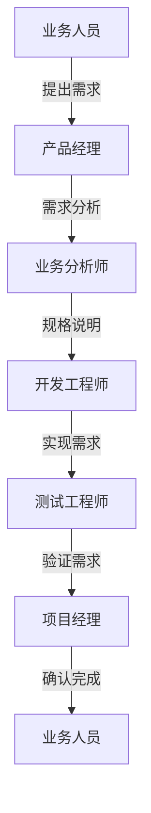
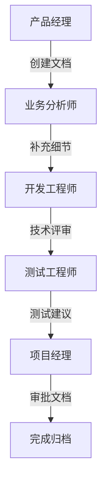

# 用户角色定义

## 1. 角色概述

系统定义了以下主要用户角色：

| 角色名称 | 角色描述 | 主要职责 |
|---------|---------|---------|
| 系统管理员 | 负责系统运维和配置 | 用户管理、权限配置、系统维护 |
| 项目经理 | 负责项目整体管理 | 项目规划、资源调配、进度管理 |
| 产品经理 | 负责产品需求管理 | 需求收集、分析、规划 |
| 业务分析师 | 负责需求分析和规格说明 | 需求分析、业务建模、规格说明 |
| 开发工程师 | 负责需求实现 | 技术方案、代码开发 |
| 测试工程师 | 负责需求验证 | 测试用例、测试执行 |
| 业务人员 | 需求提出者 | 提出需求、确认需求 |

## 2. 角色权限矩阵

### 2.1 功能权限

| 功能模块 | 系统管理员 | 项目经理 | 产品经理 | 业务分析师 | 开发工程师 | 测试工程师 | 业务人员 |
|---------|-----------|----------|----------|------------|------------|------------|----------|
| 用户管理 | ✓ | - | - | - | - | - | - |
| 权限配置 | ✓ | - | - | - | - | - | - |
| 项目管理 | ✓ | ✓ | ✓ | - | - | - | - |
| 需求管理 | ✓ | ✓ | ✓ | ✓ | ✓ | ✓ | ✓ |
| 文档管理 | ✓ | ✓ | ✓ | ✓ | ✓ | ✓ | - |
| 统计分析 | ✓ | ✓ | ✓ | ✓ | - | - | - |

### 2.2 数据权限

| 数据类型 | 系统管理员 | 项目经理 | 产品经理 | 业务分析师 | 开发工程师 | 测试工程师 | 业务人员 |
|---------|-----------|----------|----------|------------|------------|------------|----------|
| 系统配置 | 读写 | 只读 | 只读 | - | - | - | - |
| 项目数据 | 读写 | 读写 | 读写 | 只读 | 只读 | 只读 | 只读 |
| 需求数据 | 读写 | 读写 | 读写 | 读写 | 只读 | 只读 | 只读 |
| 测试数据 | 读写 | 读写 | 只读 | 只读 | 只读 | 读写 | - |

## 3. 角色操作流程

### 3.1 需求管理流程

### 3.2 文档管理流程
