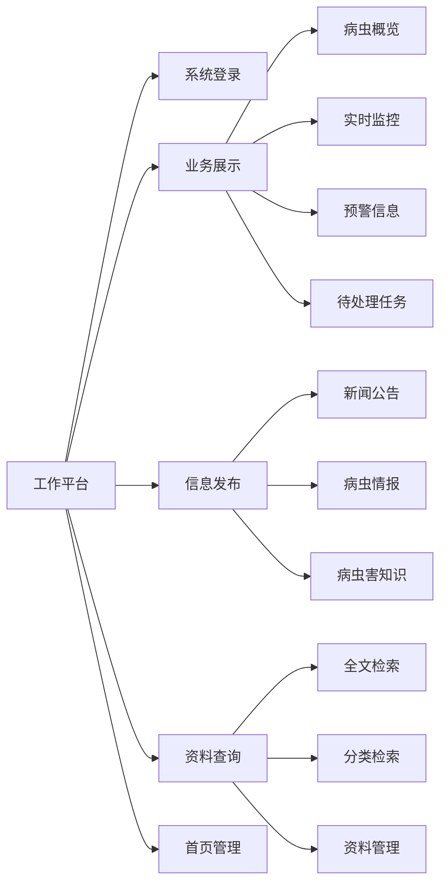

# 1. 工作平台

工作平台是安徽省病虫疫情信息调度指挥平台的基础功能模块，为用户提供系统访问入口和日常工作界面。该模块包含系统登录、业务展示、信息发布、资料查询和首页管理等功能，实现用户权限管理、数据展示、信息发布和资料管理等基本功能。

## 功能逻辑图

## 1.1 系统登录

<!--@include: @/docs/requirements/1-work-platform/1-1-system-login.md-->

## 1.2 业务展示

<!--@include: @/docs/requirements/1-work-platform/1-2-business-display.md-->

## 1.3 信息发布

<!--@include: @/docs/requirements/1-work-platform/1-3-information-publish.md-->

## 1.4 资料查询

<!--@include: @/docs/requirements/1-work-platform/1-4-resource-query.md-->

## 1.5 首页管理 

<!--@include: @/docs/requirements/1-work-platform/1-5-homepage-management.md-->
