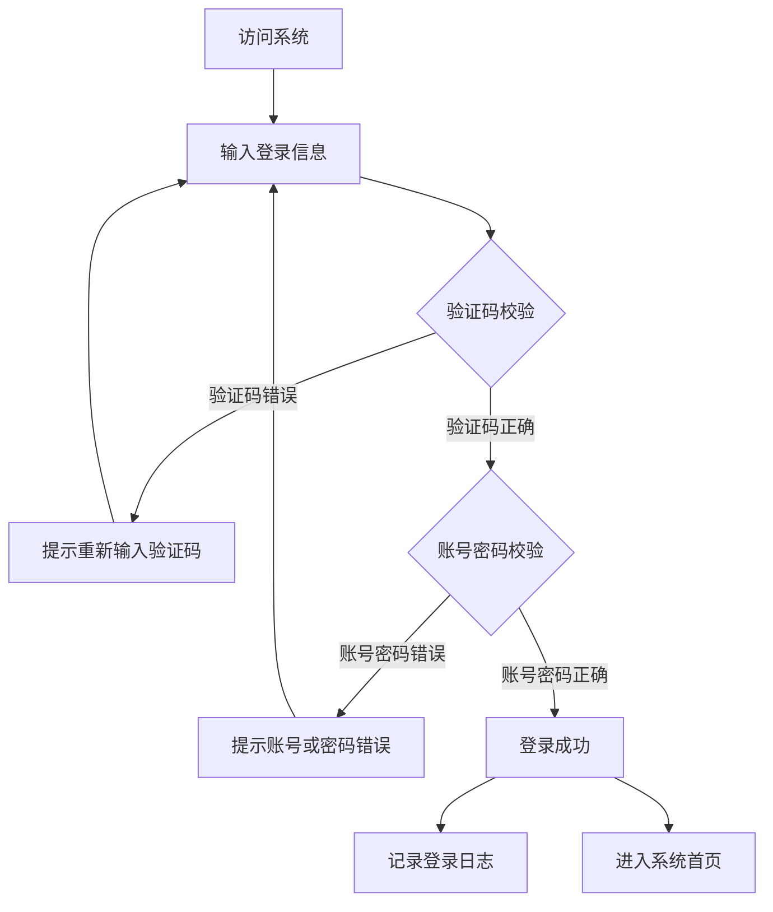

<a href="/diagrams/prototype/1-1-system-login.html" target="_blank" rel="noopener noreferrer">查看登录界面原型</a>

### 功能定义

系统登录功能是工作平台的统一入口，通过账号、密码和验证码的方式，实现对用户身份的认证，确保系统的安全访问。该功能支持省级平台web端的用户登录，是用户访问系统其他功能的前置条件。

### 流程与逻辑

1. 登录流程
   - 用户访问系统登录页面
   - 系统生成并显示验证码图片
   - 用户输入账号、密码和验证码
   - 系统进行验证码校验
   - 验证码正确后，进行账号密码校验
   - 校验通过后，记录登录日志并跳转到系统首页
   - 校验失败时，显示相应的错误提示

2. 安全控制
   - 密码传输采用加密方式
   - 验证码图片定时刷新
   - 登录失败次数限制，超过限制次数后锁定账号
   - 支持会话超时自动退出
   - 记录登录IP和时间等信息

3. 异常处理
   - 验证码输入错误：提示"验证码错误，请重新输入"
   - 账号不存在：提示"账号或密码错误"
   - 密码错误：提示"账号或密码错误"，并记录错误次数
   - 账号被锁定：提示"账号已被锁定，请联系管理员"
   - 系统异常：提示"系统繁忙，请稍后重试"

### 数据项

#### 输入数据项

| 编号 | 交互对象 | 输入项 | 定义 | 数据类型 |
|------|----------|--------|------|----------|
| 1 | 用户 | 账号 | 用户登录账号 | 字符串 |
| 2 | 用户 | 密码 | 用户登录密码 | 字符串 |
| 3 | 用户 | 验证码 | 图形验证码 | 字符串 |

#### 输出数据项

| 编号 | 交互对象 | 输出项 | 定义 | 数据类型 |
|------|----------|--------|------|----------|
| 1 | 系统 | 验证码图片 | 随机生成的验证码图片 | 图片 |
| 2 | 系统 | 登录结果 | 登录成功或失败的结果信息 | 布尔值 |
| 3 | 系统 | 错误提示 | 登录失败时的错误提示信息 | 字符串 |

#### 数据规则和约束
- 账号：长度6-20位，支持字母、数字、下划线
- 密码：长度8-20位，必须包含字母和数字
- 验证码：4位字母或数字组合
- 登录失败次数限制：连续失败5次后锁定账号
- 会话超时时间：30分钟

### 用户访问权限

本功能面向所有系统用户，包括：
- 省级管理员
- 市级管理员
- 县级管理员
- 普通用户

### 界面设计

#### 界面布局
1. 登录页面主要分为以下区域：
   - 系统名称和Logo区域（顶部居中）
   - 登录表单区域（中央）
   - 页脚信息区域（底部）

2. 登录表单包含：
   - 账号输入框
   - 密码输入框
   - 验证码输入框和验证码图片
   - 登录按钮
   - 记住账号选项

3. 交互设计
   - 输入框获得焦点时显示边框高亮效果
   - 验证码图片支持点击刷新
   - 登录按钮在输入完整时高亮显示
   - 错误提示信息在输入框下方红色显示
   - 支持Enter键提交登录

### 招标文件中的原文信息

> 实现通过账号、密码、验证码登录省级平台 web 端。 