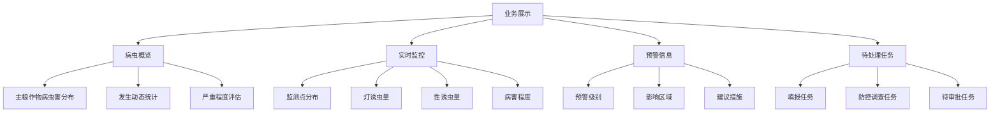

<a href="/diagrams/prototype/1-2-business-display.html" target="_blank" rel="noopener noreferrer">查看业务展示界面原型</a>

### 功能定义

业务展示功能是工作平台的核心展示模块，通过集中展示安徽省当前主要病虫害总体发生情况、病虫实时监测数据、病虫预警信息及待处理任务列表等植保业务职能相关信息，帮助用户快速了解和掌握全省植保工作的整体态势。

### 流程与逻辑

1. 数据聚合流程
   - 系统定时从各数据源获取最新数据
   - 按照不同维度进行数据统计和分析
   - 生成各类统计图表和地图展示
   - 实时更新展示内容

2. 数据更新机制
   - 病虫概览：每日更新一次总体情况
   - 实时监控：每小时更新一次监测数据
   - 预警信息：实时推送最新预警
   - 待处理任务：实时更新任务状态

3. 异常处理
   - 数据源异常：显示最近一次成功获取的数据，并标注数据更新时间
   - 数据缺失：相应区域显示"暂无数据"
   - 统计异常：显示错误提示，并记录日志

### 数据项

#### 输入数据项

| 编号 | 交互对象 | 输入项 | 定义 | 数据类型 |
|------|----------|--------|------|----------|
| 1 | 监测系统 | 病虫害分布数据 | 主要病虫害的地理分布信息 | GeoJSON |
| 2 | 监测系统 | 发生动态数据 | 病虫害发生面积和程度变化 | 数值型 |
| 3 | 物联网设备 | 监测点数据 | 各监测点采集的实时数据 | JSON |
| 4 | 预警系统 | 预警信息 | 病虫害预警相关信息 | JSON |
| 5 | 任务系统 | 任务列表 | 各类待处理任务信息 | JSON |

#### 输出数据项

| 编号 | 交互对象 | 输出项 | 定义 | 数据类型 |
|------|----------|--------|------|----------|
| 1 | 用户界面 | 病虫害分布图 | 病虫害分布的GIS地图 | 地图 |
| 2 | 用户界面 | 统计图表 | 各类数据的统计图表 | 图表 |
| 3 | 用户界面 | 预警提示 | 预警信息的展示内容 | HTML |
| 4 | 用户界面 | 任务列表 | 待处理任务的列表视图 | 表格 |

#### 数据规则和约束
- 地图数据：使用国标GIS坐标系
- 统计数据：保留两位小数
- 时间格式：统一使用ISO 8601标准
- 数据缓存：热点数据缓存不超过1小时
- 历史数据：保留最近一年的数据

### 用户访问权限

1. 省级管理员
   - 可查看全省所有数据
   - 可查看所有预警信息
   - 可查看和处理所有任务

2. 市级管理员
   - 可查看本市所有数据
   - 可查看本市预警信息
   - 可查看和处理本市任务

3. 县级管理员
   - 可查看本县所有数据
   - 可查看本县预警信息
   - 可查看和处理本县任务

4. 普通用户
   - 可查看被授权区域的数据
   - 可查看被授权的预警信息
   - 可查看和处理被分配的任务

### 界面设计

#### 界面布局
1. 总体布局
   - 顶部：系统导航栏
   - 左侧：功能菜单栏
   - 中央：数据展示区
   - 右侧：快捷操作区

2. 数据展示区（四个卡片布局）
   - 病虫概览卡片
   - 实时监控卡片
   - 预警信息卡片
   - 待处理任务卡片

3. 交互设计
   - 支持卡片展开/收起
   - 数据图表支持缩放和导出
   - 地图支持放大/缩小/平移
   - 列表支持排序和筛选
   - 关键数据支持下钻分析

### 招标文件中的原文信息

> 实现安徽省当前主要病虫害总体发生情况、病虫实时监测数据、病虫预警信息及待处理任务列表等植保业务职能相关信息的集中展示。
> （1）病虫概览：展示主粮作物当前病虫害的总体发生情况，包括病虫分布、发生动态、严重程度等。
> （2）实时监控：通过地图和图表形式，实时展示重点病虫害监测数据，包括监测点分布、灯诱虫量、性诱虫量、病害程度等。
> （3）预警信息：展示重点病虫害预警信息，包括预警级别、影响区域、建议措施等。
> （4）待处理任务：展示当前待处理的任务列表，包括填报任务、防控调查任务及待审批任务等。 