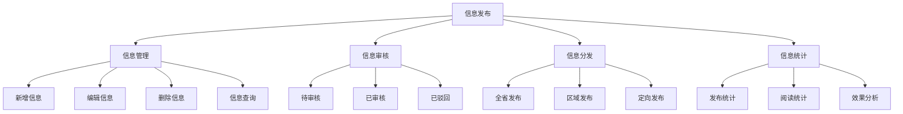

<a href="/diagrams/prototype/1-3-information-publish.html" target="_blank" rel="noopener noreferrer">查看信息发布界面原型</a>

### 功能定义

信息发布功能是工作平台的重要组成部分，用于管理和发布各类植保相关信息，包括病虫害预警信息、防控技术指导、工作动态等内容。该功能支持多种信息类型的发布、编辑、审核和管理，确保信息及时、准确地传递给相关用户。

### 流程与逻辑

1. 信息管理流程
   - 用户根据权限创建新的信息内容
   - 支持富文本编辑、图片上传、附件添加
   - 设置信息类型、发布范围、有效期等
   - 提交审核或保存为草稿

2. 审核流程
   - 审核人员接收审核任务
   - 审核内容的准确性和合规性
   - 提出修改意见或直接通过
   - 记录审核过程和结果

3. 发布流程
   - 审核通过后自动发布或定时发布
   - 按照设定的发布范围推送信息
   - 支持多渠道同步发布
   - 发布后可追踪阅读情况

4. 统计分析
   - 记录信息发布数量和类型
   - 统计信息阅读和转发情况
   - 分析信息发布效果
   - 生成统计报表

### 数据项

#### 输入数据项

| 编号 | 数据项 | 类型 | 必填 | 说明 |
|------|--------|------|------|------|
| 1 | 标题 | 字符串 | 是 | 信息标题，长度不超过100字符 |
| 2 | 类型 | 枚举 | 是 | 预警信息/技术指导/工作动态等 |
| 3 | 内容 | 富文本 | 是 | 支持文字、图片、表格等格式 |
| 4 | 发布范围 | 多选 | 是 | 全省/市/县级行政区域 |
| 5 | 有效期 | 日期时间 | 是 | 信息的有效展示时间 |
| 6 | 附件 | 文件 | 否 | 支持常用办公文档格式 |
| 7 | 关键词 | 字符串数组 | 否 | 用于信息检索，最多5个 |
| 8 | 紧急程度 | 枚举 | 是 | 普通/重要/紧急 |

#### 输出数据项

| 编号 | 数据项 | 类型 | 说明 |
|------|--------|------|------|
| 1 | 发布状态 | 枚举 | 草稿/待审核/已发布/已驳回 |
| 2 | 阅读数 | 整数 | 信息被阅读的次数 |
| 3 | 转发数 | 整数 | 信息被转发的次数 |
| 4 | 反馈数 | 整数 | 收到的反馈意见数量 |
| 5 | 审核记录 | 对象数组 | 包含审核人、时间、意见等 |
| 6 | 发布时间 | 日期时间 | 实际发布的时间 |
| 7 | 更新记录 | 对象数组 | 信息的修改历史 |
| 8 | 访问分析 | 对象 | 包含访问来源、地域分布等 |

### 权限控制

1. 信息发布人员
   - 创建和编辑信息内容
   - 查看自己发布的信息
   - 查看信息统计数据
   - 回复信息反馈

2. 审核人员
   - 审核信息内容
   - 提出修改意见
   - 查看所有信息
   - 管理信息分类

3. 系统管理员
   - 管理所有信息
   - 设置审核流程
   - 分配用户权限
   - 查看系统日志

4. 普通用户
   - 查看已发布信息
   - 提交信息反馈
   - 转发分享信息

### 界面设计

#### 界面布局
1. 信息管理界面
   - 左侧：信息分类导航
   - 中部：信息列表/编辑区
   - 右侧：快捷操作区

2. 信息编辑界面
   - 顶部：基本信息填写
   - 中部：富文本编辑器
   - 底部：附件上传和操作按钮

3. 审核界面
   - 左侧：待审核列表
   - 右侧：内容预览
   - 底部：审核意见和操作

4. 统计分析界面
   - 顶部：统计指标概览
   - 中部：趋势图表
   - 底部：详细数据列表

### 招标文件中的原文信息

> 支持站内新闻公告、病虫情报、病虫害知识等信息展示和信息发布管理入口。
> （1）新闻公告：展示最新的植物保护政策、新闻动态、工作动态等信息。
> （2）病虫情报：展示全国和全省的病虫情报、防治预案、技术措施、研究成果等信息。
> （3）病虫害知识：提供病虫草害图片、发生规律、防治技术要点等资料的在线查阅。 