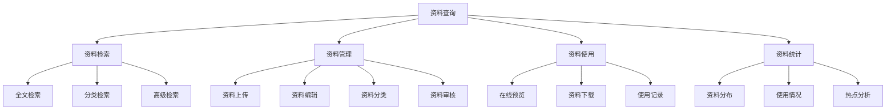

<a href="/diagrams/prototype/1-4-resource-query.html" target="_blank" rel="noopener noreferrer">查看资料查询界面原型</a>

### 功能定义

资料查询功能是工作平台的重要支撑模块，提供对病虫害防治技术资料、历史数据、政策文件等各类资料的统一检索和管理功能。该模块支持多维度检索、在线预览、下载管理等功能，为用户提供便捷的资料获取和使用服务。

### 流程与逻辑

1. 检索流程
   - 支持按关键词全文检索
   - 支持按资料分类、年份、地区等条件筛选
   - 支持多条件组合的高级检索
   - 提供检索结果的排序和筛选功能

2. 管理流程
   - 资料分类管理和维护
   - 资料上传和属性设置
   - 资料内容审核和发布
   - 资料更新和版本管理

3. 使用流程
   - 资料在线预览和阅读
   - 资料下载和使用授权
   - 记录资料使用情况
   - 收集用户反馈意见

4. 统计分析
   - 资料分类统计
   - 使用频率分析
   - 热点资料分析
   - 用户行为分析

### 数据项

#### 输入数据项

| 编号 | 数据项 | 类型 | 必填 | 说明 |
|------|--------|------|------|------|
| 1 | 资料名称 | 字符串 | 是 | 资料的标题或名称 |
| 2 | 资料分类 | 枚举 | 是 | 技术资料/历史数据/政策文件等 |
| 3 | 关键词 | 字符串数组 | 是 | 用于检索的关键词，最多10个 |
| 4 | 摘要 | 文本 | 否 | 资料的简要描述 |
| 5 | 作者/来源 | 字符串 | 是 | 资料的作者或来源机构 |
| 6 | 发布日期 | 日期 | 是 | 资料的发布或更新日期 |
| 7 | 文件 | 文件 | 是 | 支持PDF、Word、Excel等格式 |
| 8 | 适用范围 | 多选 | 否 | 资料适用的地区或作物 |

#### 输出数据项

| 编号 | 数据项 | 类型 | 说明 |
|------|--------|------|------|
| 1 | 资料列表 | 数组 | 检索结果列表 |
| 2 | 预览内容 | HTML | 资料的在线预览内容 |
| 3 | 下载链接 | URL | 资料的下载地址 |
| 4 | 使用统计 | 对象 | 包含浏览量、下载量等 |
| 5 | 相关资料 | 数组 | 相关推荐资料列表 |
| 6 | 版本信息 | 对象 | 资料的版本历史记录 |
| 7 | 用户评价 | 数组 | 用户的评价和反馈 |
| 8 | 使用权限 | 对象 | 资料的访问和使用权限 |

### 权限控制

1. 资料管理员
   - 管理资料分类体系
   - 上传和编辑资料
   - 审核资料内容
   - 管理资料权限

2. 普通用户
   - 检索和浏览资料
   - 下载授权资料
   - 提交使用反馈
   - 收藏常用资料

3. 系统管理员
   - 管理用户权限
   - 监控系统使用
   - 维护系统参数
   - 数据备份恢复

### 界面设计

#### 界面布局
1. 检索界面
   - 顶部：检索条件区
   - 左侧：分类导航树
   - 中部：检索结果列表
   - 右侧：筛选和排序区

2. 资料详情界面
   - 顶部：资料基本信息
   - 中部：资料预览区
   - 右侧：相关资料推荐
   - 底部：用户评价区

3. 管理界面
   - 左侧：功能导航菜单
   - 中部：资料列表/编辑区
   - 右侧：操作和统计区

4. 统计分析界面
   - 顶部：统计指标概览
   - 中部：统计图表展示
   - 底部：详细数据列表

### 招标文件中的原文信息

> 提供全文搜索功能，用户可以根据关键词查询历史资料信息，查询内容包括病虫情报、站内发文、病虫知识。 