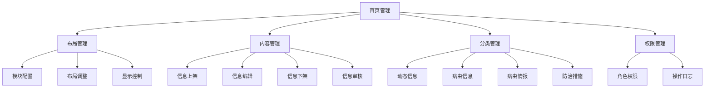

<a href="/diagrams/prototype/1-5-homepage-management.html" target="_blank" rel="noopener noreferrer">查看首页管理界面原型</a>

### 功能定义

首页管理功能是工作平台的重要配置模块，用于管理和维护平台首页的展示内容和布局。该功能支持对动态信息、病虫信息、病虫情报、防治措施等首页信息进行上架发布、编辑和下架等操作，确保首页能够及时、准确地展示平台的核心业务信息。

### 流程与逻辑

1. 布局管理流程
   - 配置首页各功能模块的显示与隐藏
   - 调整模块的位置和大小
   - 设置模块的展示样式和交互方式
   - 预览和发布布局变更

2. 内容管理流程
   - 信息上架：选择信息类型，填写信息内容，设置展示位置和时间，提交审核
   - 信息编辑：修改已上架信息的内容、展示位置或时间，重新提交审核
   - 信息下架：设置下架时间或立即下架，记录下架原因
   - 信息审核：审核人员审查信息内容，确认后发布或驳回

3. 分类管理流程
   - 动态信息：管理工作动态、通知公告等信息
   - 病虫信息：管理病虫害发生情况、监测数据等信息
   - 病虫情报：管理预警信息、发展趋势等情报
   - 防治措施：管理防控建议、技术指导等措施

4. 权限管理流程
   - 设置不同角色的管理权限
   - 记录信息操作日志
   - 管理审核流程和权限
   - 控制信息发布权限

### 数据项

#### 输入数据项

| 编号 | 数据项 | 类型 | 必填 | 说明 |
|------|--------|------|------|------|
| 1 | 信息标识 | 字符串 | 是 | 信息的唯一标识 |
| 2 | 信息类型 | 枚举 | 是 | 动态信息/病虫信息/病虫情报/防治措施 |
| 3 | 信息标题 | 字符串 | 是 | 信息的标题，长度不超过100字符 |
| 4 | 信息内容 | 富文本 | 是 | 支持文字、图片、表格等格式 |
| 5 | 展示位置 | 对象 | 是 | 包含展示区域和排序号 |
| 6 | 展示时间 | 对象 | 是 | 包含上架时间和下架时间 |
| 7 | 审核状态 | 枚举 | 是 | 待审核/已通过/已驳回/已下架 |
| 8 | 更新记录 | 对象 | 是 | 包含更新人、时间、原因等 |

#### 输出数据项

| 编号 | 数据项 | 类型 | 说明 |
|------|--------|------|------|
| 1 | 布局配置 | 对象 | 首页整体布局配置 |
| 2 | 信息列表 | 数组 | 分类展示的信息列表 |
| 3 | 审核记录 | 对象数组 | 信息的审核历史记录 |
| 4 | 访问统计 | 对象 | 信息的访问量统计 |
| 5 | 操作日志 | 数组 | 管理操作的历史记录 |
| 6 | 权限配置 | 对象 | 用户的权限配置信息 |
| 7 | 错误提示 | 字符串 | 操作失败的错误提示 |
| 8 | 预览数据 | 对象 | 布局预览的渲染数据 |

### 权限控制

1. 超级管理员
   - 管理所有首页配置和布局
   - 设置其他管理员权限
   - 查看所有操作日志
   - 管理审核流程

2. 信息管理员
   - 管理指定类型的信息内容
   - 上架和编辑信息
   - 下架过期信息
   - 查看信息统计

3. 审核管理员
   - 审核信息内容
   - 通过或驳回信息
   - 查看审核记录
   - 管理审核规则

4. 普通用户
   - 查看首页内容
   - 浏览已发布信息
   - 查看信息详情
   - 反馈信息问题

### 界面设计

#### 界面布局
1. 首页布局管理界面
   - 左侧：模块分类导航
     * 动态信息区
     * 病虫信息区
     * 病虫情报区
     * 防治措施区
   - 中部：可视化布局设计区
     * 支持拖拽调整模块位置
     * 支持调整模块大小
     * 支持预览效果
   - 右侧：模块属性配置区
     * 显示/隐藏设置
     * 刷新频率设置
     * 数据源配置
     * 展示样式配置

2. 信息管理界面
   - 顶部：信息分类切换
     * 动态信息管理
     * 病虫信息管理
     * 病虫情报管理
     * 防治措施管理
   - 左侧：信息状态筛选
     * 全部信息
     * 待审核
     * 已发布
     * 已下架
   - 中部：信息列表/编辑区
     * 列表视图：显示标题、类型、发布时间、状态等
     * 编辑视图：富文本编辑器，支持图文混排
   - 右侧：快捷操作区
     * 新增信息
     * 编辑信息
     * 上架/下架
     * 提交审核

3. 审核管理界面
   - 左侧：待审核列表
     * 按信息类型分类
     * 显示提交时间
     * 显示紧急程度
   - 中部：内容预览区
     * 信息基本属性
     * 内容预览
     * 历史版本对比
   - 右侧：审核操作区
     * 审核意见填写
     * 通过/驳回操作
     * 设置发布时间
     * 选择发布范围

4. 信息统计分析界面
   - 顶部：统计指标概览
     * 各类信息数量统计
     * 信息审核情况统计
     * 信息访问量统计
   - 中部：趋势分析图表
     * 信息发布趋势
     * 访问量趋势
     * 各类信息占比
   - 底部：详细数据列表
     * 热点信息排行
     * 访问量排行
     * 审核效率分析

5. 业务内容展示区（首页预览）
   - 动态信息展示区
     * 工作动态列表
     * 通知公告轮播
     * 重要政策提醒
   - 病虫信息展示区
     * 发生情况地图
     * 监测数据图表
     * 重点区域提示
   - 病虫情报展示区
     * 预警信息列表
     * 发展趋势分析
     * 防控建议提示
   - 防治措施展示区
     * 技术指导文档
     * 防控方案推荐
     * 典型案例展示

界面交互说明：
1. 布局管理
   - 支持模块拖拽排序
   - 支持模块大小调整
   - 支持显示/隐藏切换
   - 提供布局模板选择
   - 支持自定义布局保存

2. 内容编辑
   - 支持富文本编辑
   - 支持图片上传和裁剪
   - 支持附件管理
   - 支持预览功能
   - 支持定时发布设置

3. 审核流程
   - 提供审核工作台
   - 支持批量审核
   - 支持快速预览
   - 支持审核意见模板
   - 支持审核回退

4. 数据分析
   - 支持数据导出
   - 支持自定义统计
   - 支持图表切换
   - 支持数据钻取
   - 支持报表定制

### 招标文件中的原文信息

> 支持对平台首页展示内容的编辑和管理功能，支持平台首页信息的上架发布、编辑和下架等操作，支持对审核后的动态信息、病虫信息、病虫情报、防治措施等首页信息管理功能。 