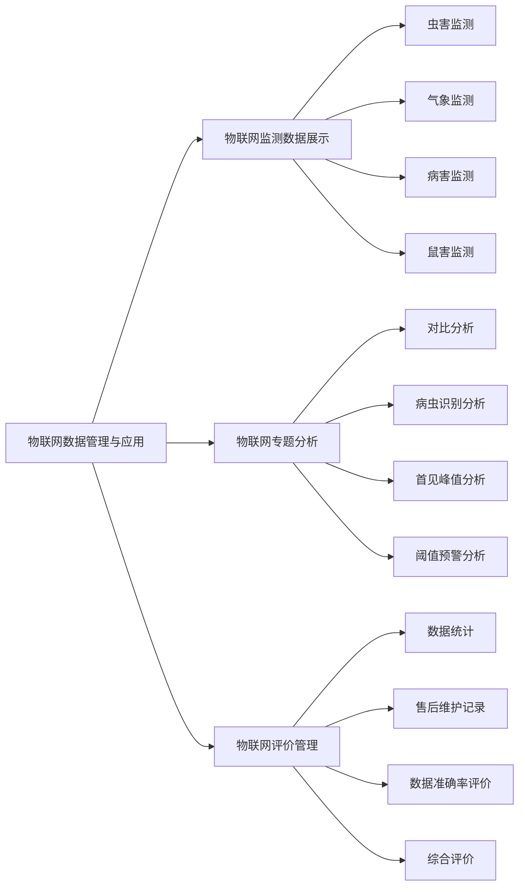

# 2. 物联网数据管理与应用

物联网数据管理与应用模块负责对全省田间监测点的物联网设备采集数据进行集中监管。系统通过对虫害监测、气象监测、病害监测、视频监控等多种类型的物联网数据进行采集和展示，结合多维度的数据分析功能，实现对病虫害发生情况的精准监测和分析。同时，通过评价管理功能对物联网设备的运行状况进行监督，确保数据采集的质量和可靠性。

## 功能逻辑图

## 2.1 物联网监测数据展示

<!--@include: @/docs/requirements/2-iot-management/2-1-monitoring-data-display.md-->

## 2.2 物联网专题分析

<!--@include: @/docs/requirements/2-iot-management/2-2-topic-analysis.md-->

## 2.3 物联网评价管理 

<!--@include: @/docs/requirements/2-iot-management/2-3-evaluation-management.md-->
