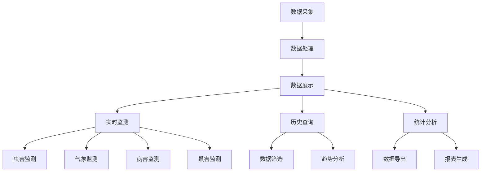

<a href="/diagrams/prototype/2-1-monitoring-data-display.html" target="_blank" rel="noopener noreferrer">查看物联网监测数据展示界面原型</a>

### 功能定义

物联网监测数据展示功能是物联网数据管理与应用模块的核心功能，负责对全省各地田间监测点的物联网设备采集数据进行实时展示和管理。该功能支持虫害监测、气象监测、病害监测、鼠害监测等多种类型的数据展示，通过多维度的数据可视化方式，直观呈现监测数据，帮助用户及时掌握病虫害发生动态。

### 流程与逻辑

1. 数据采集流程
   - 自动采集各监测点的实时数据，包括：设备状态数据、环境数据、图像数据、虫情数据等
   - 定期同步历史数据，包括：每日数据汇总、每周数据统计、每月数据分析等
   - 支持手动数据补录，包括：断线数据补录、设备更换后数据补录、人工采样数据补录等
   - 数据采集异常自动告警，包括：设备离线告警、数据异常告警、采集延迟告警等

2. 数据处理流程
   - 数据清洗和校验，包括：异常值过滤、重复数据去除、数据格式规范化、数据完整性检查等
   - 异常数据标记，包括：超出阈值标记、数据缺失标记、设备故障标记、采集延迟标记等
   - 数据分类整理，包括：按监测类型分类、按区域分类、按时间分类、按设备分类等
   - 数据格式转换，包括：单位换算、坐标转换、时间格式统一、编码格式转换等

3. 数据展示流程
   - 实时监测数据展示
     * 虫害监测：虫情密度（头/平方米）、种类分布（按虫害类型统计）、发生程度（轻、中、重度）、空间分布（GIS地图展示）、发展趋势（24小时变化曲线）
     * 气象监测：温度（℃）、湿度（%）、降水量（mm）、风速（m/s）、光照（lux）、土壤温度（℃）、土壤湿度（%）、气压（hPa）
     * 病害监测：发病率（%）、病斑面积（cm²）、危害程度（轻、中、重度）、发病部位（根、茎、叶、果）、病害类型（真菌、细菌、病毒）
     * 鼠害监测：鼠洞数量（个/亩）、活动强度（频次/天）、危害面积（亩）、种群密度（头/亩）、活动规律（昼夜变化）
   - 历史数据查询
     * 支持多维度数据筛选，包括：时间维度（年、月、日、时）、空间维度（省、市、县、点位）、指标维度（监测类型、数据项）、设备维度（设备类型、设备ID）
     * 支持时间序列分析，包括：同比分析（与去年同期比较）、环比分析（与上期比较）、自定义时段分析、季节性分析
     * 支持数据对比分析，包括：区域间对比、设备间对比、指标间对比、时段间对比
   - 统计分析功能
     * 支持数据导出，包括：Excel格式导出、CSV格式导出、PDF报表导出、图片导出
     * 支持报表生成，包括：日报表、周报表、月报表、年报表、自定义报表
     * 支持趋势分析，包括：发展趋势预测、周期性分析、突发性分析、相关性分析

### 数据项

#### 输入数据项

| 编号 | 数据项 | 类型 | 必填 | 说明 |
|------|--------|------|------|------|
| 1 | 监测点ID | 字符串 | 是 | 监测点的唯一标识 |
| 2 | 监测类型 | 枚举 | 是 | 虫害/气象/病害/鼠害 |
| 3 | 监测时间 | 日期时间 | 是 | 数据采集的时间点 |
| 4 | 监测数据 | 对象 | 是 | 根据监测类型不同，包含不同的数据项 |
| 5 | 地理位置 | 对象 | 是 | 包含经纬度信息 |
| 6 | 设备状态 | 枚举 | 是 | 正常/异常/离线 |
| 7 | 数据来源 | 字符串 | 是 | 数据的采集设备或来源 |
| 8 | 备注信息 | 字符串 | 否 | 其他补充说明 |

#### 输出数据项

| 编号 | 数据项 | 类型 | 说明 |
|------|--------|------|------|
| 1 | 监测概览 | 对象 | 包含各类监测的汇总数据 |
| 2 | 实时数据 | 数组 | 各监测点的实时数据列表 |
| 3 | 历史数据 | 数组 | 历史监测数据记录 |
| 4 | 统计报表 | 对象 | 数据统计分析结果 |
| 5 | 告警信息 | 数组 | 异常数据告警记录 |
| 6 | 设备状态 | 对象 | 监测设备的运行状态统计 |
| 7 | 趋势分析 | 对象 | 数据变化趋势分析结果 |
| 8 | 导出文件 | 文件 | 导出的数据文件 |

### 权限控制

1. 系统管理员
   - 管理所有监测点数据
   - 配置数据采集参数
   - 管理数据访问权限
   - 处理数据异常

2. 省级用户
   - 查看全省监测数据
   - 导出数据和报表
   - 进行数据分析
   - 查看告警信息

3. 市级用户
   - 查看本市监测数据
   - 导出本市数据
   - 查看本市告警

4. 县级用户
   - 查看本县监测数据
   - 查看本县告警
   - 数据补录

### 界面设计

#### 界面布局
1. 监测数据总览
   - 顶部：数据概览面板
     * 监测点总数
     * 在线设备数
     * 告警数量
     * 数据采集量
   - 中部：地图展示区
     * 监测点分布图
     * 设备状态标识
     * 实时数据气泡
   - 右侧：实时数据列表
     * 最新数据展示
     * 告警信息提示
     * 快速筛选工具

2. 数据详情界面
   - 左侧：监测点树形列表
     * 按区域分组
     * 按监测类型分组
     * 支持搜索筛选
   - 中部：数据展示区
     * 数据可视化图表
     * 历史趋势图
     * 对比分析图
   - 右侧：控制面板
     * 时间范围选择
     * 数据项选择
     * 图表类型切换
     * 导出功能

3. 统计分析界面
   - 顶部：筛选条件区
     * 时间范围
     * 区域选择
     * 监测类型
     * 数据项选择
   - 中部：统计图表区
     * 趋势分析图
     * 对比分析图
     * 分布统计图
   - 底部：数据列表区
     * 详细数据表格
     * 导出功能
     * 打印功能

界面交互说明：
1. 数据展示
   - 支持图表联动
   - 支持数据钻取
   - 支持图表切换
   - 支持数据筛选
   - 支持图表缩放

2. 数据操作
   - 支持数据导出
   - 支持报表打印
   - 支持数据复制
   - 支持图表保存
   - 支持配置保存

3. 告警处理
   - 支持告警确认
   - 支持告警处理
   - 支持告警关闭
   - 支持告警统计
   - 支持告警推送

### 招标文件中的原文信息

> 实现对虫害监测、气象监测、病害监测、视频监控等多种类型的物联网数据进行采集和展示，结合多维度的数据分析功能，实现对病虫害发生情况的精准监测和分析。系统应具备对全省田间监测点的物联网设备采集数据进行集中监管的能力，确保数据采集的质量和可靠性。 