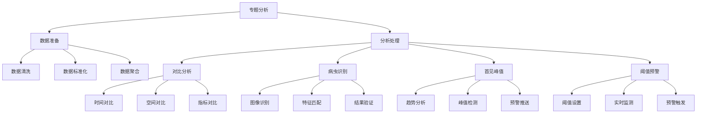

<a href="/diagrams/prototype/2-2-topic-analysis.html" target="_blank" rel="noopener noreferrer">查看物联网专题分析界面原型</a>

### 功能定义

物联网专题分析功能是物联网数据管理与应用模块的高级分析功能，通过对采集的物联网数据进行多维度的专题分析，包括对比分析、病虫识别分析、首见峰值分析和阈值预警分析等，为病虫害防控决策提供数据支持。该功能通过深入挖掘数据价值，实现对病虫害发生趋势的科学预测和精准防控。

### 流程与逻辑

1. 数据准备流程
   - 数据清洗，包括：
     * 异常值处理：基于3σ原则的异常值检测和处理
     * 缺失值处理：基于时间序列插值或邻近设备数据补充
     * 重复值处理：基于时间戳和数据特征的重复数据识别和清除
     * 噪声数据过滤：基于滑动窗口的数据平滑处理
   - 数据标准化，包括：
     * 数值归一化：将不同量纲的数据统一到[0,1]区间
     * 时间对齐：将不同采集频率的数据统一到相同时间点
     * 空间标准化：统一空间坐标系和地理编码
     * 单位转换：统一度量单位和计量标准
   - 数据聚合，包括：
     * 时间维度聚合：小时级、日级、周级、月级汇总
     * 空间维度聚合：点位级、县级、市级、省级汇总
     * 指标维度聚合：按监测类型、危害程度、影响范围汇总
     * 设备维度聚合：按设备类型、区域分布、运行状态汇总

2. 对比分析流程
   - 时间维度对比，包括：
     * 同比分析：与历史同期数据的对比，包含增长率、变化趋势、周期性特征
     * 环比分析：与上一时期数据的对比，包含变化幅度、变化方向、突发性变化
     * 趋势分析：基于时间序列的长期变化趋势，包含季节性、周期性、趋势性分析
   - 空间维度对比，包括：
     * 区域间横向比较：不同区域间的发生程度、传播速度、影响范围对比
     * 空间分布分析：基于GIS的空间聚类分析、热点分析、空间自相关分析
     * 传播路径分析：病虫害传播方向、速度、范围的时空演变分析
   - 指标维度对比，包括：
     * 不同监测指标的关联分析：基于相关系数和因果分析
     * 综合指标评估：基于多指标加权的综合评价体系
     * 影响因素分析：基于主成分分析和因子分析的关键因素识别

3. 病虫识别分析流程
   - 图像数据采集，包括：
     * 多光谱图像采集：可见光、近红外、热红外等多波段图像
     * 图像预处理：去噪、增强、校正、配准等处理
     * 目标区域提取：基于图像分割的病虫害区域提取
     * 特征提取：形态特征、颜色特征、纹理特征提取
   - 特征提取和匹配，包括：
     * 深度学习模型：基于CNN的病虫害特征学习
     * 特征匹配：基于相似度度量的特征匹配
     * 分类识别：多分类器融合的病虫害类型识别
     * 病情程度评估：基于图像分析的危害程度评估
   - 识别结果验证，包括：
     * 专家审核：专家对识别结果的确认和修正
     * 历史数据验证：与历史识别结果的一致性检验
     * 多源数据交叉验证：结合气象、土壤等环境数据的综合验证
     * 准确率评估：基于混淆矩阵的识别准确率评估

4. 首见峰值分析流程
   - 历史数据分析，包括：
     * 时间序列分解：趋势项、季节项、周期项、随机项分解
     * 模式识别：典型峰值模式的提取和分类
     * 影响因素分析：环境因素对峰值出现的影响分析
     * 历史规律总结：峰值出现的时间、空间、强度规律分析
   - 趋势预测，包括：
     * 时间序列预测：基于ARIMA、LSTM等模型的趋势预测
     * 多因素预测：考虑气象、农事活动等多因素的综合预测
     * 情景分析：不同防控措施下的发展趋势预测
     * 不确定性分析：预测结果的置信区间分析
   - 峰值检测，包括：
     * 实时监测：基于滑动窗口的实时数据监测
     * 阈值判断：基于多级阈值的峰值判断
     * 突发性分析：突发性峰值的快速识别
     * 持续性评估：峰值持续时间和影响范围评估

5. 阈值预警分析流程
   - 阈值规则配置，包括：
     * 单指标阈值：基于专家经验的单一指标阈值设置
     * 复合阈值：多个指标组合的复合阈值规则
     * 动态阈值：基于历史数据的自适应阈值调整
     * 分级阈值：不同预警等级的阈值区间设置
   - 实时数据监测，包括：
     * 数据实时接入：多源数据的实时采集和处理
     * 指标计算：复合指标的实时计算
     * 阈值比对：与预设阈值的实时比对
     * 趋势判断：短期趋势的实时评估
   - 预警规则匹配，包括：
     * 规则解析：预警规则的实时解析和匹配
     * 条件判断：多条件组合的逻辑判断
     * 等级评估：预警等级的综合评估
     * 范围确定：预警影响范围的确定
   - 预警信息处理，包括：
     * 预警生成：预警信息的自动生成
     * 级别确认：预警级别的人工确认
     * 信息发布：多渠道的预警信息发布
     * 反馈跟踪：预警效果的跟踪评估

### 数据项

#### 输入数据项

| 编号 | 数据项 | 类型 | 必填 | 说明 |
|------|--------|------|------|------|
| 1 | 分析类型 | 枚举 | 是 | 对比/识别/峰值/阈值 |
| 2 | 时间范围 | 对象 | 是 | 包含开始和结束时间 |
| 3 | 空间范围 | 对象 | 是 | 包含地理区域信息 |
| 4 | 监测指标 | 数组 | 是 | 需要分析的指标列表 |
| 5 | 分析参数 | 对象 | 是 | 具体分析方法的参数设置 |
| 6 | 阈值设置 | 对象 | 否 | 预警阈值配置 |
| 7 | 图像数据 | 文件 | 否 | 用于病虫识别的图像 |
| 8 | 参考数据 | 对象 | 否 | 历史参考数据 |

#### 输出数据项

| 编号 | 数据项 | 类型 | 说明 |
|------|--------|------|------|
| 1 | 分析结果 | 对象 | 包含各类分析的结果数据 |
| 2 | 对比报告 | 对象 | 各维度的对比分析结果 |
| 3 | 识别结果 | 对象 | 病虫害识别的结果信息 |
| 4 | 峰值数据 | 数组 | 检测到的峰值点信息 |
| 5 | 预警信息 | 对象 | 触发的预警信息详情 |
| 6 | 趋势预测 | 对象 | 发展趋势预测结果 |
| 7 | 分析图表 | 数组 | 可视化图表数据 |
| 8 | 评估报告 | 对象 | 综合分析评估报告 |

### 权限控制

1. 系统管理员
   - 配置分析参数
   - 设置预警规则
   - 管理分析模型
   - 查看所有分析结果

2. 分析专家
   - 进行专题分析
   - 调整分析参数
   - 验证分析结果
   - 生成分析报告

3. 普通用户
   - 查看分析结果
   - 导出分析报告
   - 接收预警信息
   - 查看趋势预测

### 界面设计

#### 界面布局
1. 分析配置界面
   - 顶部：分析类型选择
     * 对比分析
     * 病虫识别
     * 首见峰值
     * 阈值预警
   - 左侧：参数配置区
     * 时间范围选择
     * 空间范围选择
     * 指标选择
     * 参数设置
   - 右侧：数据预览区
     * 数据概览
     * 数据质量检查
     * 参数验证

2. 分析结果界面
   - 顶部：结果概览
     * 关键指标展示
     * 预警信息提示
     * 快速操作按钮
   - 中部：可视化展示区
     * 分析图表
     * 地图展示
     * 趋势曲线
   - 右侧：详细信息区
     * 结果详情
     * 评估建议
     * 操作记录

3. 预警管理界面
   - 左侧：预警规则配置
     * 阈值设置
     * 规则编辑
     * 触发条件
   - 中部：预警监控
     * 实时监控
     * 预警列表
     * 处理状态
   - 右侧：统计分析
     * 预警统计
     * 效果评估
     * 优化建议

界面交互说明：
1. 分析操作
   - 支持参数快速调整
   - 支持结果即时预览
   - 支持批量处理
   - 支持结果对比
   - 支持参数保存

2. 结果展示
   - 支持多维度展示
   - 支持图表联动
   - 支持数据钻取
   - 支持结果筛选
   - 支持导出分享

3. 预警处理
   - 支持规则调整
   - 支持批量处理
   - 支持状态跟踪
   - 支持效果评估
   - 支持规则优化

### 招标文件中的原文信息

> 结合多维度的数据分析功能，实现对病虫害发生情况的精准监测和分析。系统应支持对比分析、病虫识别分析、首见峰值分析和阈值预警分析等多种分析方式，为病虫害防控决策提供数据支持。 