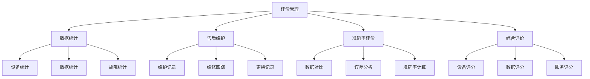

<a href="/diagrams/prototype/2-3-evaluation-management.html" target="_blank" rel="noopener noreferrer">查看物联网评价管理界面原型</a>

### 功能定义

物联网评价管理功能是物联网数据管理与应用模块的质量保障功能，负责对物联网设备的运行状况和数据质量进行全面评估和管理。该功能通过数据统计、售后维护记录、数据准确率评价和综合评价等多个维度，实现对物联网监测系统的质量监督和持续改进，确保数据采集的可靠性和准确性。

### 流程与逻辑

1. 数据统计流程
   - 设备统计，包括：
     * 设备总量统计：按区域、类型、用途的设备数量统计
     * 在线率统计：实时在线率、平均在线率、离线时长分析
     * 故障率统计：故障发生频率、平均修复时间、可靠性分析
     * 使用年限统计：设备使用时长、更换周期、寿命预测
   - 数据统计，包括：
     * 数据量统计：原始数据量、有效数据量、数据增长趋势
     * 数据完整率：数据缺失率、数据覆盖率、数据质量评分
     * 数据及时率：实时数据率、延迟数据率、数据传输效率
     * 数据有效率：有效数据比例、异常数据比例、数据可用性
   - 故障统计，包括：
     * 故障类型分布：硬件故障、软件故障、通信故障、供电故障
     * 故障频率分析：故障发生规律、高发故障识别、故障预警
     * 故障持续时间：故障响应时间、修复时间、累计故障时长
     * 故障影响范围：影响设备数、影响数据量、影响业务程度

2. 售后维护流程
   - 维护记录管理，包括：
     * 定期维护记录：维护计划制定、维护执行记录、维护效果评估
     * 故障维修记录：故障现象描述、原因分析、解决方案、维修过程
     * 巡检记录：巡检计划、巡检路线、巡检项目、巡检结果
     * 维护计划制定：年度维护计划、季度维护计划、月度维护计划
   - 维修跟踪管理，包括：
     * 故障报修：故障等级划分、报修流程、响应时限要求
     * 维修进度跟踪：维修状态更新、进度反馈、延期预警
     * 维修结果确认：维修验收标准、验收流程、验收记录
     * 维修质量评价：维修及时性、维修有效性、服务满意度
   - 更换记录管理，包括：
     * 设备更换记录：更换原因、更换过程、新旧设备参数对比
     * 配件更换记录：配件类型、更换日期、使用寿命统计
     * 更换原因分析：正常损耗、意外损坏、升级改造分析
     * 使用寿命评估：设备寿命预测、更换建议、成本效益分析

3. 准确率评价流程
   - 数据对比分析，包括：
     * 与人工采样对比：采样点选择、采样方法、数据记录、误差计算
     * 与周边设备对比：相似环境设备选择、数据校准、一致性分析
     * 与历史数据对比：历史数据筛选、趋势对比、异常识别
   - 误差分析，包括：
     * 系统误差分析：设备固有误差、环境因素影响、校准误差
     * 随机误差分析：数据波动范围、置信区间、可靠性评估
     * 误差来源追溯：误差产生环节、影响因素、改进措施
   - 准确率计算，包括：
     * 单点准确率计算：测量值与标准值对比、相对误差计算
     * 区域准确率计算：区域内设备准确率统计、空间分布分析
     * 时间序列准确率：不同时段准确率变化、稳定性评估
     * 综合准确率评估：多维度准确率综合评分、等级划分

4. 综合评价流程
   - 设备评分，包括：
     * 运行状态评分：在线率、稳定性、数据质量综合评分
     * 维护情况评分：维护及时性、维护效果、故障处理评分
     * 故障情况评分：故障频率、影响程度、修复效率评分
   - 数据评分，包括：
     * 数据质量评分：准确性、完整性、及时性、一致性评分
     * 数据完整性评分：数据缺失率、有效数据率、覆盖率评分
     * 数据及时性评分：实时性、延迟率、传输效率评分
   - 服务评分，包括：
     * 维护响应评分：响应时效、处理速度、问题解决率评分
     * 维修效率评分：维修时长、一次修复率、返修率评分
     * 服务满意度评分：用户反馈、投诉处理、服务态度评分

### 数据项

#### 输入数据项

| 编号 | 数据项 | 类型 | 必填 | 说明 |
|------|--------|------|------|------|
| 1 | 设备信息 | 对象 | 是 | 包含设备基本信息和运行状态 |
| 2 | 维护记录 | 对象 | 是 | 设备维护和维修记录 |
| 3 | 监测数据 | 数组 | 是 | 设备采集的原始数据 |
| 4 | 对比数据 | 对象 | 是 | 用于准确率评价的参考数据 |
| 5 | 评价规则 | 对象 | 是 | 评价标准和计算规则 |
| 6 | 评价周期 | 字符串 | 是 | 评价统计的时间周期 |
| 7 | 评价人员 | 字符串 | 是 | 执行评价的人员信息 |
| 8 | 评价备注 | 字符串 | 否 | 评价过程的补充说明 |

#### 输出数据项

| 编号 | 数据项 | 类型 | 说明 |
|------|--------|------|------|
| 1 | 统计报告 | 对象 | 包含各类统计分析结果 |
| 2 | 维护报告 | 对象 | 设备维护情况汇总 |
| 3 | 准确率报告 | 对象 | 数据准确率评价结果 |
| 4 | 综合评分 | 对象 | 多维度评价得分 |
| 5 | 改进建议 | 数组 | 基于评价的改进建议 |
| 6 | 评价记录 | 对象 | 评价过程的详细记录 |
| 7 | 趋势分析 | 对象 | 评价指标的变化趋势 |
| 8 | 评价报表 | 文件 | 导出的评价报告文件 |

### 权限控制

1. 系统管理员
   - 管理评价规则
   - 设置评价周期
   - 分配评价任务
   - 查看所有评价结果

2. 评价专员
   - 执行评价任务
   - 录入评价数据
   - 生成评价报告
   - 提出改进建议

3. 维护人员
   - 查看评价结果
   - 处理改进建议
   - 更新维护记录
   - 反馈处理结果

4. 普通用户
   - 查看统计报告
   - 查看评价结果
   - 提交问题反馈
   - 查看处理进度

### 界面设计

#### 界面布局
1. 评价管理主界面
   - 顶部：功能导航
     * 数据统计
     * 售后维护
     * 准确率评价
     * 综合评价
   - 左侧：设备树形列表
     * 按区域分组
     * 按类型分组
     * 支持搜索筛选
   - 右侧：评价工作区
     * 评价表单
     * 数据展示
     * 结果分析

2. 统计分析界面
   - 顶部：统计维度选择
     * 时间维度
     * 空间维度
     * 指标维度
   - 中部：统计图表区
     * 趋势图表
     * 分布图表
     * 对比图表
   - 底部：详细数据表格
     * 统计数据列表
     * 导出功能
     * 打印功能

3. 维护管理界面
   - 左侧：维护任务列表
     * 待处理任务
     * 处理中任务
     * 已完成任务
   - 中部：维护详情
     * 基本信息
     * 处理记录
     * 相关附件
   - 右侧：操作面板
     * 任务分配
     * 进度更新
     * 结果确认

界面交互说明：
1. 评价操作
   - 支持批量评价
   - 支持评价模板
   - 支持数据导入
   - 支持结果预览
   - 支持记录保存

2. 数据展示
   - 支持多维度展示
   - 支持图表切换
   - 支持数据筛选
   - 支持趋势分析
   - 支持导出分享

3. 任务管理
   - 支持任务分配
   - 支持进度跟踪
   - 支持提醒通知
   - 支持结果确认
   - 支持评价反馈

### 招标文件中的原文信息

> 通过评价管理功能对物联网设备的运行状况进行监督，确保数据采集的质量和可靠性。系统应具备数据统计、售后维护记录、数据准确率评价和综合评价等功能，实现对物联网监测系统的质量监督和持续改进。 