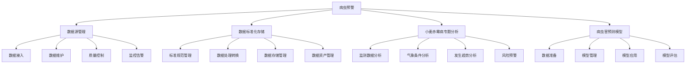

# 病虫预警

病虫预警模块是系统的核心业务功能模块之一，主要负责对农作物病虫害的监测预警工作。该模块通过整合多源数据，建立标准化的数据管理体系，结合专业预测模型，实现对病虫害发生趋势的科学预测和预警，为病虫害防控提供决策支持。

## 功能架构

## 3.1 数据源管理

<!--@include: @/docs/requirements/3-pest-warning/3-1-data-source-management.md-->

## 3.2 数据标准化存储

<!--@include: @/docs/requirements/3-pest-warning/3-2-data-standardization.md-->

## 3.3 小麦赤霉病专题分析

<!--@include: @/docs/requirements/3-pest-warning/3-3-wheat-scab-analysis.md-->

## 3.4 病虫害预测模型

<!--@include: @/docs/requirements/3-pest-warning/3-4-pest-prediction-model.md-->

## 招标文件中的原文信息

> 病虫预警分析模块通过整合物联网数据、气象数据、历史数据等多源数据，建立标准化的数据管理体系。系统应支持物联网数据、采购数据、历史数据等多种类型数据的接入和管理，通过标准化的数据接入流程和质量控制机制，确保数据的完整性、准确性和及时性。系统应建立统一的数据资源标准体系，实现数据格式规范化、数据质量标准化、数据存储结构化，并通过数据资源整合建库，形成完整的数据资产管理体系。针对小麦赤霉病这一重大病害，系统应整合气象数据、物联网监测数据、历史发生数据等多源数据，结合专业预测模型，实现对小麦赤霉病的发生趋势分析、风险评估和预警预报，为科学防控提供决策支持。系统应建立基于机器学习的病虫害预测模型，通过整合历史数据、监测数据、气象数据等多源数据，实现对病虫害发生发展趋势的科学预测。系统应支持模型训练、验证、应用和优化的全生命周期管理，提供精准的预测分析能力。 