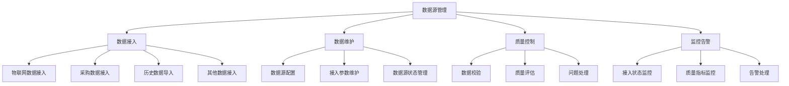

<a href="/diagrams/prototype/3-1-data-source-management.html" target="_blank" rel="noopener noreferrer">查看数据源管理界面原型</a>

### 功能定义

数据源管理功能是病虫预警分析模块的基础功能，负责对各类数据源进行统一管理和维护。该功能支持物联网数据、采购数据、历史数据等多源异构数据的接入和管理，通过标准化的数据接入流程和质量控制机制，确保数据的完整性、准确性和及时性，为病虫预警分析提供可靠的数据基础。

### 流程与逻辑

1. 数据接入流程
   - 物联网数据接入，包括：
     * 实时数据接入：通过WebSocket等协议实现物联网设备数据的实时接入
     * 批量数据接入：支持物联网历史数据的批量导入和更新
     * 数据格式适配：支持JSON、XML、CSV等多种数据格式的解析和转换
     * 数据完整性校验：确保接入数据的完整性和连续性
   - 采购数据接入，包括：
     * 气象数据接入：气象站点数据、天气预报数据、历史气象数据
     * 遥感数据接入：卫星遥感数据、无人机航拍数据、地理信息数据
     * 第三方数据接入：农情数据、土壤数据、农药使用数据等
     * 数据清洗转换：对采购数据进行清洗、转换和标准化处理
   - 历史数据导入，包括：
     * 历史病虫害数据：历年发生记录、防治记录、损失评估数据
     * 历史监测数据：田间调查数据、诱捕器数据、专家诊断数据
     * 历史防控数据：防控措施数据、用药记录、防效评估数据
     * 数据质量处理：对历史数据进行质量评估和修正
   - 其他数据接入，包括：
     * 农业生产数据：种植面积、作物品种、种植结构数据
     * 防控资源数据：防控物资、专业队伍、技术力量数据
     * 基础数据：行政区划、地理信息、农业基础设施数据
     * 数据关联处理：建立不同数据源之间的关联关系

2. 数据维护流程
   - 数据源配置，包括：
     * 数据源注册：数据源基本信息登记、接入方式配置、权限设置
     * 接入参数配置：数据接口参数、传输协议、加密方式配置
     * 数据映射配置：字段映射规则、数据转换规则、编码对照配置
     * 调度策略配置：数据采集频率、同步策略、重试机制配置
   - 接入参数维护，包括：
     * 参数更新：定期更新接入参数、接口地址、认证信息
     * 参数验证：验证接入参数的有效性和可用性
     * 参数备份：重要参数的备份和版本管理
     * 参数同步：多节点间的参数同步和一致性维护
   - 数据源状态管理，包括：
     * 状态监控：实时监控数据源的连接状态和运行状态
     * 异常处理：数据源异常情况的识别和处理
     * 状态统计：数据源运行状态的统计分析和报告
     * 状态预警：数据源状态异常的预警和通知

3. 质量控制流程
   - 数据校验，包括：
     * 格式校验：数据格式、编码格式、必填字段校验
     * 规则校验：业务规则校验、逻辑关系校验、取值范围校验
     * 一致性校验：数据一致性校验、关联关系校验、时序性校验
     * 完整性校验：数据完整性校验、记录完整性校验、字段完整性校验
   - 质量评估，包括：
     * 准确性评估：数据准确性、可信度、有效性评估
     * 及时性评估：数据更新及时性、滞后性评估
     * 完整性评估：数据覆盖率、缺失率、重复率评估
     * 一致性评估：数据一致性、规范性、标准化程度评估
   - 问题处理，包括：
     * 问题识别：质量问题的自动识别和人工审核
     * 问题分类：按照问题类型和严重程度进行分类
     * 处理流程：问题处理流程的跟踪和管理
     * 处理反馈：处理结果的反馈和评估

4. 监控告警流程
   - 接入状态监控，包括：
     * 连接状态监控：数据源连接状态、响应时间监控
     * 数据流监控：数据传输速率、数据量监控
     * 异常监控：接入异常、传输异常、处理异常监控
     * 性能监控：系统资源占用、处理效率监控
   - 质量指标监控，包括：
     * 质量指标采集：实时采集质量相关指标数据
     * 指标分析：质量指标的统计分析和趋势分析
     * 阈值监控：质量指标的阈值监控和预警
     * 报告生成：质量监控报告的自动生成
   - 告警处理，包括：
     * 告警规则配置：告警条件、级别、通知方式配置
     * 告警触发：自动触发告警、告警信息推送
     * 告警确认：告警信息的确认和处理
     * 告警统计：告警情况的统计分析和报告

### 数据项

#### 输入数据项

| 编号 | 数据项 | 类型 | 必填 | 说明 |
|------|--------|------|------|------|
| 1 | 数据源编码 | 字符串 | 是 | 数据源的唯一标识 |
| 2 | 数据源名称 | 字符串 | 是 | 数据源的名称描述 |
| 3 | 数据源类型 | 枚举 | 是 | 物联网/采购/历史/其他 |
| 4 | 接入方式 | 枚举 | 是 | 实时/批量/手动 |
| 5 | 接入参数 | 对象 | 是 | 数据接入的配置参数 |
| 6 | 数据格式 | 枚举 | 是 | JSON/XML/CSV等 |
| 7 | 更新频率 | 字符串 | 是 | 数据更新的时间间隔 |
| 8 | 数据量级 | 字符串 | 是 | 预计数据量大小 |
| 9 | 质量要求 | 对象 | 是 | 数据质量控制要求 |
| 10 | 责任人 | 字符串 | 是 | 数据源管理责任人 |
| 11 | 备注说明 | 字符串 | 否 | 其他补充说明 |

#### 输出数据项

| 编号 | 数据项 | 类型 | 说明 |
|------|--------|------|------|
| 1 | 接入状态 | 对象 | 数据源接入状态信息 |
| 2 | 运行统计 | 对象 | 运行情况统计数据 |
| 3 | 质量报告 | 对象 | 数据质量评估报告 |
| 4 | 告警信息 | 数组 | 监控告警记录列表 |
| 5 | 处理日志 | 数组 | 数据处理日志记录 |
| 6 | 评估结果 | 对象 | 数据源评估结果 |
| 7 | 统计报表 | 对象 | 统计分析报表数据 |
| 8 | 配置信息 | 对象 | 当前配置参数信息 |

### 权限控制

1. 系统管理员
   - 管理所有数据源配置
   - 设置数据接入参数
   - 配置质量控制规则
   - 管理告警规则
   - 分配数据源权限

2. 数据管理员
   - 维护数据源配置
   - 监控数据接入状态
   - 处理质量问题
   - 处理告警信息
   - 生成统计报告

3. 运维人员
   - 监控系统运行状态
   - 处理运行异常
   - 维护系统参数
   - 执行数据备份

4. 普通用户
   - 查看数据源信息
   - 查看运行状态
   - 查看统计报告
   - 提交问题反馈

### 界面设计

#### 界面布局
1. 数据源管理主界面
   - 顶部：功能导航栏
     * 数据源管理
     * 运行监控
     * 质量控制
     * 统计分析
   - 左侧：数据源树形列表
     * 按类型分组
     * 按状态分组
     * 支持搜索筛选
   - 右侧：详细信息区
     * 基本信息
     * 运行状态
     * 质量指标
     * 操作按钮

2. 数据接入配置界面
   - 左侧：配置项分类
     * 基本配置
     * 接入参数
     * 质量规则
     * 告警设置
   - 右侧：参数配置区
     * 参数表单
     * 验证结果
     * 保存按钮
   - 底部：测试区域
     * 连接测试
     * 数据预览
     * 测试结果

3. 监控告警界面
   - 顶部：状态概览
     * 运行状态
     * 告警统计
     * 质量评分
   - 中部：监控面板
     * 实时监控图表
     * 告警列表
     * 处理记录
   - 右侧：操作面板
     * 快速处理
     * 详细信息
     * 处理历史

界面交互说明：
1. 数据源操作
   - 支持数据源的增删改查
   - 支持参数配置和测试
   - 支持状态切换和控制
   - 支持批量操作处理
   - 支持导入导出功能

2. 监控展示
   - 支持多维度数据展示
   - 支持图表切换展示
   - 支持数据下钻分析
   - 支持自定义视图
   - 支持实时数据刷新

3. 告警处理
   - 支持告警确认和处理
   - 支持处理意见录入
   - 支持处理流程跟踪
   - 支持告警级别调整
   - 支持告警规则配置

### 招标文件中的原文信息

> 病虫预警分析模块通过整合物联网数据、气象数据、历史数据等多源数据，建立标准化的数据管理体系。系统应支持物联网数据、采购数据、历史数据等多种类型数据的接入和管理，通过标准化的数据接入流程和质量控制机制，确保数据的完整性、准确性和及时性。 