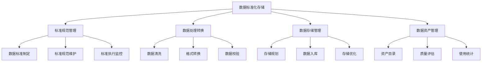

<a href="/diagrams/prototype/3-2-data-standardization.html" target="_blank" rel="noopener noreferrer">查看数据标准化存储界面原型</a>

### 功能定义

数据标准化存储功能是病虫预警分析模块的基础支撑功能，负责对多源异构数据进行标准化处理和统一存储管理。该功能通过建立统一的数据资源标准体系，实现数据格式规范化、数据质量标准化、数据存储结构化，并通过数据资源整合建库，形成完整的数据资产管理体系，为病虫预警分析提供高质量的数据基础。

### 流程与逻辑

1. 标准规范管理流程
   - 数据标准制定，包括：
     * 数据元标准：数据项定义、数据类型、取值范围、计量单位等
     * 编码标准：行政区划编码、作物编码、病虫害编码等
     * 接口标准：数据交换格式、接口协议、传输规范等
     * 质量标准：数据完整性、准确性、一致性、时效性标准
   - 标准规范维护，包括：
     * 标准版本管理：标准文档版本控制、变更记录、发布管理
     * 标准更新维护：标准内容更新、标准废止、标准合并等
     * 标准映射管理：不同标准间的映射关系维护
     * 标准使用指南：标准应用说明、实施指导、案例参考
   - 标准执行监控，包括：
     * 执行情况监控：标准执行率、违规情况统计
     * 问题跟踪处理：标准执行问题识别、处理、反馈
     * 效果评估分析：标准实施效果评估、优化建议
     * 考核评价管理：标准执行考核、评价指标管理

2. 数据处理转换流程
   - 数据清洗，包括：
     * 数据格式清洗：特殊字符处理、格式规范化、编码转换
     * 数据内容清洗：错误数据修正、重复数据处理、缺失值处理
     * 数据质量清洗：异常值处理、噪声数据过滤、一致性检查
     * 数据结构清洗：字段拆分合并、数据结构调整、关系重构
   - 格式转换，包括：
     * 数据格式转换：不同格式间的转换（JSON、XML、CSV等）
     * 编码格式转换：字符编码转换、数值格式转换、日期格式转换
     * 单位换算转换：计量单位换算、坐标系转换、比例尺转换
     * 结构化转换：非结构化数据结构化、半结构化数据标准化
   - 数据校验，包括：
     * 格式合规校验：数据格式、编码规范、结构规范校验
     * 内容正确校验：数据有效性、逻辑关系、业务规则校验
     * 标准符合校验：与数据标准的符合性校验
     * 质量达标校验：与质量标准的符合性校验

3. 数据存储管理流程
   - 存储规划，包括：
     * 存储方案设计：存储架构、存储类型、容量规划
     * 分区策略制定：数据分区、分表策略、存储周期
     * 备份策略制定：备份方式、频率、保留策略
     * 安全策略制定：访问控制、加密策略、审计策略
   - 数据入库，包括：
     * 入库前准备：数据预处理、索引优化、存储空间检查
     * 数据加载：批量加载、实时写入、增量更新
     * 质量控制：入库校验、异常处理、失败重试
     * 性能优化：加载性能优化、并发控制、资源调度
   - 存储优化，包括：
     * 性能优化：索引优化、查询优化、存储结构优化
     * 空间优化：数据压缩、冷热数据分离、垃圾回收
     * 可用性优化：高可用架构、灾备方案、故障恢复
     * 成本优化：存储成本控制、资源利用率优化

4. 数据资产管理流程
   - 资产目录管理，包括：
     * 数据资产分类：按业务域、数据类型、重要程度分类
     * 元数据管理：数据项描述、数据血缘关系、数据生命周期
     * 数据地图：数据分布、数据流向、数据关系图谱
     * 资产价值评估：数据价值评估、使用价值分析
   - 质量评估管理，包括：
     * 质量监控：数据质量指标监控、问题发现、告警管理
     * 质量评估：质量评分、质量报告、趋势分析
     * 问题处理：质量问题处理、改进措施、效果跟踪
     * 质量提升：质量改进计划、实施管理、效果评估
   - 使用统计管理，包括：
     * 使用情况统计：访问量、使用频率、用户分布
     * 效益分析：使用效益、价值贡献、成本收益
     * 共享情况：数据共享范围、共享方式、共享效果
     * 使用评价：用户满意度、应用效果、问题反馈

### 数据项

#### 输入数据项

| 编号 | 数据项 | 类型 | 必填 | 说明 |
|------|--------|------|------|------|
| 1 | 标准编码 | 字符串 | 是 | 数据标准的唯一标识 |
| 2 | 标准名称 | 字符串 | 是 | 数据标准的名称 |
| 3 | 标准类型 | 枚举 | 是 | 元数据/编码/接口/质量 |
| 4 | 标准内容 | 对象 | 是 | 标准的具体内容 |
| 5 | 版本号 | 字符串 | 是 | 标准的版本号 |
| 6 | 生效时间 | 日期时间 | 是 | 标准的生效时间 |
| 7 | 制定人 | 字符串 | 是 | 标准的制定人 |
| 8 | 审核状态 | 枚举 | 是 | 草稿/审核中/已发布 |
| 9 | 适用范围 | 字符串 | 是 | 标准的适用范围 |
| 10 | 更新说明 | 字符串 | 否 | 标准更新的说明 |

#### 输出数据项

| 编号 | 数据项 | 类型 | 说明 |
|------|--------|------|------|
| 1 | 标准目录 | 对象 | 数据标准的分类目录 |
| 2 | 执行统计 | 对象 | 标准执行情况统计 |
| 3 | 质量报告 | 对象 | 数据质量评估报告 |
| 4 | 存储状态 | 对象 | 数据存储状态信息 |
| 5 | 资产目录 | 对象 | 数据资产目录信息 |
| 6 | 使用统计 | 对象 | 数据使用情况统计 |
| 7 | 问题记录 | 数组 | 标准执行问题记录 |
| 8 | 评估报告 | 对象 | 标准实施评估报告 |

### 权限控制

1. 系统管理员
   - 管理标准规范
   - 配置存储策略
   - 管理数据资产
   - 分配数据权限
   - 监控系统运行

2. 数据管理员
   - 维护数据标准
   - 管理数据处理
   - 监控数据质量
   - 处理数据问题
   - 生成统计报告

3. 标准管理员
   - 制定数据标准
   - 维护标准规范
   - 监控标准执行
   - 评估标准效果
   - 更新标准文档

4. 普通用户
   - 查看数据标准
   - 使用标准工具
   - 提交问题反馈
   - 查看统计报告

### 界面设计

#### 界面布局
1. 标准管理主界面
   - 顶部：功能导航栏
     * 标准管理
     * 数据处理
     * 存储管理
     * 资产管理
   - 左侧：标准分类树
     * 按类型分类
     * 按状态分类
     * 支持搜索筛选
   - 右侧：详细信息区
     * 标准详情
     * 执行情况
     * 问题记录
     * 操作按钮

2. 数据处理界面
   - 左侧：处理任务列表
     * 待处理任务
     * 处理中任务
     * 已完成任务
   - 中部：处理配置区
     * 处理规则配置
     * 参数设置
     * 预览结果
   - 右侧：监控面板
     * 处理进度
     * 质量指标
     * 问题统计

3. 资产管理界面
   - 顶部：资产概览
     * 资产总量
     * 质量评分
     * 使用情况
   - 中部：资产目录
     * 资产分类
     * 资产详情
     * 血缘关系
   - 右侧：统计分析
     * 使用统计
     * 质量分析
     * 价值评估

界面交互说明：
1. 标准管理操作
   - 支持标准的增删改查
   - 支持版本管理
   - 支持标准发布
   - 支持执行监控
   - 支持问题处理

2. 数据处理操作
   - 支持规则配置
   - 支持任务管理
   - 支持进度监控
   - 支持结果预览
   - 支持问题处理

3. 资产管理操作
   - 支持资产注册
   - 支持目录管理
   - 支持质量评估
   - 支持使用统计
   - 支持价值评估

### 招标文件中的原文信息

> 建立标准化的数据管理体系，实现对病虫害发生情况的精准监测和分析。系统应建立统一的数据资源标准体系，实现数据格式规范化、数据质量标准化、数据存储结构化，并通过数据资源整合建库，形成完整的数据资产管理体系。 