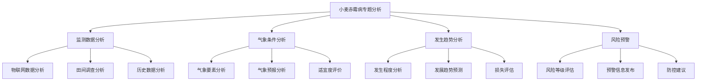

<a href="/diagrams/prototype/3-3-wheat-scab-analysis.html" target="_blank" rel="noopener noreferrer">查看小麦赤霉病专题分析界面原型</a>

### 功能定义

小麦赤霉病专题分析功能是病虫预警分析模块的重要专题分析功能，针对小麦赤霉病这一重大病害，通过整合气象数据、物联网监测数据、历史发生数据等多源数据，结合专业预测模型，实现对小麦赤霉病的发生趋势分析、风险评估和预警预报，为科学防控提供决策支持。

### 流程与逻辑

1. 监测数据分析流程
   - 物联网数据分析，包括：
     * 环境监测数据：温度、湿度、降水等环境因子分析
     * 病害图像识别：基于图像的病害识别和严重程度评估
     * 孢子监测数据：空气中病原菌孢子浓度监测分析
     * 趋势变化分析：监测指标的动态变化趋势分析
   - 田间调查分析，包括：
     * 发病率统计：病害发生面积、程度的统计分析
     * 病情指数计算：病害严重程度的量化评估
     * 空间分布分析：病害发生的空间分布特征分析
     * 品种敏感性：不同品种的抗病性表现分析
   - 历史数据分析，包括：
     * 历年发生规律：总结历史发生特点和规律
     * 危害损失评估：历史危害损失数据分析
     * 防控效果分析：历史防控措施效果评估
     * 发生趋势对比：与历史同期情况对比分析

2. 气象条件分析流程
   - 气象要素分析，包括：
     * 温度适宜性：温度条件对病害发生的影响分析
     * 湿度适宜性：湿度条件对病害发展的影响分析
     * 降水影响：降水量、降水频率对病害的影响分析
     * 气象组合条件：多气象要素组合对病害的影响
   - 气象预报分析，包括：
     * 短期预报分析：3-7天气象条件预报分析
     * 中期预报分析：7-15天气象趋势预报分析
     * 气象预警：不利气象条件预警分析
     * 适宜气象预测：病害发生适宜气象条件预测
   - 适宜度评价，包括：
     * 气象适宜度：气象条件对病害发生的适宜程度评价
     * 区域差异性：不同区域气象条件差异性分析
     * 时段适宜性：不同时段气象条件适宜性分析
     * 发生风险评价：基于气象条件的发生风险评价

3. 发生趋势分析流程
   - 发生程度分析，包括：
     * 发病率分析：当前发病率水平评估
     * 病情指数分析：病情严重程度分析
     * 扩展速度分析：病害扩展蔓延速度分析
     * 危害程度评估：当前危害损失程度评估
   - 发展趋势预测，包括：
     * 短期趋势预测：3-7天发展趋势预测
     * 中期趋势预测：7-15天发展趋势预测
     * 流行程度预测：病害流行程度预测
     * 危害范围预测：病害影响范围预测
   - 损失评估，包括：
     * 产量损失评估：预计产量损失评估
     * 经济损失评估：预计经济损失评估
     * 防控成本评估：所需防控成本评估
     * 综合影响评估：社会经济综合影响评估

4. 风险预警流程
   - 风险等级评估，包括：
     * 风险指标体系：建立风险评估指标体系
     * 风险等级划分：划分风险预警等级标准
     * 综合风险评估：多因素综合风险评估
     * 区域风险评估：分区域风险等级评估
   - 预警信息发布，包括：
     * 预警信息制作：编制预警信息内容
     * 分级预警发布：按风险等级发布预警
     * 预警信息推送：多渠道预警信息推送
     * 预警效果跟踪：预警信息到达率和接受度跟踪
   - 防控建议，包括：
     * 防控措施建议：针对性防控技术措施建议
     * 用药指导：科学用药指导建议
     * 应急预案：不同风险等级应急预案
     * 防控效果评估：防控措施实施效果评估

### 数据项

#### 输入数据项

| 编号 | 数据项 | 类型 | 必填 | 说明 |
|------|--------|------|------|------|
| 1 | 监测点编码 | 字符串 | 是 | 监测点的唯一标识 |
| 2 | 监测时间 | 日期时间 | 是 | 数据监测的时间 |
| 3 | 温度数据 | 数值 | 是 | 环境温度值(℃) |
| 4 | 湿度数据 | 数值 | 是 | 环境湿度值(%) |
| 5 | 降水数据 | 数值 | 是 | 降水量(mm) |
| 6 | 病害图像 | 文件 | 否 | 病害现场图片 |
| 7 | 孢子浓度 | 数值 | 否 | 空气中孢子浓度 |
| 8 | 发病率 | 数值 | 是 | 田间调查发病率(%) |
| 9 | 病情指数 | 数值 | 是 | 病情严重程度指数 |
| 10 | 品种信息 | 字符串 | 是 | 种植品种信息 |
| 11 | 历史数据 | 对象 | 否 | 历史发生数据 |

#### 输出数据项

| 编号 | 数据项 | 类型 | 说明 |
|------|--------|------|------|
| 1 | 趋势分析 | 对象 | 发生趋势分析结果 |
| 2 | 风险评估 | 对象 | 风险等级评估结果 |
| 3 | 预警信息 | 对象 | 预警预报信息 |
| 4 | 损失评估 | 对象 | 损失评估结果 |
| 5 | 防控建议 | 对象 | 防控措施建议 |
| 6 | 适宜度评价 | 对象 | 气象适宜度评价 |
| 7 | 分析报告 | 对象 | 综合分析报告 |
| 8 | 预测结果 | 对象 | 发展趋势预测结果 |

### 权限控制

1. 系统管理员
   - 管理分析模型
   - 配置评估规则
   - 管理预警规则
   - 分配数据权限
   - 监控系统运行

2. 业务管理员
   - 管理监测数据
   - 审核分析结果
   - 发布预警信息
   - 管理防控建议
   - 生成分析报告

3. 专家用户
   - 查看监测数据
   - 分析发生趋势
   - 评估风险等级
   - 制定防控建议
   - 查看分析报告

4. 普通用户
   - 查看预警信息
   - 查看防控建议
   - 查看分析报告
   - 查看基础数据

### 界面设计

#### 界面布局
1. 分析主界面
   - 顶部：功能导航栏
     * 监测分析
     * 趋势分析
     * 风险预警
     * 统计报告
   - 左侧：区域树形列表
     * 按行政区划分组
     * 按监测点分组
     * 支持区域筛选
   - 右侧：分析展示区
     * 数据展示
     * 图表分析
     * 地图展示
     * 操作按钮

2. 趋势分析界面
   - 左侧：分析维度
     * 时间维度
     * 空间维度
     * 指标维度
   - 中部：分析图表区
     * 趋势图表
     * 对比分析
     * 预测结果
   - 右侧：详细信息
     * 指标详情
     * 分析说明
     * 相关建议

3. 预警发布界面
   - 顶部：风险概览
     * 风险等级
     * 影响范围
     * 紧急程度
   - 中部：预警信息
     * 预警内容
     * 防控建议
     * 发布范围
   - 底部：操作区域
     * 信息预览
     * 发布按钮
     * 记录查询

界面交互说明：
1. 数据分析操作
   - 支持数据筛选查询
   - 支持图表联动分析
   - 支持数据钻取分析
   - 支持多维对比分析
   - 支持结果导出

2. 趋势分析操作
   - 支持时段选择
   - 支持区域选择
   - 支持指标选择
   - 支持模型选择
   - 支持结果导出

3. 预警发布操作
   - 支持等级选择
   - 支持范围选择
   - 支持内容编辑
   - 支持定向发布
   - 支持发布审核

### 招标文件中的原文信息

> 针对小麦赤霉病这一重大病害，系统应整合气象数据、物联网监测数据、历史发生数据等多源数据，结合专业预测模型，实现对小麦赤霉病的发生趋势分析、风险评估和预警预报，为科学防控提供决策支持。系统应具备监测数据分析、气象条件分析、发生趋势分析、风险预警等功能，实现对小麦赤霉病的精准监测和科学预警。 