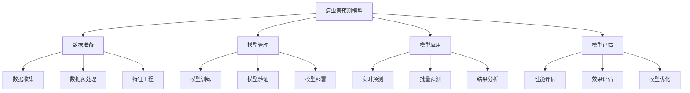

<a href="/diagrams/prototype/3-4-pest-prediction-model.html" target="_blank" rel="noopener noreferrer">查看病虫害预测模型界面原型</a>

### 功能定义

病虫害预测模型功能是病虫预警分析模块的核心算法支撑功能，通过整合多源数据，构建基于机器学习的病虫害预测模型，实现对病虫害发生发展趋势的科学预测。该功能支持模型训练、验证、应用和优化的全生命周期管理，为病虫害预警预报提供精准的算法支持。

### 流程与逻辑

1. 数据准备流程
   - 数据收集，包括：
     * 历史数据收集：历年病虫害发生数据、防治数据
     * 监测数据收集：物联网监测数据、田间调查数据
     * 气象数据收集：气象监测数据、气象预报数据
     * 环境数据收集：土壤数据、地理信息数据
   - 数据预处理，包括：
     * 数据清洗：异常值处理、缺失值处理、重复值处理
     * 数据转换：格式转换、单位统一、编码转换
     * 数据标准化：数值归一化、标准化处理
     * 数据集成：多源数据关联整合
   - 特征工程，包括：
     * 特征提取：从原始数据中提取有效特征
     * 特征选择：筛选重要特征变量
     * 特征转换：特征变换和组合
     * 特征验证：特征有效性验证

2. 模型管理流程
   - 模型训练，包括：
     * 算法选择：选择适合的机器学习算法
     * 参数设置：设置模型训练参数
     * 训练过程：执行模型训练流程
     * 中间结果分析：分析训练过程中间结果
   - 模型验证，包括：
     * 交叉验证：模型交叉验证评估
     * 性能测试：模型性能指标测试
     * 稳定性测试：模型稳定性评估
     * 对比验证：与其他模型对比验证
   - 模型部署，包括：
     * 模型封装：模型服务封装
     * 接口定义：预测接口定义
     * 部署发布：模型部署上线
     * 版本管理：模型版本控制

3. 模型应用流程
   - 实时预测，包括：
     * 数据接入：实时数据接入处理
     * 特征处理：实时特征提取转换
     * 模型预测：执行预测计算
     * 结果输出：预测结果实时输出
   - 批量预测，包括：
     * 数据批处理：批量数据预处理
     * 批量预测：执行批量预测
     * 结果汇总：预测结果汇总
     * 结果导出：预测结果导出
   - 结果分析，包括：
     * 预测结果分析：预测结果统计分析
     * 趋势分析：发展趋势分析
     * 空间分析：空间分布分析
     * 对比分析：与历史数据对比分析

4. 模型评估流程
   - 性能评估，包括：
     * 准确率评估：预测准确率评估
     * 时效性评估：预测时效性评估
     * 资源消耗：计算资源消耗评估
     * 性能优化：模型性能优化建议
   - 效果评估，包括：
     * 应用效果：实际应用效果评估
     * 经济效益：经济效益评估
     * 社会效益：社会效益评估
     * 改进建议：应用改进建议
   - 模型优化，包括：
     * 参数优化：模型参数优化
     * 特征优化：特征选择优化
     * 算法优化：算法改进优化
     * 性能优化：计算性能优化

### 数据项

#### 输入数据项

| 编号 | 数据项 | 类型 | 必填 | 说明 |
|------|--------|------|------|------|
| 1 | 历史数据 | 对象 | 是 | 历史发生数据 |
| 2 | 监测数据 | 对象 | 是 | 实时监测数据 |
| 3 | 气象数据 | 对象 | 是 | 气象监测预报数据 |
| 4 | 环境数据 | 对象 | 是 | 环境相关数据 |
| 5 | 防治数据 | 对象 | 否 | 防治措施数据 |
| 6 | 品种数据 | 对象 | 否 | 作物品种数据 |
| 7 | 土壤数据 | 对象 | 否 | 土壤环境数据 |
| 8 | 地理数据 | 对象 | 否 | 地理信息数据 |
| 9 | 模型参数 | 对象 | 是 | 模型配置参数 |
| 10 | 特征配置 | 对象 | 是 | 特征工程配置 |

#### 输出数据项

| 编号 | 数据项 | 类型 | 说明 |
|------|--------|------|------|
| 1 | 预测结果 | 对象 | 模型预测结果 |
| 2 | 趋势分析 | 对象 | 趋势分析结果 |
| 3 | 评估报告 | 对象 | 模型评估报告 |
| 4 | 性能指标 | 对象 | 性能评估指标 |
| 5 | 优化建议 | 对象 | 模型优化建议 |
| 6 | 特征重要性 | 对象 | 特征重要性分析 |
| 7 | 误差分析 | 对象 | 预测误差分析 |
| 8 | 应用报告 | 对象 | 应用效果报告 |

### 权限控制

1. 系统管理员
   - 管理模型配置
   - 管理模型部署
   - 监控模型运行
   - 管理系统资源
   - 分配使用权限

2. 模型管理员
   - 管理训练数据
   - 配置模型参数
   - 执行模型训练
   - 评估模型效果
   - 优化模型性能

3. 业务管理员
   - 应用模型预测
   - 分析预测结果
   - 评估应用效果
   - 提出优化建议
   - 生成分析报告

4. 普通用户
   - 查看预测结果
   - 查看分析报告
   - 查看评估结果
   - 提交问题反馈

### 界面设计

#### 界面布局
1. 模型管理主界面
   - 顶部：功能导航栏
     * 模型管理
     * 数据管理
     * 预测应用
     * 评估分析
   - 左侧：模型列表
     * 按类型分组
     * 按状态分组
     * 支持搜索筛选
   - 右侧：详细信息区
     * 模型详情
     * 运行状态
     * 评估指标
     * 操作按钮

2. 预测应用界面
   - 左侧：预测配置
     * 数据选择
     * 参数配置
     * 特征选择
   - 中部：预测结果
     * 结果展示
     * 趋势图表
     * 空间分布
   - 右侧：分析评估
     * 准确率分析
     * 误差分析
     * 效果评估

3. 评估分析界面
   - 顶部：性能概览
     * 准确率指标
     * 性能指标
     * 资源消耗
   - 中部：评估详情
     * 评估报告
     * 分析图表
     * 优化建议
   - 底部：操作区域
     * 导出报告
     * 优化调整
     * 版本管理

界面交互说明：
1. 模型管理操作
   - 支持模型创建
   - 支持参数配置
   - 支持训练控制
   - 支持版本管理
   - 支持模型部署

2. 预测应用操作
   - 支持数据选择
   - 支持参数调整
   - 支持预测执行
   - 支持结果分析
   - 支持结果导出

3. 评估分析操作
   - 支持指标分析
   - 支持效果评估
   - 支持优化分析
   - 支持报告生成
   - 支持优化调整

### 招标文件中的原文信息

> 系统应建立基于机器学习的病虫害预测模型，通过整合历史数据、监测数据、气象数据等多源数据，实现对病虫害发生发展趋势的科学预测。系统应支持模型训练、验证、应用和优化的全生命周期管理，提供精准的预测分析能力。 