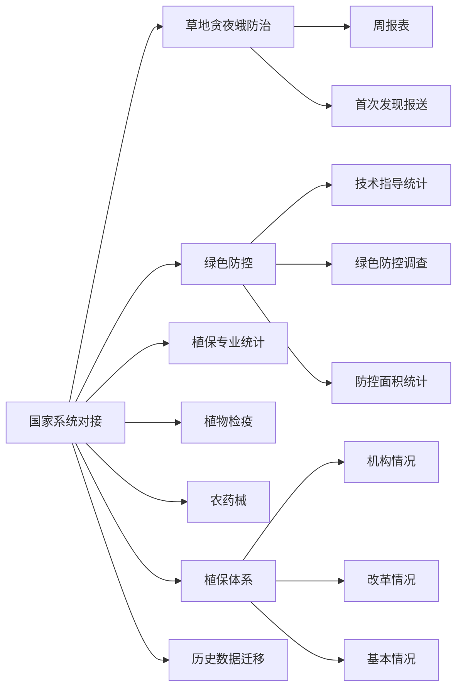

# 4. 国家植保植检信息管理系统对接

国家植保植检信息管理系统对接模块实现与国家系统的数据互通和业务协同。系统集成国家植保植检信息管理系统中的草地贪夜蛾防治、绿色防控、植物检疫、农药械、植保体系等专业数据，通过统一的数据接口实现数据的一次填报、多处使用。同时支持历史数据的迁移和查询，确保省级数据能够及时、准确地同步到国家系统。

## 功能逻辑图

## 4.1 草地贪夜蛾防治

<!--@include: @/docs/requirements/4-national-system/4-1-fall-armyworm.md-->

## 4.2 绿色防控

<!--@include: @/docs/requirements/4-national-system/4-2-green-prevention.md-->

## 4.3 植保专业统计

<!--@include: @/docs/requirements/4-national-system/4-3-professional-statistics.md-->

## 4.4 植物检疫

<!--@include: @/docs/requirements/4-national-system/4-4-plant-quarantine.md-->

## 4.5 农药械

<!--@include: @/docs/requirements/4-national-system/4-5-pesticide-machinery.md-->

## 4.6 植保体系

<!--@include: @/docs/requirements/4-national-system/4-6-plant-protection-system.md-->

## 4.7 历史数据迁移

<!--@include: @/docs/requirements/4-national-system/4-7-historical-data-migration.md-->