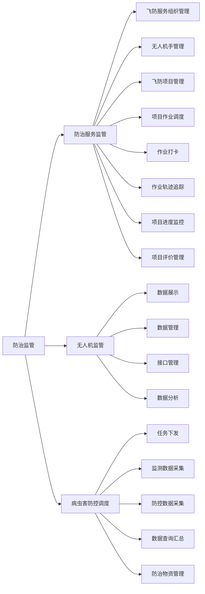

# 5. 防治监管

防治监管模块建立专业化的防治服务监管体系，实现对防治组织、设备和作业的全过程管理。系统通过对飞防服务组织、无人机手、作业过程等多个环节的监管，确保防治工作的规范性和有效性。同时，通过无人机监管和病虫害防控调度功能，实现对防治工作的精细化管理和科学调度。

## 功能逻辑图

## 5.1 防治服务监管

<!--@include: @/docs/requirements/5-prevention-supervision/5-1-service-supervision.md-->

## 5.2 无人机监管

<!--@include: @/docs/requirements/5-prevention-supervision/5-2-uav-supervision.md-->

## 5.3 病虫害防控调度

<!--@include: @/docs/requirements/5-prevention-supervision/5-3-pest-control-scheduling.md--> 