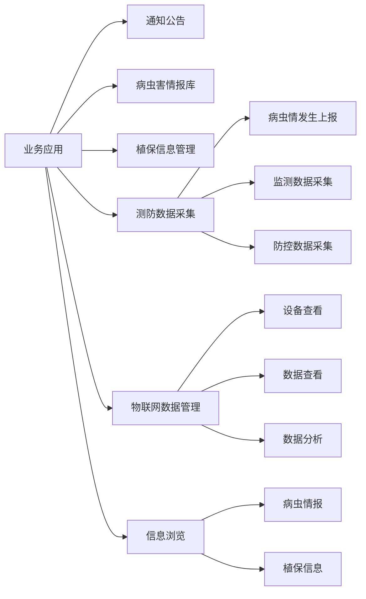

# 6. 业务应用

业务应用模块提供业务信息交流平台，支持日常业务数据的采集和展示。系统通过通知公告、病虫害情报库、植保信息管理等功能，实现业务信息的有效传递和共享。同时，通过移动端的测防数据采集和物联网数据管理功能，提升植保工作的便捷性和效率。

## 功能逻辑图

## 6.1 通知公告

<!--@include: @/docs/requirements/6-business-application/6-1-notice.md-->

## 6.2 病虫害情报库

<!--@include: @/docs/requirements/6-business-application/6-2-pest-report.md-->

## 6.3 植保信息管理

<!--@include: @/docs/requirements/6-business-application/6-3-plant-protection-info.md-->

## 6.4 测防数据采集

<!--@include: @/docs/requirements/6-business-application/6-4-pest-monitoring.md-->

## 6.5 物联网数据管理

<!--@include: @/docs/requirements/6-business-application/6-5-iot-management.md-->

## 6.6 信息浏览

<!--@include: @/docs/requirements/6-business-application/6-6-info-browse.md--> 