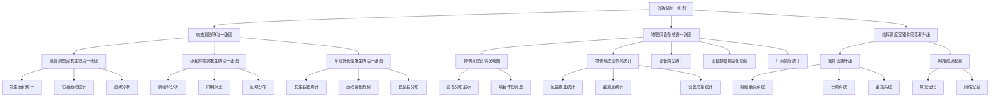

# 8. 指挥调度一张图

## 功能概述

指挥调度一张图是一个基于GIS技术的综合性可视化展示系统，通过对时空数据和植保业务数据进行融合及挖掘分析，构建集植保数据共享、数据分析、数据应用为一体的病虫测防联动一张图、物联网监测一张图等，实现以图防灾、以图智农、以图决策，实现全省病虫疫情防控指挥调度，提高全省植保管理服务的实时化、可视化、精细化。

## 功能逻辑图

## 8.1 病虫测防联动一张图

<!--@include: @/docs/requirements/8-command-map/8-1-pest-prevention-map.md-->

## 8.2 物联网设备总览一张图

<!--@include: @/docs/requirements/8-command-map/8-2-iot-overview-map.md-->

## 8.3 指挥调度室硬件完善和升级

<!--@include: @/docs/requirements/8-command-map/8-3-hardware-upgrade.md--> 