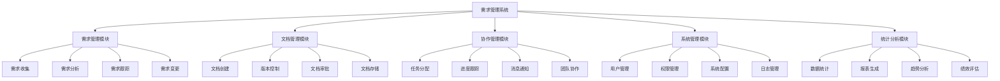

# 功能架构设计

## 1. 系统总体架构

### 1.1 架构图

## 2. 核心功能模块

### 2.1 需求管理模块
- 需求收集：支持多渠道需求收集
- 需求分析：需求分类、优先级评估
- 需求跟踪：需求生命周期管理
- 需求变更：变更申请、审批、执行

### 2.2 文档管理模块
- 文档创建：模板管理、在线编辑
- 版本控制：版本历史、差异比较
- 文档审批：审批流程、状态管理
- 文档存储：分类存储、快速检索

### 2.3 协作管理模块
- 任务分配：任务创建、分配、跟踪
- 进度跟踪：里程碑、甘特图
- 消息通知：站内信、邮件、提醒
- 团队协作：讨论、评论、共享

### 2.4 系统管理模块
- 用户管理：用户信息、角色分配
- 权限管理：功能权限、数据权限
- 系统配置：参数设置、工作流配置
- 日志管理：操作日志、系统日志

### 2.5 统计分析模块
- 数据统计：多维度统计分析
- 报表生成：自定义报表、导出
- 趋势分析：数据可视化、预测
- 绩效评估：KPI考核、团队评估

## 3. 技术架构

### 3.1 前端架构
- Vue.js 3.0
- Element Plus
- Axios
- ECharts

### 3.2 后端架构
- Spring Boot
- Spring Security
- MyBatis Plus
- Redis

### 3.3 数据架构
- MySQL
- MongoDB
- Elasticsearch

### 3.4 部署架构
- Docker
- Kubernetes
- Jenkins
- Nginx 