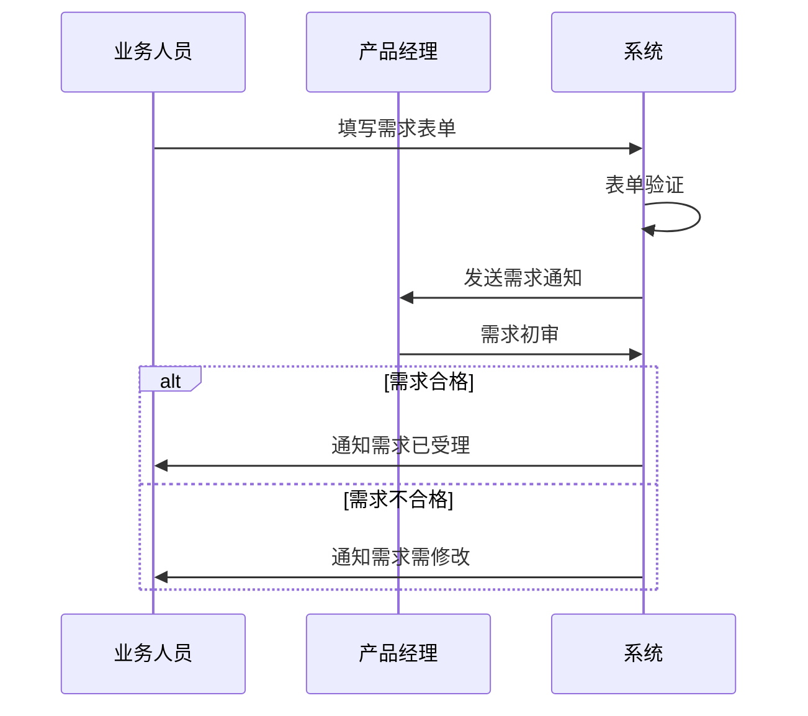
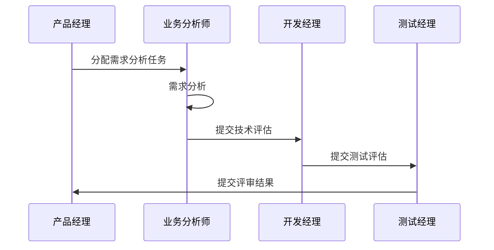
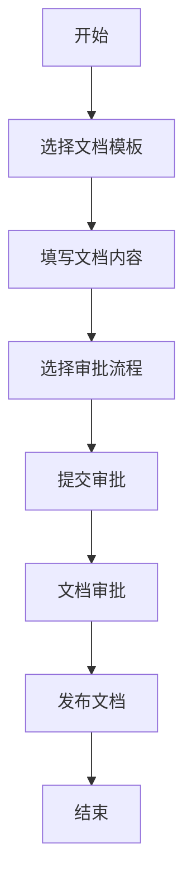
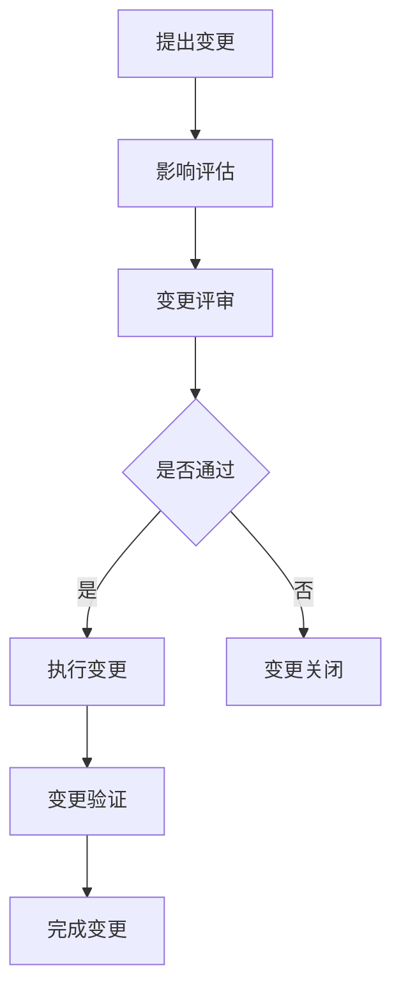
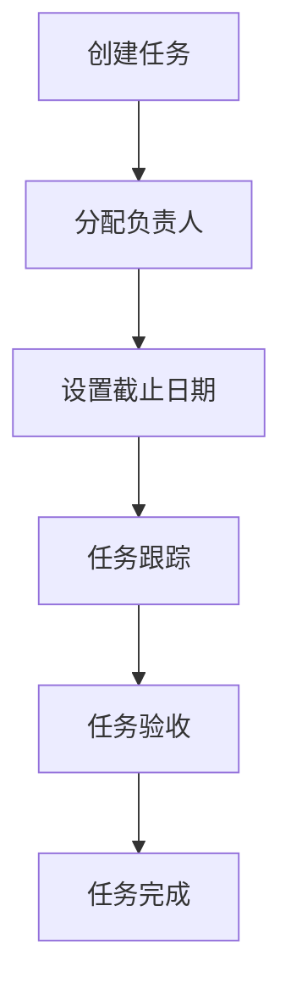

# 业务流程设计

## 1. 需求管理流程

### 1.1 需求提交流程

### 1.2 需求评审流程

## 2. 文档管理流程

### 2.1 文档创建流程

### 2.2 文档审批流程
- 提交人：创建文档并提交审批
- 审批人：审查文档内容
- 批准人：最终审批决定
- 归档人：文档归档管理

## 3. 变更管理流程

### 3.1 需求变更流程

### 3.2 变更控制流程
1. 变更申请
   - 填写变更申请单
   - 说明变更原因
   - 评估变更影响

2. 变更评审
   - 技术可行性分析
   - 资源影响评估
   - 进度影响评估

3. 变更实施
   - 制定实施计划
   - 执行变更操作
   - 记录变更过程

4. 变更验证
   - 测试验证
   - 用户确认
   - 文档更新

## 4. 协作管理流程

### 4.1 任务分配流程

### 4.2 进度管理流程
1. 计划制定
   - 项目里程碑
   - 任务分解
   - 资源分配

2. 进度跟踪
   - 日常更新
   - 偏差分析
   - 风险预警

3. 调整优化
   - 资源调配
   - 计划调整
   - 风险应对 