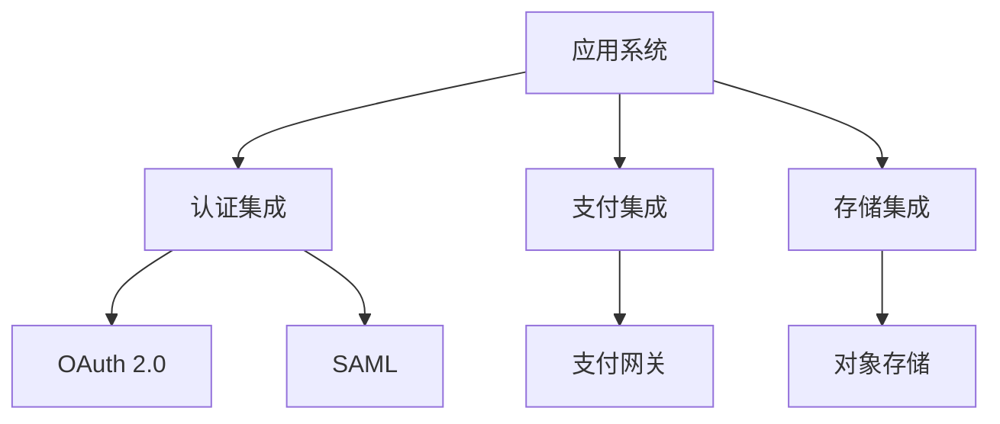

# 兼容性需求

## 1. 浏览器兼容性

### 1.1 桌面浏览器
| 浏览器 | 最低版本 | 推荐版本 | 特殊要求 |
|-------|---------|----------|---------|
| Chrome | 90+ | 最新版 | WebGL支持 |
| Firefox | 90+ | 最新版 | ES6支持 |
| Edge | 90+ | 最新版 | - |
| Safari | 14+ | 最新版 | - |

### 1.2 移动浏览器
| 浏览器 | 最低版本 | 推荐版本 | 特殊要求 |
|-------|---------|----------|---------|
| Chrome Mobile | 90+ | 最新版 | 触屏支持 |
| Safari Mobile | 14+ | 最新版 | 触屏支持 |
| 微信浏览器 | 7.0+ | 最新版 | JS API支持 |

## 2. 设备兼容性

### 2.1 屏幕分辨率
```css
/* 响应式断点 */
--screen-xs: 320px;  /* 手机竖屏 */
--screen-sm: 480px;  /* 手机横屏 */
--screen-md: 768px;  /* 平板竖屏 */
--screen-lg: 1024px; /* 平板横屏 */
--screen-xl: 1200px; /* 桌面显示器 */
--screen-xxl: 1600px; /* 大屏显示器 */
```

### 2.2 设备适配
| 设备类型 | 最小分辨率 | 推荐分辨率 | 适配要求 |
|---------|-----------|------------|---------|
| 手机 | 320x480 | 375x667 | 响应式布局 |
| 平板 | 768x1024 | 1024x768 | 自适应布局 |
| 桌面 | 1024x768 | 1920x1080 | 固定布局 |
| 大屏 | 1920x1080 | 2560x1440 | 可缩放布局 |

## 3. 操作系统兼容性

### 3.1 桌面操作系统
- Windows
  - Windows 10 (1909+)
  - Windows 11
- macOS
  - macOS 11 (Big Sur)
  - macOS 12 (Monterey)
  - macOS 13 (Ventura)
- Linux
  - Ubuntu 20.04+
  - CentOS 8+
  - Debian 10+

### 3.2 移动操作系统
- iOS
  - iOS 14+
  - iPadOS 14+
- Android
  - Android 9+
  - 鸿蒙OS 2+

## 4. 数据兼容性

### 4.1 文件格式
| 类型 | 支持格式 | 大小限制 | 说明 |
|-----|----------|----------|------|
| 文档 | doc, docx, pdf | 20MB | Office文档 |
| 图片 | jpg, png, gif | 10MB | 常用图片 |
| 视频 | mp4, mov | 100MB | H.264编码 |
| 音频 | mp3, wav | 20MB | - |

### 4.2 数据交换
- 导入格式
  - Excel (.xlsx, .xls)
  - CSV
  - JSON
  - XML
- 导出格式
  - Excel (.xlsx)
  - PDF
  - CSV
  - JSON

## 5. 接口兼容性

### 5.1 API版本
```json
{
  "api": {
    "current": "v2",
    "supported": ["v1", "v2"],
    "deprecated": ["v1"],
    "sunset": "2024-12-31"
  }
}
```

### 5.2 接口协议
- HTTP/HTTPS
- WebSocket
- RESTful
- GraphQL
- gRPC

### 5.3 数据格式
```json
{
  "content-type": [
    "application/json",
    "application/xml",
    "multipart/form-data",
    "application/x-www-form-urlencoded"
  ]
}
```

## 6. 第三方集成

### 6.1 支持平台
- 社交平台
  - 微信
  - 钉钉
  - 企业微信
- 支付平台
  - 支付宝
  - 微信支付
  - 银联
- 存储平台
  - 阿里云OSS
  - 腾讯云COS
  - AWS S3

### 6.2 集成要求
