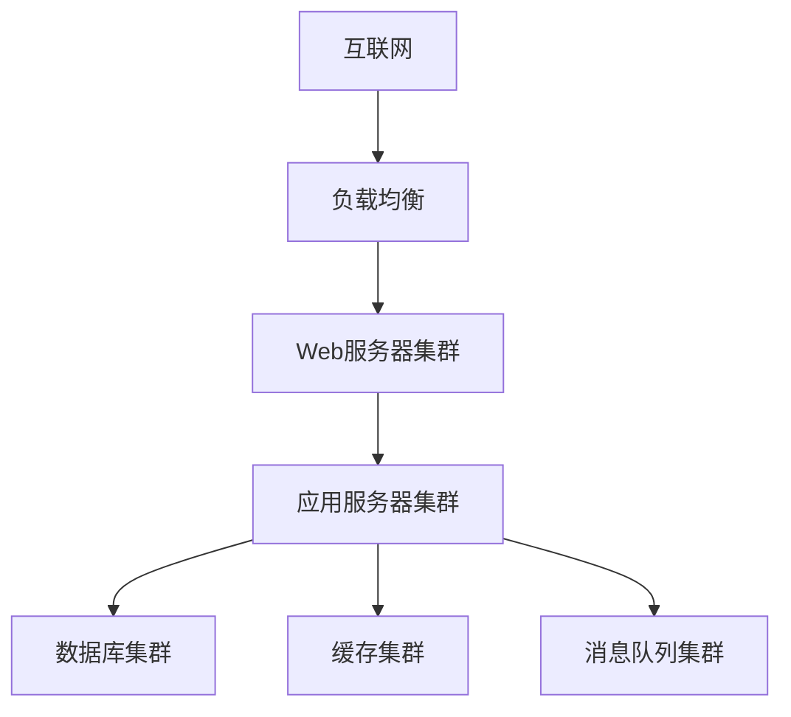

# 运行环境要求

## 1. 硬件环境

### 1.1 服务器配置
| 配置项 | 最低配置 | 推荐配置 |
|-------|---------|---------|
| CPU | 4核 | 8核+ |
| 内存 | 8GB | 16GB+ |
| 硬盘 | 100GB SSD | 200GB+ SSD |
| 网络带宽 | 10Mbps | 100Mbps+ |

### 1.2 客户端配置
| 配置项 | 最低配置 | 推荐配置 |
|-------|---------|---------|
| CPU | 双核 | 四核+ |
| 内存 | 4GB | 8GB+ |
| 硬盘空间 | 10GB | 20GB+ |
| 显示器分辨率 | 1366x768 | 1920x1080+ |

## 2. 软件环境

### 2.1 服务器环境
- 操作系统
  - Linux (Ubuntu 20.04+/CentOS 8+)
  - Windows Server 2019+
- 数据库
  - MySQL 8.0+
  - MongoDB 5.0+
  - Redis 6.0+
- 中间件
  - Nginx 1.20+
  - Docker 20.10+
  - Kubernetes 1.20+

### 2.2 客户端环境
- 操作系统
  - Windows 10/11
  - macOS 11+
  - Linux Desktop
- 浏览器
  - Chrome 90+
  - Firefox 90+
  - Edge 90+
  - Safari 14+

## 3. 开发环境

### 3.1 前端环境
```json
{
  "dependencies": {
    "vue": "^3.3.0",
    "vite": "^4.5.0",
    "typescript": "^5.0.0",
    "element-plus": "^2.4.0",
    "axios": "^1.6.0",
    "pinia": "^2.1.0"
  }
}
```

### 3.2 后端环境
```xml
<properties>
    <java.version>17</java.version>
    <spring-boot.version>3.1.0</spring-boot.version>
    <spring-cloud.version>2022.0.0</spring-cloud.version>
    <mybatis-plus.version>3.5.3</mybatis-plus.version>
</properties>
```

## 4. 网络环境

### 4.1 网络拓扑


### 4.2 网络要求
- 内网带宽：≥1000Mbps
- 外网带宽：≥100Mbps
- 网络延迟：≤50ms
- 丢包率：≤0.1%

## 5. 安全环境

### 5.1 安全要求
- 网络安全
  - 防火墙配置
  - 入侵检测
  - DDoS防护
  - SSL/TLS加密
- 应用安全
  - 身份认证
  - 权限控制
  - 数据加密
  - 审计日志
- 数据安全
  - 数据备份
  - 容灾恢复
  - 数据加密
  - 访问控制

### 5.2 安全策略
1. 密码策略
   - 最小长度：8位
   - 复杂度要求：包含大小写字母、数字和特殊字符
   - 定期更换：90天
   - 密码历史：记录前5次密码

2. 访问控制
   - 基于角色的访问控制（RBAC）
   - 最小权限原则
   - 定期权限审计
   - 异常访问监控

3. 数据保护
   - 敏感数据加密存储
   - 传输数据加密
   - 定期数据备份
   - 数据销毁机制 