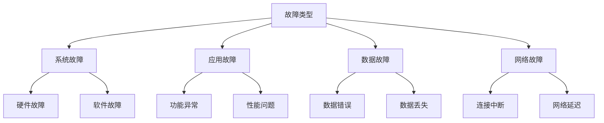
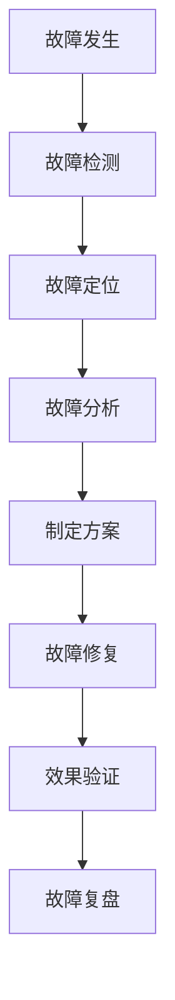
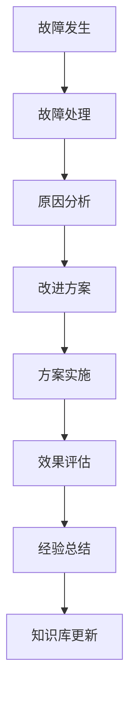

# 故障处理需求

## 1. 故障分类

### 1.1 故障等级
| 等级 | 影响范围 | 处理时限 | 示例 |
|-----|----------|----------|------|
| P0 | 全局影响 | 30分钟内 | 系统完全不可用 |
| P1 | 主要功能 | 2小时内 | 核心功能异常 |
| P2 | 次要功能 | 4小时内 | 非核心功能异常 |
| P3 | 局部功能 | 24小时内 | 特定功能异常 |

### 1.2 故障类型


## 2. 故障监控

### 2.1 监控指标
- 系统层面
  - 服务器状态
  - 资源使用率
  - 系统日志
  - 性能指标
- 应用层面
  - 接口状态
  - 业务指标
  - 错误日志
  - 性能统计
- 数据层面
  - 数据一致性
  - 数据完整性
  - 数据同步状态
  - 备份状态

### 2.2 告警机制
```json
{
  "alert": {
    "level": "P0",
    "type": "system_error",
    "source": "application_server_01",
    "message": "服务不可用",
    "timestamp": "2024-01-24 10:00:00",
    "metrics": {
      "error_rate": "100%",
      "affected_users": "all",
      "service_status": "down"
    }
  }
}
```

## 3. 故障处理流程

### 3.1 处理流程


### 3.2 响应机制
| 阶段 | 响应要求 | 参与角色 | 输出物 |
|-----|----------|----------|--------|
| 发现 | 实时 | 监控系统/用户 | 告警信息 |
| 响应 | 10分钟内 | 运维人员 | 响应确认 |
| 处理 | 按等级要求 | 技术团队 | 处理方案 |
| 恢复 | 按方案执行 | 实施人员 | 执行报告 |
| 总结 | 3个工作日内 | 项目组 | 复盘报告 |

## 4. 应急预案

### 4.1 系统故障
- 服务器宕机
  1. 启动备用服务器
  2. 切换流量
  3. 数据同步检查
  4. 服务验证
- 数据库故障
  1. 主从切换
  2. 数据一致性检查
  3. 应用重连
  4. 服务恢复

### 4.2 应用故障
- 功能异常
  1. 定位问题模块
  2. 回滚版本
  3. 修复缺陷
  4. 验证功能
- 性能问题
  1. 资源扩容
  2. 优化配置
  3. 清理缓存
  4. 性能测试

## 5. 故障预防

### 5.1 预防措施
- 技术预防
  - 代码审查
  - 自动化测试
  - 性能测试
  - 压力测试
- 运维预防
  - 容量规划
  - 监控告警
  - 备份策略
  - 应急演练

### 5.2 风险评估
| 风险点 | 影响程度 | 发生概率 | 预防措施 |
|-------|----------|----------|----------|
| 硬件故障 | 高 | 中 | 硬件冗余 |
| 网络中断 | 高 | 低 | 多线路备份 |
| 数据丢失 | 高 | 低 | 实时备份 |
| 性能瓶颈 | 中 | 高 | 性能优化 |

## 6. 持续改进

### 6.1 改进机制


### 6.2 评估指标
- MTBF（平均故障间隔时间）
- MTTR（平均修复时间）
- 故障解决率
- 用户满意度
- 系统可用性
- 服务质量 