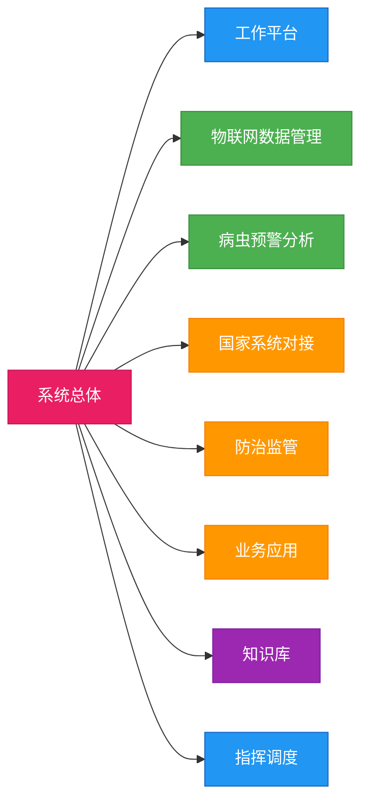

# 功能需求概述

## 功能框图

::: info 系统功能架构说明
本系统采用模块化设计，共划分为8个一级功能模块。各模块之间既相对独立又紧密关联，共同构成完整的植保信息化应用平台。
:::

::: info 图例说明
- 红色节点：系统总体
- 蓝色节点：平台类功能
- 绿色节点：数据类功能
- 橙色节点：业务类功能
- 紫色节点：知识类功能
:::

## 一级功能说明

### 1. 工作平台

**功能定位**：系统的基础入口平台，是用户访问和使用系统各项功能的统一界面。

**功能用途**：提供系统登录、业务展示、信息发布、资料查询、系统管理等基础功能，实现系统功能的统一入口和管理。

**一般逻辑**：
1. 用户管理：实现基于角色的访问控制（RBAC），支持账号密码验证和安全登录
2. 数据展示：提供病虫害发生情况、监测数据、预警信息等业务数据的集中展示
3. 信息管理：支持新闻公告、病虫情报、病虫害知识等信息的发布和管理
4. 资料检索：提供基于全文索引的资料检索功能，支持多维度组合查询
5. 首页管理：实现首页内容的可配置管理，支持个性化定制

### 2. 物联网数据管理与应用

**功能定位**：系统的数据采集和分析中心，是物联网设备数据的管理平台。

**功能用途**：实现对全省田间监测点的物联网设备采集数据的集中监管，提供数据展示、专题分析和评价管理功能。

**一般逻辑**：
1. 数据采集：实时采集虫害监测、气象监测、病害监测、视频监控等物联网数据
2. 数据分析：提供对比分析、病虫识别分析、首见峰值分析等多维度分析功能
3. 设备管理：实现物联网设备的注册、配置、状态监控和维护管理
4. 质量评价：建立数据质量评价体系，确保数据的准确性和可用性
5. 预警提示：支持设备异常、数据异常的实时预警

### 3. 病虫预警分析

**功能定位**：系统的智能分析中心，是病虫害预测预报的核心模块。

**功能用途**：通过多源数据的融合分析，实现对病虫害发生趋势的科学预测，为防控决策提供支持。

**一般逻辑**：
1. 数据融合：整合物联网数据、气象数据、历史数据等多源数据
2. 数据治理：提供数据标准化、清洗、存储和管理功能
3. 专题分析：实现小麦赤霉病等重点病害的专题分析和预警
4. 模型应用：支持病虫害预测模型的配置、训练和应用
5. 预警发布：提供多层级、多维度的预警信息发布功能

### 4. 国家植保植检信息管理系统对接

**功能定位**：系统的数据共享枢纽，是与国家系统对接的关键模块。

**功能用途**：实现与国家植保植检信息管理系统的数据互通和业务协同，确保省级数据能及时同步到国家系统。

**一般逻辑**：
1. 接口对接：对接国家系统的草地贪夜蛾防治、绿色防控等核心模块
2. 数据同步：实现数据的自动同步和一次填报、多处使用
3. 数据迁移：支持历史数据的规范化迁移和查询
4. 业务协同：确保省级业务与国家要求的一致性
5. 监控管理：提供数据同步状态的监控和异常处理功能

### 5. 防治监管

**功能定位**：系统的监管执行中心，是防治工作的管理平台。

**功能用途**：建立专业化的防治服务监管体系，实现对防治组织、设备和作业的全过程管理。

**一般逻辑**：
1. 组织管理：维护飞防服务组织和无人机手的基础信息
2. 设备管理：实现无人机等防治设备的登记和管理
3. 作业监控：跟踪记录防治作业的全过程，支持实时定位
4. 任务调度：提供防治任务的分配、跟踪和考核功能
5. 效果评估：建立防治效果评估体系，支持数据化考核

### 6. 业务应用

**功能定位**：系统的业务协同平台，是日常工作的交互中心。

**功能用途**：提供业务信息交流平台，支持日常业务数据的采集和展示，促进部门间的协作。

**一般逻辑**：
1. 信息发布：实现通知公告的分级发布和管理
2. 情报管理：建立病虫害情报的采集、审核和发布流程
3. 移动采集：支持测防数据的移动端采集和上传
4. 数据查看：提供物联网数据的移动端实时查看功能
5. 协同工作：支持部门间的任务协同和信息共享

### 7. 病虫害知识库

**功能定位**：系统的知识管理中心，是植保知识的集成平台。

**功能用途**：构建全面、权威的省级病虫害知识体系，为植保工作提供知识支持和经验传承。

**一般逻辑**：
1. 知识采集：建立病虫草害识别知识的标准化采集流程
2. 知识整理：系统化整理植保技术知识，形成知识图谱
3. 知识应用：维护植保员比赛试题库，支持在线学习
4. 知识共享：提供知识检索和推荐功能
5. 知识更新：建立知识库的动态更新和维护机制

### 8. 指挥调度一张图

**功能定位**：系统的指挥决策中心，是业务可视化的集成平台。

**功能用途**：通过GIS和可视化技术，实现全省植保业务的可视化指挥调度，提供直观的决策支持。

**一般逻辑**：
1. 数据集成：整合病虫测防、物联网监测等多源数据
2. 可视展示：提供病虫测防联动一张图、物联网设备总览一张图
3. 分析决策：支持多维度的数据分析和辅助决策
4. 指挥调度：实现跨区域、跨部门的协同指挥
5. 硬件升级：配套升级指挥调度室的硬件设施 