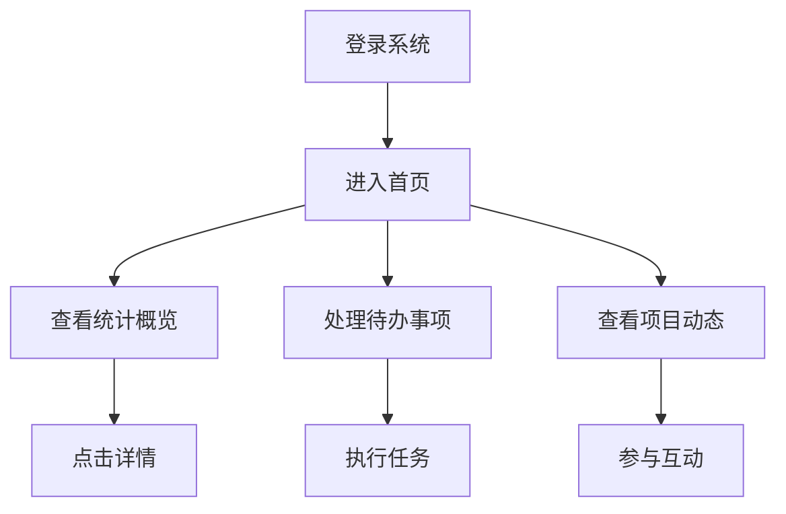

# 系统首页需求

## 1. 页面布局

### 1.1 整体布局
```vue
<template>
  <div class="layout">
    <!-- 顶部导航 -->
    <header class="header">
      <div class="logo">需求管理系统</div>
      <nav class="nav">
        <a href="#dashboard">仪表盘</a>
        <a href="#projects">项目管理</a>
        <a href="#requirements">需求管理</a>
        <a href="#documents">文档中心</a>
      </nav>
      <div class="user-info">
        <span class="username">当前用户</span>
        <span class="role">角色信息</span>
      </div>
    </header>

    <!-- 侧边栏 -->
    <aside class="sidebar">
      <div class="menu">
        <!-- 菜单项 -->
      </div>
    </aside>

    <!-- 主要内容区 -->
    <main class="main-content">
      <!-- 内容区域 -->
    </main>
  </div>
</template>
```

### 1.2 响应式设计
- 桌面端（≥1200px）：三栏布局
- 平板端（≥768px）：双栏布局
- 移动端（<768px）：单栏布局

## 2. 功能模块

### 2.1 快捷操作区
- 新建需求
- 新建文档
- 创建项目
- 发起评审
- 任务分配

### 2.2 统计概览
- 需求统计
  - 总需求数
  - 待处理需求
  - 进行中需求
  - 已完成需求
- 项目统计
  - 总项目数
  - 进行中项目
  - 已完成项目
  - 延期项目
- 文档统计
  - 总文档数
  - 待审核文档
  - 已发布文档
  - 待更新文档

### 2.3 待办事项
- 待处理需求列表
- 待审批文档列表
- 待参与评审列表
- 待完成任务列表

### 2.4 项目动态
- 最近更新的需求
- 最新创建的文档
- 最近的评审活动
- 项目进度更新

## 3. 交互设计

### 3.1 页面交互
- 顶部固定导航
- 侧边栏可折叠
- 内容区滚动加载
- 模块可拖拽排序

### 3.2 操作流程


## 4. 性能要求

### 4.1 页面性能
- 首页加载时间：≤2秒
- 模块加载时间：≤1秒
- 操作响应时间：≤0.5秒
- 动画过渡时间：≤0.3秒

### 4.2 数据刷新
- 统计数据：5分钟自动刷新
- 待办事项：实时更新
- 项目动态：1分钟自动刷新

## 5. 权限控制

### 5.1 模块权限
| 模块 | 管理员 | 项目经理 | 产品经理 | 普通用户 |
|-----|--------|----------|----------|----------|
| 统计概览 | ✓ | ✓ | ✓ | - |
| 快捷操作 | ✓ | ✓ | ✓ | ✓ |
| 待办事项 | ✓ | ✓ | ✓ | ✓ |
| 项目动态 | ✓ | ✓ | ✓ | ✓ |

### 5.2 操作权限
| 操作 | 管理员 | 项目经理 | 产品经理 | 普通用户 |
|-----|--------|----------|----------|----------|
| 新建需求 | ✓ | ✓ | ✓ | ✓ |
| 创建项目 | ✓ | ✓ | - | - |
| 发起评审 | ✓ | ✓ | ✓ | - |
| 任务分配 | ✓ | ✓ | ✓ | - |
``` 