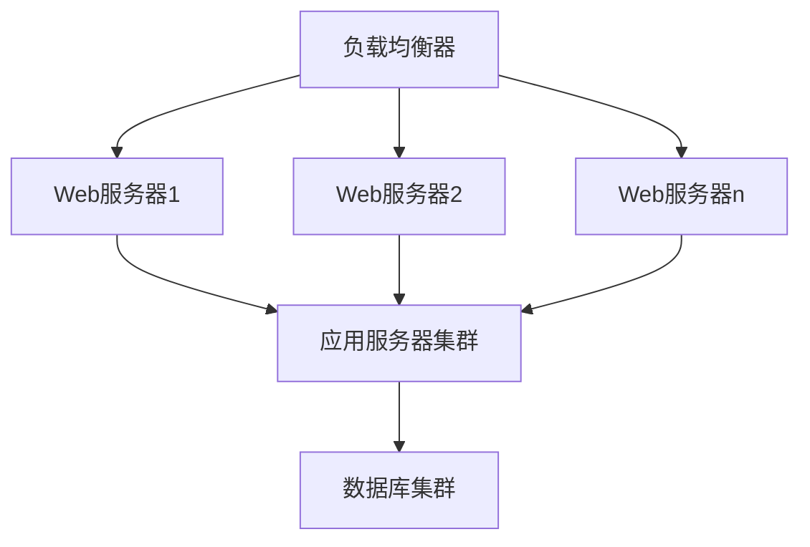

# 性能需求

## 1. 响应时间要求

### 1.1 页面加载时间
| 操作类型 | 响应时间要求 | 说明 |
|---------|------------|------|
| 首页加载 | ≤2秒 | 包含所有静态资源 |
| 列表页面 | ≤1.5秒 | 包含分页数据 |
| 详情页面 | ≤1秒 | 单条数据加载 |
| 导出数据 | ≤5秒 | 1000条数据内 |

### 1.2 操作响应时间
| 操作类型 | 响应时间要求 | 说明 |
|---------|------------|------|
| 按钮点击 | ≤0.2秒 | 普通操作 |
| 表单提交 | ≤1秒 | 包含验证 |
| 数据保存 | ≤2秒 | 包含事务处理 |
| 文件上传 | ≤5秒 | 10MB以内文件 |

## 2. 并发处理能力

### 2.1 用户并发
- 同时在线用户：≥500
- 峰值并发用户：≥200
- 单用户会话数：≥3
- 会话超时时间：30分钟

### 2.2 事务处理
- 每秒事务处理：≥100 TPS
- 数据库连接池：≥50
- 最大连接数：≥200
- 连接超时时间：5秒

## 3. 资源使用率

### 3.1 服务器资源
- CPU使用率：≤70%
- 内存使用率：≤80%
- 磁盘IO：≤60%
- 网络带宽：≤50%

### 3.2 客户端资源
- 浏览器内存：≤500MB
- CPU使用率：≤30%
- 本地存储：≤100MB
- 网络流量：≤1MB/s

## 4. 可扩展性要求

### 4.1 系统扩展性

### 4.2 扩展指标
- 水平扩展：支持服务器动态扩容
- 垂直扩展：支持资源动态调整
- 数据扩展：支持分库分表
- 功能扩展：支持模块化扩展

## 5. 性能监控

### 5.1 监控指标
- 系统性能指标
  - CPU使用率
  - 内存使用率
  - 磁盘IO
  - 网络流量
- 应用性能指标
  - 响应时间
  - 并发数
  - 事务处理量
  - 错误率
- 业务性能指标
  - 用户在线数
  - 业务处理量
  - 数据增长率
  - 系统吞吐量

### 5.2 告警机制
| 指标 | 警告阈值 | 严重阈值 | 处理方式 |
|-----|----------|----------|----------|
| CPU使用率 | 70% | 90% | 自动扩容 |
| 内存使用率 | 80% | 95% | 自动清理 |
| 响应时间 | 3秒 | 5秒 | 负载均衡 |
| 错误率 | 5% | 10% | 故障转移 |

## 6. 性能优化

### 6.1 前端优化
- 资源压缩
- 懒加载
- 缓存策略
- CDN加速

### 6.2 后端优化
- 数据库优化
- 缓存机制
- 异步处理
- 代码优化

### 6.3 网络优化
- 负载均衡
- 带宽优化
- 连接池管理
- 超时处理 