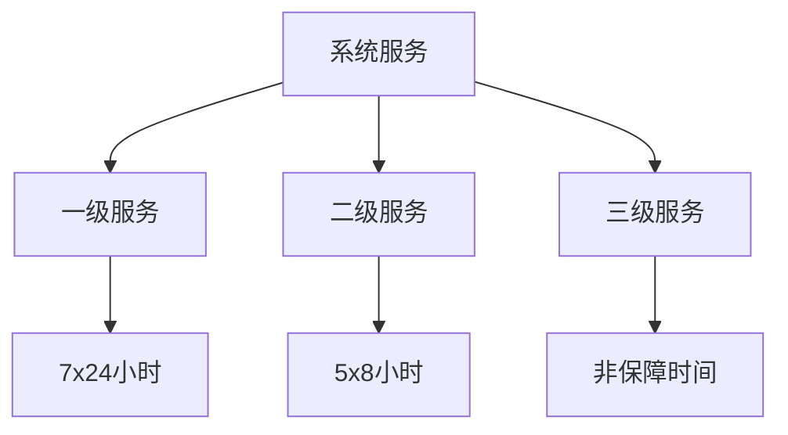
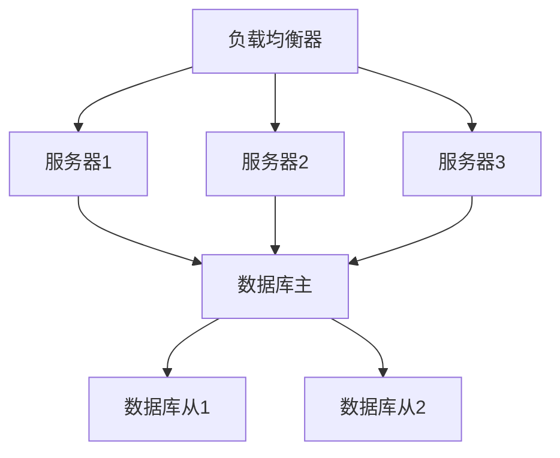
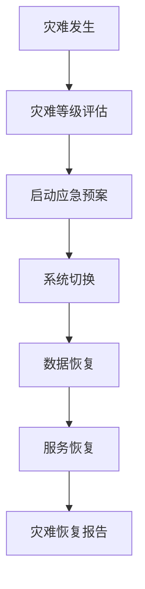

# 可靠性需求

## 1. 系统可用性

### 1.1 可用性指标
| 指标 | 要求 | 说明 |
|-----|------|------|
| 系统可用性 | 99.99% | 每年允许停机时间不超过1小时 |
| 业务可用性 | 99.9% | 核心业务功能可用性 |
| 数据可用性 | 99.999% | 数据存储可用性 |
| 接口可用性 | 99.9% | 外部接口可用性 |

### 1.2 服务等级协议（SLA）

## 2. 容错能力

### 2.1 故障转移
- 应用服务器故障转移
  - 主备切换时间：≤30秒
  - 数据同步延迟：≤5秒
  - 会话保持时间：≥30分钟
- 数据库故障转移
  - 主从切换时间：≤10秒
  - 数据一致性检查
  - 自动故障检测

### 2.2 负载均衡

## 3. 数据可靠性

### 3.1 数据备份
| 备份类型 | 周期 | 保留时间 | 恢复时间目标 |
|---------|------|----------|-------------|
| 全量备份 | 每周 | 3个月 | 4小时 |
| 增量备份 | 每天 | 1个月 | 2小时 |
| 实时同步 | 实时 | - | 10分钟 |

### 3.2 数据一致性
- 强一致性要求
  - 金融交易数据
  - 用户关键信息
  - 系统配置数据
- 最终一致性要求
  - 统计数据
  - 日志数据
  - 缓存数据

## 4. 系统监控

### 4.1 监控指标
- 系统监控
  - CPU使用率
  - 内存使用率
  - 磁盘使用率
  - 网络流量
- 应用监控
  - 响应时间
  - 错误率
  - 并发数
  - QPS/TPS
- 业务监控
  - 业务成功率
  - 业务处理量
  - 用户活跃度
  - 关键指标

### 4.2 告警策略
| 级别 | 响应时间 | 处理方式 | 通知方式 |
|-----|----------|----------|----------|
| P0 | 10分钟 | 立即处理 | 电话+短信+邮件 |
| P1 | 30分钟 | 优先处理 | 短信+邮件 |
| P2 | 2小时 | 正常处理 | 邮件 |
| P3 | 24小时 | 计划处理 | 系统通知 |

## 5. 灾难恢复

### 5.1 恢复目标
- RPO（恢复点目标）：≤5分钟
- RTO（恢复时间目标）：≤4小时
- MTD（最大容忍中断时间）：≤8小时
- BCP（业务连续性计划）：定期演练

### 5.2 灾难恢复流程

## 6. 性能可靠性

### 6.1 稳定性指标
- 系统运行时间
  - 连续运行时间：≥90天
  - 平均故障间隔：≥1000小时
  - 平均修复时间：≤30分钟
- 资源使用率
  - CPU峰值：≤80%
  - 内存峰值：≤85%
  - 磁盘使用率：≤75%

### 6.2 性能监控
| 监控项 | 正常值 | 警告值 | 严重值 |
|-------|--------|--------|--------|
| 响应时间 | ≤1秒 | ≤3秒 | >5秒 |
| 并发用户 | ≤500 | ≤800 | >1000 |
| 事务处理 | ≤100/秒 | ≤150/秒 | >200/秒 |
| 队列长度 | ≤100 | ≤200 | >300 | 