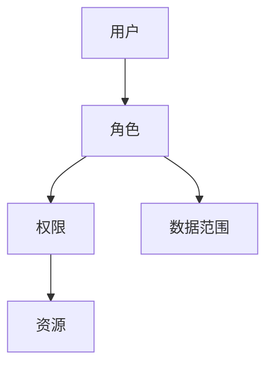

# 安全需求

## 1. 身份认证

### 1.1 登录认证
- 用户名密码认证
- 双因素认证（可选）
- 手机验证码登录
- 第三方登录集成
- 单点登录（SSO）

### 1.2 密码策略
| 策略项 | 要求 | 说明 |
|-------|------|------|
| 最小长度 | 8位 | 必须包含大小写字母、数字和特殊字符 |
| 有效期 | 90天 | 强制更换密码 |
| 历史记录 | 5次 | 不能使用最近5次使用过的密码 |
| 锁定策略 | 5次 | 连续错误5次锁定账号30分钟 |

## 2. 访问控制

### 2.1 权限模型


### 2.2 权限管理
- 基于角色的访问控制（RBAC）
- 基于属性的访问控制（ABAC）
- 最小权限原则
- 职责分离原则
- 权限继承机制

### 2.3 数据权限
| 数据类型 | 访问级别 | 控制方式 |
|---------|----------|----------|
| 公开数据 | 全员可见 | 角色控制 |
| 部门数据 | 部门可见 | 组织控制 |
| 个人数据 | 个人可见 | 用户控制 |
| 敏感数据 | 特权可见 | 特权控制 |

## 3. 数据安全

### 3.1 数据加密
- 传输加密：SSL/TLS
- 存储加密：AES-256
- 密钥管理：HSM硬件加密
- 敏感信息加密：手机号、身份证等

### 3.2 数据保护
- 数据备份策略
  - 全量备份：每周一次
  - 增量备份：每天一次
  - 实时同步：核心数据
- 数据恢复机制
  - 时间点恢复
  - 快速回滚
  - 灾难恢复

### 3.3 数据脱敏
| 数据类型 | 脱敏规则 | 示例 |
|---------|----------|------|
| 手机号 | 中间4位 | 138****8888 |
| 身份证 | 中间8位 | 110***********88 |
| 银行卡 | 前后4位 | 6222****8888 |
| 姓名 | 姓氏保留 | 张** |

## 4. 系统安全

### 4.1 网络安全
- 防火墙配置
- 入侵检测（IDS）
- 入侵防御（IPS）
- DDoS防护
- VPN访问

### 4.2 应用安全
- SQL注入防护
- XSS防护
- CSRF防护
- 文件上传安全
- 请求限流

### 4.3 运行安全
- 系统加固
- 漏洞扫描
- 安全补丁
- 病毒防护
- 日志审计

## 5. 安全审计

### 5.1 审计内容
- 用户行为审计
  - 登录登出
  - 权限变更
  - 敏感操作
- 系统行为审计
  - 配置变更
  - 数据变更
  - 异常事件

### 5.2 审计日志
```json
{
  "timestamp": "2024-01-24 10:00:00",
  "user": "admin",
  "action": "修改用户权限",
  "ip": "192.168.1.100",
  "result": "success",
  "details": {
    "target": "user123",
    "changes": ["添加管理权限"],
    "reason": "工作需要"
  }
}
```

## 6. 安全合规

### 6.1 合规要求
- 数据保护法规
- 网络安全法规
- 行业安全标准
- 等级保护要求

### 6.2 安全评估
- 定期安全评估
- 渗透测试
- 代码审计
- 风险评估
- 应急演练 