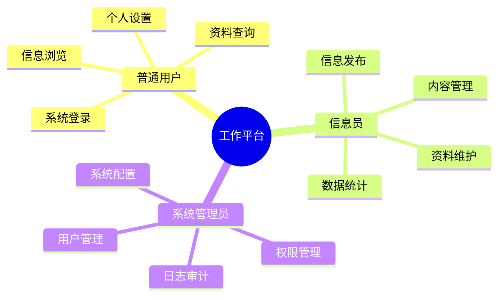
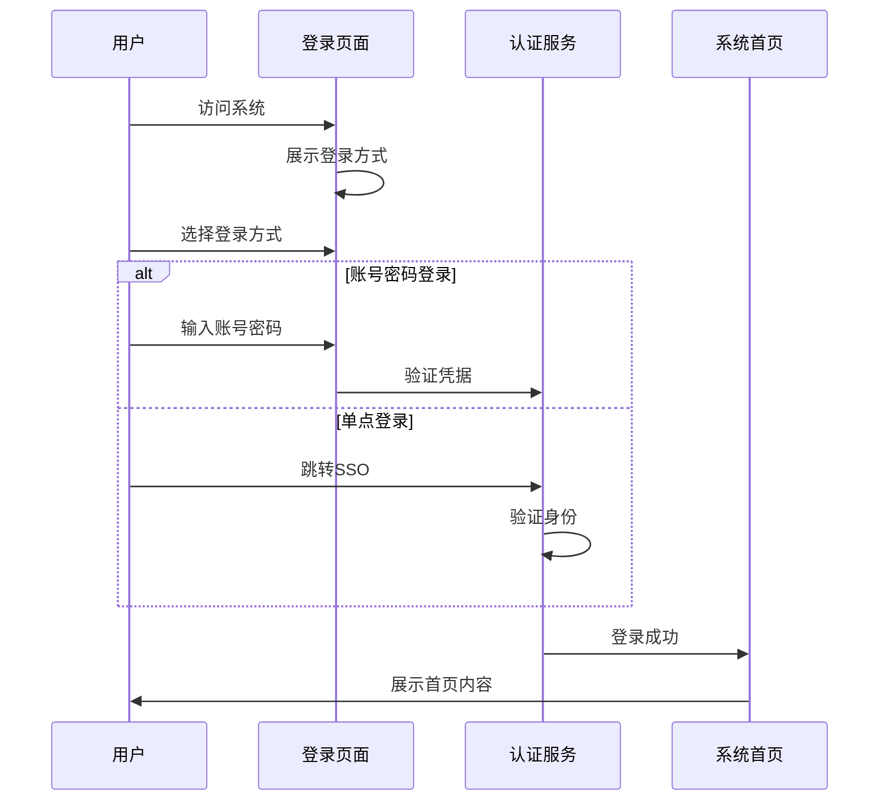

# 1. 工作平台

## 功能需求分析

### 原始需求

```yaml
功能需求：
1. 系统登录
   - 用户账号密码登录
   - 角色权限控制
   - 单点登录集成
   - 密码安全策略
2. 业务展示
   - 病虫害发生情况展示
   - 监测数据展示
   - 预警信息展示
   - 工作任务展示
3. 信息发布
   - 新闻公告管理
   - 病虫情报管理
   - 病虫害知识管理
   - 信息分类管理
4. 资料查询
   - 全文检索功能
   - 多维度组合查询
   - 检索结果导出
   - 检索历史记录
5. 系统管理
   - 用户管理
   - 角色权限管理
   - 系统配置管理
   - 日志审计管理
```

### 用户角色分析



## 用户故事

### 普通用户故事

1. 系统登录（Must Have）
```
作为一名普通用户
我想要通过账号密码或单点登录方式访问系统
以便于安全便捷地使用系统功能
```

2. 信息浏览（Must Have）
```
作为一名普通用户
我想要浏览病虫害发生情况和预警信息
以便于及时了解病虫害防控动态
```

3. 资料查询（Must Have）
```
作为一名普通用户
我想要进行全文检索和多维度组合查询
以便于快速找到所需的资料信息
```

4. 个人设置（Should Have）
```
作为一名普通用户
我想要设置个人偏好和修改密码
以便于个性化使用系统和保障账号安全
```

### 信息员故事

1. 信息发布（Must Have）
```
作为一名信息员
我想要发布和管理各类通知公告
以便于及时传递重要信息
```

2. 内容管理（Must Have）
```
作为一名信息员
我想要对已发布的内容进行分类管理
以便于维护信息的有序性和可查找性
```

3. 数据统计（Should Have）
```
作为一名信息员
我想要统计和分析信息发布情况
以便于了解信息传播效果
```

### 系统管理员故事

1. 用户管理（Must Have）
```
作为一名系统管理员
我想要管理用户账号和角色权限
以便于确保系统安全和规范使用
```

2. 系统配置（Must Have）
```
作为一名系统管理员
我想要配置系统参数和功能选项
以便于优化系统运行和用户体验
```

3. 日志审计（Must Have）
```
作为一名系统管理员
我想要查看和分析系统操作日志
以便于监控系统使用情况和排查问题
```

## 场景描述

### 系统登录场景



### 场景详细描述

#### 1. 系统登录场景

**目标用户**：所有用户

**前置条件**：
- 已注册系统账号
- 账号状态正常
- 网络连接正常

**操作流程**：
1. 访问系统登录页
2. 选择登录方式
3. 提供身份凭据
4. 验证身份信息
5. 进入系统首页

**预期结果**：
- 登录成功
- 获取权限
- 进入首页

**异常处理**：
- 账号锁定提醒
- 密码错误提示
- 登录失败重试

## 验收标准

### 功能验收标准

1. 登录功能
   - 支持账号密码登录
   - 支持单点登录
   - 支持密码重置
   - 支持登录失败锁定

2. 展示功能
   - 支持数据可视化
   - 支持信息分类展示
   - 支持内容动态更新
   - 支持个性化定制

3. 查询功能
   - 支持全文检索
   - 支持条件组合
   - 支持结果导出
   - 支持检索历史

### 非功能验收标准

1. 性能要求
   - 登录响应 < 1秒
   - 页面加载 < 2秒
   - 查询响应 < 3秒
   - 并发用户 > 500

2. 安全要求
   - 密码加密存储
   - 传输数据加密
   - 防暴力破解
   - 会话超时控制

3. 可用性要求
   - 界面简洁直观
   - 操作步骤简单
   - 提供操作指引
   - 支持快捷操作 