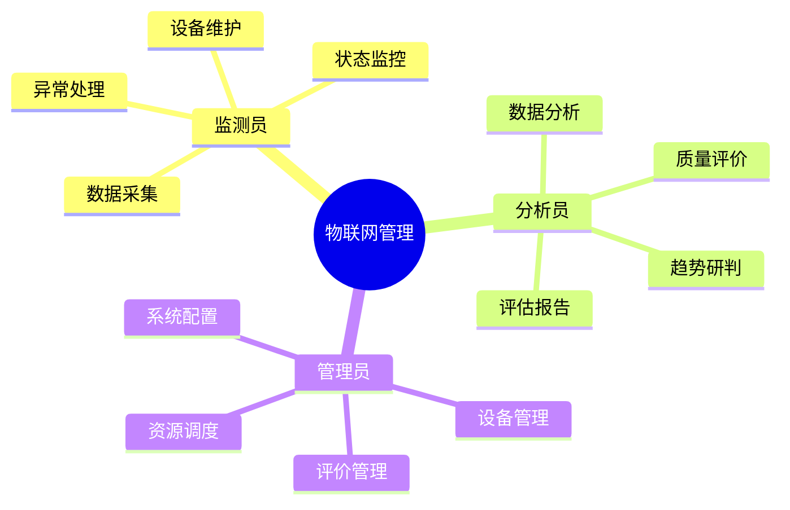
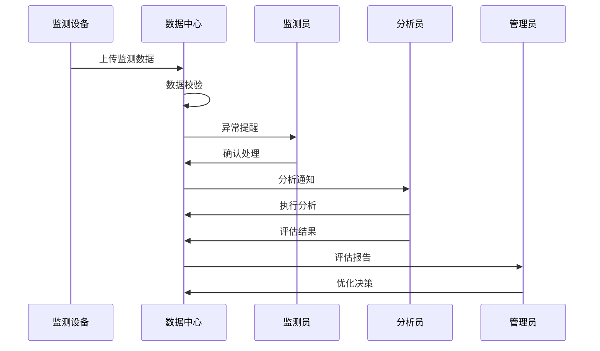

# 2. 物联网数据管理

## 功能需求分析

### 原始需求

```yaml
功能需求：
1. 数据采集与展示
   - 虫害监测数据采集
   - 气象监测数据采集
   - 病害监测数据采集
   - 视频监控数据采集
   - 数据实时展示
2. 数据分析功能
   - 对比分析功能
   - 病虫识别分析
   - 首见峰值分析
   - 趋势预测分析
3. 设备管理功能
   - 设备注册管理
   - 设备状态监控
   - 设备维护管理
   - 设备轨迹追踪
4. 评价管理功能
   - 数据质量评价
   - 设备可用性评价
   - 监测点评价
   - 评价结果应用
```

### 用户角色分析



## 用户故事

### 监测员故事

1. 数据采集（Must Have）
```
作为一名监测员
我想要实时采集各类监测数据
以便于及时掌握病虫害发生动态
```

2. 设备维护（Must Have）
```
作为一名监测员
我想要及时了解设备运行状态
以便于进行设备维护和故障处理
```

3. 异常处理（Must Have）
```
作为一名监测员
我想要及时处理数据采集异常
以便于确保监测数据的连续性
```

### 分析员故事

1. 数据分析（Must Have）
```
作为一名分析员
我想要对采集的数据进行多维度分析
以便于发现病虫害发生规律和趋势
```

2. 质量评价（Must Have）
```
作为一名分析员
我想要评估监测数据的质量和可靠性
以便于确保分析结果的准确性
```

3. 趋势研判（Must Have）
```
作为一名分析员
我想要分析病虫害首发和峰值情况
以便于提供预警预测依据
```

4. 评估报告（Should Have）
```
作为一名分析员
我想要生成设备和监测点评估报告
以便于指导监测网络的优化
```

### 管理员故事

1. 设备管理（Must Have）
```
作为一名管理员
我想要统一管理所有物联网设备
以便于确保设备的正常运行和维护
```

2. 评价管理（Must Have）
```
作为一名管理员
我想要对监测点和设备进行评价管理
以便于优化监测网络的布局和效率
```

3. 资源调度（Should Have）
```
作为一名管理员
我想要根据评价结果调度监测资源
以便于提高监测网络的整体效能
```

## 场景描述

### 数据采集与分析场景



### 场景详细描述

#### 1. 数据采集与分析场景

**目标用户**：监测员、分析员

**前置条件**：
- 设备已注册并激活
- 网络连接正常
- 数据中心运行正常

**操作流程**：
1. 设备自动采集数据
2. 系统校验数据质量
3. 处理异常情况
4. 执行数据分析
5. 生成分析报告

**预期结果**：
- 数据采集准确
- 分析结果可靠
- 评估报告完整

**异常处理**：
- 设备故障报警
- 数据异常标记
- 分析失败重试

## 验收标准

### 功能验收标准

1. 数据采集功能
   - 支持多类型数据采集
   - 支持实时数据上传
   - 支持异常数据处理
   - 支持数据质量控制

2. 数据分析功能
   - 支持多维度分析
   - 支持趋势预测
   - 支持对比分析
   - 支持首发分析

3. 评价管理功能
   - 支持质量评价
   - 支持设备评价
   - 支持监测点评价
   - 支持评价应用

### 非功能验收标准

1. 性能要求
   - 数据采集延迟 < 5秒
   - 分析响应时间 < 3秒
   - 支持1000+设备并发
   - 数据存储时效 > 3年

2. 可靠性要求
   - 数据采集成功率 > 99%
   - 设备在线率 > 95%
   - 数据准确率 > 99.9%
   - 系统可用性 > 99.9%

3. 安全要求
   - 设备认证加密
   - 数据传输加密
   - 访问权限控制
   - 数据备份恢复 