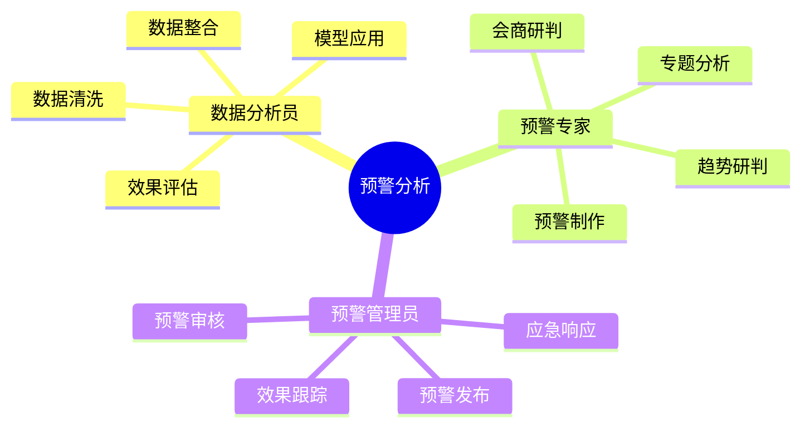
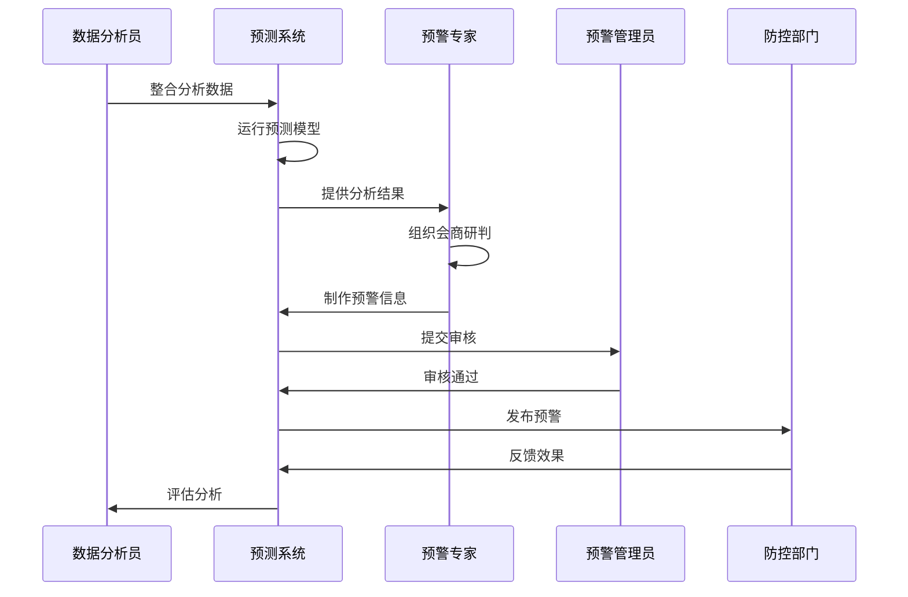

# 3. 病虫预警分析

## 功能需求分析

### 原始需求

```yaml
功能需求：
1. 数据融合分析
   - 物联网数据整合
   - 气象数据整合
   - 历史数据整合
   - 多源数据融合
   - 数据标准化处理
2. 预测预报功能
   - 发生趋势预测
   - 灾情程度预测
   - 发展趋势预测
   - 预警级别判定
3. 专题分析功能
   - 小麦赤霉病分析
   - 草地贪夜蛾分析
   - 重大病虫害分析
   - 专题报告生成
4. 预警发布功能
   - 预警信息制作
   - 预警信息审核
   - 预警信息发布
   - 预警效果评估
```

### 用户角色分析



## 用户故事

### 数据分析员故事

1. 数据整合（Must Have）
```
作为一名数据分析员
我想要整合多源监测数据并进行标准化处理
以便于为预警分析提供完整可靠的数据支持
```

2. 模型应用（Must Have）
```
作为一名数据分析员
我想要应用预测模型进行分析
以便于科学预测病虫害发生趋势
```

3. 效果评估（Should Have）
```
作为一名数据分析员
我想要评估预警预测的准确性
以便于持续优化预测模型
```

### 预警专家故事

1. 趋势研判（Must Have）
```
作为一名预警专家
我想要研判病虫害发展趋势
以便于及时发现潜在的灾害风险
```

2. 专题分析（Must Have）
```
作为一名预警专家
我想要针对小麦赤霉病等重点病虫害进行专题分析
以便于提供精准的预警信息
```

3. 会商研判（Must Have）
```
作为一名预警专家
我想要组织专家进行会商研判
以便于提高预警的科学性和权威性
```

4. 预警制作（Must Have）
```
作为一名预警专家
我想要制作规范的预警信息
以便于指导防控工作的开展
```

### 预警管理员故事

1. 预警审核（Must Have）
```
作为一名预警管理员
我想要审核预警信息的准确性和规范性
以便于确保预警信息的质量
```

2. 预警发布（Must Have）
```
作为一名预警管理员
我想要及时发布预警信息
以便于相关部门采取防控措施
```

3. 效果跟踪（Should Have）
```
作为一名预警管理员
我想要跟踪评估预警效果
以便于改进预警工作
```

## 场景描述

### 预警分析场景



### 场景详细描述

#### 1. 预警分析场景

**目标用户**：预警专家

**前置条件**：
- 监测数据已完整采集
- 预测模型已完成训练
- 专家团队已准备就绪

**操作流程**：
1. 整合多源数据
2. 运行预测模型
3. 组织专家会商
4. 制作预警信息
5. 发布实施预警

**预期结果**：
- 预警及时准确
- 预警内容规范
- 指导措施明确

**异常处理**：
- 数据缺失补充
- 模型异常切换
- 会商意见分歧

## 验收标准

### 功能验收标准

1. 数据分析功能
   - 支持多源数据融合
   - 支持数据标准化
   - 支持模型应用
   - 支持效果评估

2. 预警预报功能
   - 支持趋势预测
   - 支持灾情评估
   - 支持专家会商
   - 支持预警分级

3. 专题分析功能
   - 支持重点病虫害分析
   - 支持专题报告生成
   - 支持历史对比分析
   - 支持空间分布分析

### 非功能验收标准

1. 性能要求
   - 数据融合时间 < 10分钟
   - 预测分析时间 < 5分钟
   - 预警发布时间 < 30分钟
   - 支持100个并发分析

2. 准确性要求
   - 预测准确率 > 85%
   - 预警及时率 > 90%
   - 数据融合准确率 > 95%
   - 分析结果可信度 > 90%

3. 可用性要求
   - 系统可用性 > 99.9%
   - 数据可追溯性
   - 分析过程可解释
   - 预警流程规范化 